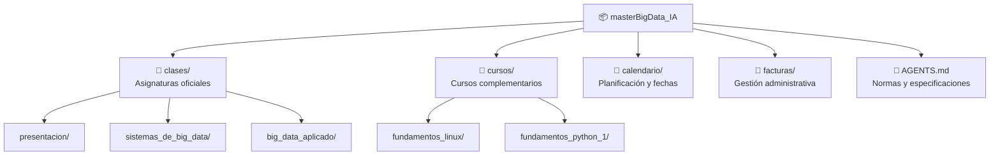

# Máster en Big Data e Inteligencia Artificial (FP)

Repositorio central de apuntes, prácticas, entregables, proyectos y documentación del **Curso de Especialización en Big Data e Inteligencia Artificial** para Formación Profesional (2026/2027).

---

## 🗺️ Índice General Navegable

A continuación se muestra el mapa interactivo del repositorio. Cada sección contiene su propia documentación detallada y estructura de archivos:



| Carpeta / Archivo | Descripción del Contenido | Acceso Directo |
| :--- | :--- | :---: |
| [📁 `clases/`](clases/README.md) | Asignaturas oficiales del curso, divididas en sus cinco áreas clave: anotaciones, entregables, grabaciones, presentaciones y calificaciones. | [Ver índice de clases](clases/README.md) |
| [📁 `cursos/`](cursos/README.md) | Cursos de formación preparatoria y complementaria (Linux CLI, Scripting Bash, Python Essentials, etc.). | [Ver índice de cursos](cursos/README.md) |
| [📁 `calendario/`](calendario/README.md) | Cronograma académico, calendario lectivo oficial, hitos del curso y fechas límite de entrega. | [Ver calendario](calendario/README.md) |
| [📁 `facturas/`](facturas/README.md) | Justificantes de pago de matrícula, mensualidades, recibos y documentación administrativa. | [Ver facturación](facturas/README.md) |
| [📄 `AGENTS.md`](AGENTS.md) | Normativa de contribución, directrices del repositorio y especificaciones de trabajo con IA. | [Ver especificaciones](AGENTS.md) |

---

## 📚 Índice de Clases y Anotaciones (Organizado por Asignatura)

### [Presentación](clases/presentacion/)

#### 🎓 Sesiones y Clases Lectivas
| Fecha | Sesión / Temática Impartida | Recurso / Acceso |
| :---: | :--- | :---: |
| **2026-10-01** | Jornada inaugural, metodología docente y presentación del programa formativo | [📊 Ver PDF](<clases/presentacion/presentaciones/Presentación MASTER IA y BIGDATA.pdf>)<br>[🎥 Grabación](clases/presentacion/grabaciones/2026_10_01_grabacion_presentacion.md) |

### [Sistemas de Big Data](clases/sistemas_de_big_data/)

#### 🎓 Sesiones y Clases Lectivas
| Fecha | Sesión / Temática Impartida | Recurso / Acceso |
| :---: | :--- | :---: |
| **2026-10-05** | Lógica proposicional, teoría de conjuntos y matemáticas discretas para computación | [📊 Material (DOCX)](<clases/sistemas_de_big_data/presentaciones/2026-10-05 - SBD Conceptos Basicos.docx>)<br>[📊 Diapositivas](<clases/sistemas_de_big_data/presentaciones/2026-10-05_Conceptos básicos>)<br>[📝 Ver Apuntes](clases/sistemas_de_big_data/anotaciones/matematicas_discretas.md)<br>[🎥 Grabación](clases/sistemas_de_big_data/grabaciones/2026_10_05_grabacion_sistemas_big_data.md) |
| **2026-10-05** | Introducción a los algoritmos y complejidad computacional | [📝 Ver Apuntes](clases/sistemas_de_big_data/anotaciones/introduccion_algoritmos.md)<br>[🎥 Grabación](clases/sistemas_de_big_data/grabaciones/2026_10_05_grabacion_sistemas_big_data.md) |

#### 📝 Cuadernos de Anotaciones y Teoría
| Fecha | Documento de Anotaciones | Conceptos Clave Tratados | Acceso al Documento |
| :---: | :--- | :--- | :--- : |
| **2026-10-05** | [Matemáticas Discretas](clases/sistemas_de_big_data/anotaciones/matematicas_discretas.md) | Conjuntos, álgebra booleana, tablas de verdad, grafos y árboles aplicados a Big Data con Python | [Leer apunte](clases/sistemas_de_big_data/anotaciones/matematicas_discretas.md) |
| **2026-10-05** | [Introducción a los Algoritmos](clases/sistemas_de_big_data/anotaciones/introduccion_algoritmos.md) | Fundamentos algorítmicos, pseudocódigo, TAD (pilas/colas), Big O, búsqueda, ordenación, grafos y árboles en Python | [Leer apunte](clases/sistemas_de_big_data/anotaciones/introduccion_algoritmos.md) |

### [Big Data Aplicado](clases/big_data_aplicado/)

#### 🎓 Sesiones y Clases Lectivas
| Fecha | Sesión / Temática Impartida | Recurso / Acceso |
| :---: | :--- | :---: |
| **2026-10-07** | Almacenamiento masivo y procesamiento de datos: fundamentos, 4 V's y tecnologías | [📝 Ver Apuntes](clases/big_data_aplicado/anotaciones/almacenamiento_masivo_datos.md)<br>[📊 Diapositivas](<clases/big_data_aplicado/presentaciones/2026-10-08_Almacenamiento y Procesamiento de Datos>)<br>📚 Mat. Recomendado: [Lectura #1](<clases/big_data_aplicado/presentaciones/2026-10-07 - BDA Lectura Recomendada #1 - The Digitization of the World.pdf>), [Lectura #2](<clases/big_data_aplicado/presentaciones/2026-10-07 - BDA Lectura Recomendada #2 - Big Data - What it is and Why it Matters.pdf>), [Lectura #3](<clases/big_data_aplicado/presentaciones/2026-10-07 - BDA Lectura Recomendada #3 - A Day in Data.jpg>), [Lectura #4](<clases/big_data_aplicado/presentaciones/2026-10-07 - BDA Lectura Recomendada #4 - Cuatro V del Big Data.jpg>), [Lectura #5](<clases/big_data_aplicado/presentaciones/2026-10-07 - BDA Lectura Recomendada #5 - Big Data, 20 Mind-Boggling Facts Everyone Must Read.pdf>), [Lectura #6](<clases/big_data_aplicado/presentaciones/2026-10-07 - BDA Lectura Recomendada #6 - NVMe, SAS, and SATA.pdf>), [Lectura #7](<clases/big_data_aplicado/presentaciones/2026-10-07 - BDA Lectura Recomendada #7 - Algoritmo de Compresion.pdf>), [Lectura #8](<clases/big_data_aplicado/presentaciones/2026-10-07 - BDA Lectura Recomendada #8 - Cloud Backup - What You Need to Know to Get Started.pdf>), [Lectura #9](<clases/big_data_aplicado/presentaciones/2026-10-07 - BDA Lectura Recomendada #9 - Recovery Manager - Performance and Best Practices.pdf>) |

#### 📝 Cuadernos de Anotaciones y Teoría
| Fecha | Documento de Anotaciones | Conceptos Clave Tratados | Acceso al Documento |
| :---: | :--- | :--- | :--- : |
| **2026-10-07** | [Almacenamiento Masivo](clases/big_data_aplicado/anotaciones/almacenamiento_masivo_datos.md) | Fundamentos de almacenamiento masivo, 4 V's, tradicional vs masivo, escalabilidad y validación en Python | [Leer apunte](clases/big_data_aplicado/anotaciones/almacenamiento_masivo_datos.md) |

> 💡 **Nota:** Para consultar la lista completa y actualizada de sesiones, dirígete a [**`clases/README.md`**](clases/README.md).

---

## 📚 Descripción Detallada de los Apartados

### 1. [Asignaturas Oficiales (`clases/`)](clases/README.md)
Contiene las carpetas individuales para cada una de las asignaturas cursadas en la especialización. Para asegurar uniformidad, cada asignatura respeta una estructura estricta de cinco subdirectorios:
- **`anotaciones/`**: Apuntes teóricos, fórmulas y ampliaciones de temario en Markdown enriquecido (ej. [Matemáticas Discretas](clases/sistemas_de_big_data/anotaciones/matematicas_discretas.md)).
- **`presentaciones/`**: Diapositivas, esquemas y material visual proporcionado por los docentes.
- **`entregables/`**: Prácticas evaluables, ejercicios resueltos y código de proyectos.
- **`calificaciones/`**: Registro de notas, evaluaciones y comentarios de feedback.
- **`grabaciones/`**: Ficheros Markdown con los enlaces organizados a las sesiones grabadas alojadas en Google Drive.

> 💡 **Nota:** Siguiendo las directrices del proyecto, nunca se almacenan archivos binarios de vídeo en el repositorio local; siempre se gestionan mediante ficheros Markdown que referencian las carpetas de Google Drive.

#### Asignaturas Actuales:
- [**`presentacion/`**](clases/presentacion/): Jornada inaugural, introducción metodológica y presentación general del curso (*Inicio: 2026-10-01*). Contiene [Presentación MASTER IA y BIGDATA.pdf](<clases/presentacion/presentaciones/Presentación MASTER IA y BIGDATA.pdf>).
- [**`sistemas_de_big_data/`**](clases/sistemas_de_big_data/): Infraestructuras distribuidas, matemáticas discretas aplicadas a datos, almacenamiento y clustering (*Inicio: 2026-10-05*).
- [**`big_data_aplicado/`**](clases/big_data_aplicado/): Aplicación práctica de pipelines de datos, ingesta, procesamiento y analítica avanzada (*Inicio: 2026-10-07*).

---

### 2. [Cursos Complementarios (`cursos/`)](cursos/README.md)
Cursos de terceros, MOOCs y preparaciones de certificaciones oficiales realizados para reforzar la base técnica:
- [**Fundamentos de Linux**](cursos/fundamentos_linux/00-indice.md): Curso completo de administración de sistemas Linux basado en Cisco Networking Academy y alineado con la certificación **LPI Linux Essentials** (16 capítulos, diagramas SVG, scripts y formatos PDF/EPUB).
- [**Fundamentos de Python 1**](cursos/fundamentos_python_1/README.md): Curso oficial Cisco / OpenEDG Python Institute enfocado en la certificación **PCEP** (Certified Entry-Level Python Programmer).

---

### 3. [Calendario y Planificación (`calendario/`)](calendario/README.md)
Espacio reservado para coordinar el avance lectivo y los hitos clave:
- Fechas de inicio y fin de módulos.
- Días festivos, no lectivos y convocatorias extraordinarias.
- Fechas límites de entrega (*deadlines*) de prácticas y exámenes.

---

### 4. [Facturación y Trámites (`facturas/`)](facturas/README.md)
Almacén seguro y ordenado para la gestión económica del curso:
- Justificantes de reserva y pago de matrícula.
- Recibos mensuales y cuotas.
- Facturas emitidas y documentación de secretaría.

---

## ⚙️ Reglas de Flujo y Estándares del Repositorio

El repositorio sigue las normas recogidas en [`AGENTS.md`](AGENTS.md):

1. **Trabajo Basado en Especificaciones (Specs):** Antes de codificar o crear documentación, se consultan los requisitos o especificaciones correspondientes.
2. **Nombres de Carpetas:** Estricto uso de minúsculas y `snake_case` (sin espacios ni tildes, ej. `sistemas_de_big_data`).
3. **Formato Documental:** Todo el contenido se documenta en **Markdown enriquecido** con tablas, bloques destacados estándar (`> 💡 **Nota:**`, `> 📌`) y diagramas **Mermaid** con sintaxis `flowchart TD` o `flowchart LR`.
4. **Ejemplos en Python:** Toda teoría o caso de uso conceptual debe respaldarse con implementaciones en Python.

---

## 🐍 Script de Utilidad: Exploración del Repositorio en Python

A continuación, se incluye un script en Python que permite a analistas e ingenieros de datos auditar y listar de manera estructurada las asignaturas y documentos disponibles en este repositorio:

```python
from pathlib import Path
import pandas as pd

def indexar_repositorio(ruta_raiz: str = ".") -> pd.DataFrame:
    """
    Recorre el repositorio y genera un DataFrame con el inventario
    de archivos Markdown clasificados por módulo o sección.
    """
    raiz = Path(ruta_raiz)
    registros = []

    for archivo in raiz.rglob("*.md"):
        # Ignorar archivos ocultos o carpetas del sistema
        if any(parte.startswith(".") for parte in archivo.parts):
            continue
        
        carpeta_padre = archivo.parent.name
        seccion_raiz = archivo.parts[0] if len(archivo.parts) > 1 else "raiz"
        
        registros.append({
            "seccion": seccion_raiz,
            "carpeta": carpeta_padre,
            "archivo": archivo.name,
            "ruta_relativa": str(archivo)
        })

    df = pd.DataFrame(registros)
    return df.sort_values(by=["seccion", "archivo"]).reset_index(drop=True)

if __name__ == "__main__":
    inventario = indexar_repositorio()
    print("Total de documentos Markdown encontrados:", len(inventario))
    print(inventario.head(10))
```
