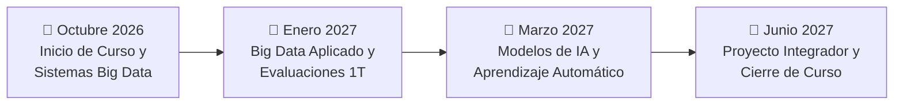

# Calendario y Planificación Académica

Espacio dedicado al seguimiento temporal del **Curso de Especialización en Big Data e Inteligencia Artificial** (curso 2026/2027): fechas de inicio de módulos, cronograma de clases, entregas de prácticas, convocatorias de exámenes y periodos no lectivos.

---

## 🗺️ Flujo Temporal del Curso Lectivo



---

## 📅 Cronograma General e Hitos del Curso (Ordenado por Fecha)

A continuación se indexan las fechas relevantes del calendario académico ordenadas cronológicamente:

| Fecha | Asignatura / Ámbito | Evento / Hito | Tipo | Estado |
| :---: | :--- | :--- | :---: | :---: |
| **2026-10-01** | General | Jornada inaugural y bienvenida del Máster | Institucional | ✅ Completado |
| **2026-10-05** | Sistemas de Big Data | Inicio del bloque teoricopráctico de Matemáticas Discretas | Clase Lectiva | ✅ Completado |
| **2026-10-12** | General | Festivo nacional (Día de la Fiesta Nacional) | Festivo | ⏳ Próximo |
| **2026-10-15** | Big Data Aplicado | Apertura del módulo de ecosistemas de datos aplicados | Clase Lectiva | ⏳ Próximo |
| **2026-10-31** | Sistemas de Big Data | Fecha límite de entrega: Práctica 1 (Modelado de datos) | Entrega | 📌 Planificado |
| **2026-11-01** | General | Festivo nacional (Día de Todos los Santos) | Festivo | 📌 Planificado |
| **2026-12-06** | General | Festivo nacional (Día de la Constitución) | Festivo | 📌 Planificado |
| **2026-12-08** | General | Festivo nacional (Inmaculada Concepción) | Festivo | 📌 Planificado |
| **2026-12-22** | General | Inicio de vacaciones de invierno (Navidad) | Periodo Vacacional | 📌 Planificado |
| **2027-01-08** | General | Reanudación de las actividades lectivas | Clase Lectiva | 📌 Planificado |
| **2027-01-25** | Sistemas de Big Data | Primera convocatoria de evaluación parcial | Evaluación | 📌 Planificado |
| **2027-06-15** | General | Entrega y defensa del Proyecto Final | Evaluación Final | 📌 Planificado |

> 💡 **Nota:** Las fechas de entrega específicas de cada asignatura se sincronizan con las especificaciones de sus respectivos directorios en [`../clases/`](../clases/).

---

## 📁 Documentos y Recursos de Planificación

Este directorio puede alojar los siguientes recursos:
- 📅 [**Calendario Lectivo 2026 2027 Master IA y Big Data.pdf**](<Calendario Lectivo 2026 2027 Master IA y Big Data.pdf>): Calendario lectivo oficial de la comunidad autónoma y del centro de estudios.
- **Archivos `.ics` (iCalendar)**: Para suscripción y sincronización automática en Google Calendar, Apple Calendar o Microsoft Outlook.
- **Cuadros de entregables**: Tablas complementarias de control de tiempo (Gantt o Kanban).

---

## 🐍 Script en Python: Monitor de Fechas Límite y Plazos

Este script en Python procesa el cronograma de fechas, calcula los días restantes para cada hito y destaca las entregas más próximas:

```python
from datetime import datetime
import pandas as pd

hitos = [
    {"fecha": "2026-10-01", "hito": "Jornada inaugural", "tipo": "Institucional"},
    {"fecha": "2026-10-05", "hito": "Inicio Sistemas de Big Data", "tipo": "Clase"},
    {"fecha": "2026-10-12", "hito": "Festivo nacional", "tipo": "Festivo"},
    {"fecha": "2026-10-15", "hito": "Inicio Big Data Aplicado", "tipo": "Clase"},
    {"fecha": "2026-10-31", "hito": "Entrega Práctica 1 Sistemas BD", "tipo": "Entrega"},
    {"fecha": "2027-01-25", "hito": "Evaluación Parcial", "tipo": "Examen"},
    {"fecha": "2027-06-15", "hito": "Defensa Proyecto Final", "tipo": "Final"},
]

def calcular_dias_restantes(datos_hitos, fecha_referencia="2026-10-05"):
    ref_dt = datetime.strptime(fecha_referencia, "%Y-%m-%d")
    df = pd.DataFrame(datos_hitos)
    df["fecha_dt"] = pd.to_datetime(df["fecha"])
    df["dias_restantes"] = (df["fecha_dt"] - ref_dt).dt.days
    
    # Clasificar estado
    df["estado"] = df["dias_restantes"].apply(
        lambda d: "Pasado" if d < 0 else ("Hoy" if d == 0 else f"Faltan {d} días")
    )
    
    return df.sort_values(by="fecha_dt")[["fecha", "hito", "tipo", "estado"]]

if __name__ == "__main__":
    df_progreso = calcular_dias_restantes(hitos)
    print(df_progreso.to_string(index=False))
```
