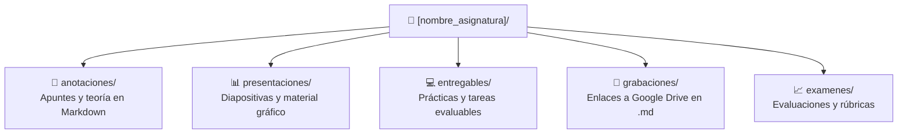

# Clases y Asignaturas Oficiales

Módulos formativos del **Curso de Especialización en Big Data e Inteligencia Artificial** (FP). Este directorio organiza el material pedagógico, apuntes, prácticas y evaluaciones de las asignaturas oficiales del curso.

---

## 📅 Índice Cronológico de Clases y Sesiones

A continuación se detallan las sesiones lectivas del curso ordenadas cronológicamente por fecha:

| Fecha | Asignatura / Módulo | Sesión / Temática | Recursos Asociados |
| :---: | :--- | :--- | :--- |
| **2026-10-01** | [**Presentación**](presentacion/) | Bienvenida institucional, metodología docente y presentación del programa formativo | <a href="https://laralbir.github.io/bigdata-ia/clases/presentacion/presentaciones/Presentaci%C3%B3n%20MASTER%20IA%20y%20BIGDATA.pdf" target="_blank">📊 Presentación (PDF)</a> [🎥 Grabación](presentacion/grabaciones/2026_10_01_grabacion_presentacion.md) |
| **2026-10-05** | [**Sistemas de Big Data**](sistemas_de_big_data/) | Matemáticas discretas y complejidad computacional | <a href="https://laralbir.github.io/bigdata-ia/clases/sistemas_de_big_data/presentaciones/2026_10_05_sbd_conceptos_basicos.docx" target="_blank">📊 Material (DOCX)</a> [📊 Diapositivas](sistemas_de_big_data/presentaciones/2026_10_05_conceptos_basicos/README.md) [📝 Mat. Discretas](sistemas_de_big_data/anotaciones/matematicas_discretas.md) [📝 Intro. Algoritmos](sistemas_de_big_data/anotaciones/introduccion_algoritmos.md) [🎥 Grabación](sistemas_de_big_data/grabaciones/2026_10_05_grabacion_sistemas_big_data.md) |
| **2026-10-07** | [**Big Data Aplicado**](big_data_aplicado/) | Almacenamiento masivo y procesamiento de datos: fundamentos, 4 V's y tecnologías | [📝 Almacenamiento Masivo](big_data_aplicado/anotaciones/almacenamiento_masivo_datos.md) [📊 Diapositivas](big_data_aplicado/presentaciones/2026_10_08_almacenamiento_y_procesamiento_de_datos/README.md) 📚 Mat. Recomendado:<ul><li><a href="https://laralbir.github.io/bigdata-ia/clases/big_data_aplicado/presentaciones/2026_10_07_bda_lectura_recomendada_1_the_digitization_of_the_world.pdf" target="_blank">2026_10_07_bda_lectura_recomendada_1_the_digitization_of_the_world.pdf</a></li><li><a href="https://laralbir.github.io/bigdata-ia/clases/big_data_aplicado/presentaciones/2026_10_07_bda_lectura_recomendada_2_big_data_what_it_is_and_why_it_matters.pdf" target="_blank">2026_10_07_bda_lectura_recomendada_2_big_data_what_it_is_and_why_it_matters.pdf</a></li><li><a href="https://laralbir.github.io/bigdata-ia/clases/big_data_aplicado/presentaciones/2026_10_07_bda_lectura_recomendada_3_a_day_in_data.jpg" target="_blank">2026_10_07_bda_lectura_recomendada_3_a_day_in_data.jpg</a></li><li><a href="https://laralbir.github.io/bigdata-ia/clases/big_data_aplicado/presentaciones/2026_10_07_bda_lectura_recomendada_4_cuatro_v_del_big_data.jpg" target="_blank">2026_10_07_bda_lectura_recomendada_4_cuatro_v_del_big_data.jpg</a></li><li><a href="https://laralbir.github.io/bigdata-ia/clases/big_data_aplicado/presentaciones/2026_10_07_bda_lectura_recomendada_5_big_data_20_mind_boggling_facts_everyone_must_read.pdf" target="_blank">2026_10_07_bda_lectura_recomendada_5_big_data_20_mind_boggling_facts_everyone_must_read.pdf</a></li><li><a href="https://laralbir.github.io/bigdata-ia/clases/big_data_aplicado/presentaciones/2026_10_07_bda_lectura_recomendada_6_nvme_sas_and_sata.pdf" target="_blank">2026_10_07_bda_lectura_recomendada_6_nvme_sas_and_sata.pdf</a></li><li><a href="https://laralbir.github.io/bigdata-ia/clases/big_data_aplicado/presentaciones/2026_10_07_bda_lectura_recomendada_7_algoritmo_de_compresion.pdf" target="_blank">2026_10_07_bda_lectura_recomendada_7_algoritmo_de_compresion.pdf</a></li><li><a href="https://laralbir.github.io/bigdata-ia/clases/big_data_aplicado/presentaciones/2026_10_07_bda_lectura_recomendada_8_cloud_backup_what_you_need_to_know_to_get_started.pdf" target="_blank">2026_10_07_bda_lectura_recomendada_8_cloud_backup_what_you_need_to_know_to_get_started.pdf</a></li><li><a href="https://laralbir.github.io/bigdata-ia/clases/big_data_aplicado/presentaciones/2026_10_07_bda_lectura_recomendada_9_recovery_manager_performance_and_best_practices.pdf" target="_blank">2026_10_07_bda_lectura_recomendada_9_recovery_manager_performance_and_best_practices.pdf</a></li></ul> |

---

## 📝 Índice Cronológico de Anotaciones y Apuntes

Registro detallado de los apuntes teóricos y cuadernos de estudio, ordenados por fecha de publicación:

| Fecha | Asignatura | Documento de Anotaciones | Conceptos Clave Tratados | Acceso Directo |
| :---: | :--- | :--- | :--- | :---: |
| **2026-10-05** | Sistemas de Big Data | [Matemáticas Discretas](sistemas_de_big_data/anotaciones/matematicas_discretas.md) | Teoría de conjuntos, lógica proposicional, tablas de verdad, álgebra de Boole, grafos y árboles aplicados a Big Data con Python | [Leer apunte](sistemas_de_big_data/anotaciones/matematicas_discretas.md) |
| **2026-10-05** | Sistemas de Big Data | [Introducción a Algoritmos](sistemas_de_big_data/anotaciones/introduccion_algoritmos.md) | Complejidad computacional, notación Big O, análisis de tiempo y espacio, clases de complejidad en Python | [Leer apunte](sistemas_de_big_data/anotaciones/introduccion_algoritmos.md) |
| **2026-10-07** | Big Data Aplicado | [Almacenamiento Masivo y Procesamiento](big_data_aplicado/anotaciones/almacenamiento_masivo_datos.md) | Fundamentos de almacenamiento masivo, escala global (Zettabytes), 4 V's de datos, tradicional vs. masivo y validación en Python | [Leer apunte](big_data_aplicado/anotaciones/almacenamiento_masivo_datos.md) |

> 💡 **Nota:** Cada vez que se incorporen nuevos apuntes teóricos a la subcarpeta `anotaciones/` de cualquier asignatura, deben registrarse en esta tabla cronológica indicando la fecha de impartición correspondiente.

---

## 🏛️ Estructura Estándar de una Asignatura

Cada asignatura sigue rigurosamente el esquema de cinco subcarpetas definido en las especificaciones del proyecto ([`AGENTS.md`](../AGENTS.md)):

### Descripción de Subcarpetas:
1. **`anotaciones/`**: Cuadernos de apuntes en Markdown enriquecido con diagramas Mermaid y ejemplos obligatorios en Python.
2. **`presentaciones/`**: Diapositivas en PDF u otros formatos facilitadas por el profesorado.
3. **`entregables/`**: Enunciados de prácticas, código fuente resuelto y documentación técnica requerida para la entrega.
4. **`grabaciones/`**: Ficheros Markdown con los enlaces directos a las grabaciones en la nube (Google Drive). **Nunca se almacenan vídeos directamente en el repositorio local.**
5. **`examenes/`**: Registro de notas obtenidas, rúbricas de corrección y comentarios de retroalimentación docente.

---

## 📂 Directorio de Asignaturas

Navegación por las asignaturas dadas de alta en el sistema:

### 1. [Presentación (`presentacion/`)](presentacion/)
*Fecha de inicio: 2026-10-01*
- [Anotaciones](presentacion/anotaciones/)
- [Presentaciones](presentacion/presentaciones/) (incluye <a href="https://laralbir.github.io/bigdata-ia/clases/presentacion/presentaciones/Presentaci%C3%B3n%20MASTER%20IA%20y%20BIGDATA.pdf" target="_blank">Presentación MASTER IA y BIGDATA.pdf</a>)
- [Entregables](presentacion/entregables/)
- [Grabaciones](presentacion/grabaciones/) (incluye [Grabación Sesión Inaugural](presentacion/grabaciones/2026_10_01_grabacion_presentacion.md))
- [Exámenes](presentacion/examenes/)

### 2. [Sistemas de Big Data (`sistemas_de_big_data/`)](sistemas_de_big_data/)
*Fecha de inicio: 2026-10-05*
- [Anotaciones](sistemas_de_big_data/anotaciones/) (incluye [Matemáticas Discretas](sistemas_de_big_data/anotaciones/matematicas_discretas.md) e [Introducción a Algoritmos](sistemas_de_big_data/anotaciones/introduccion_algoritmos.md))
- [Presentaciones](sistemas_de_big_data/presentaciones/) (incluye <a href="https://laralbir.github.io/bigdata-ia/clases/sistemas_de_big_data/presentaciones/2026_10_05_sbd_conceptos_basicos.docx" target="_blank">2026_10_05_sbd_conceptos_basicos.docx</a> y [Diapositivas](sistemas_de_big_data/presentaciones/2026_10_05_conceptos_basicos/README.md))
- [Entregables](sistemas_de_big_data/entregables/)
- [Grabaciones](sistemas_de_big_data/grabaciones/) (incluye [Grabación 2026-10-05](sistemas_de_big_data/grabaciones/2026_10_05_grabacion_sistemas_big_data.md))
- [Exámenes](sistemas_de_big_data/examenes/)

### 3. [Big Data Aplicado (`big_data_aplicado/`)](big_data_aplicado/)
*Fecha de inicio: 2026-10-07 (Docente: Alejandro Delgado)*
- [Anotaciones](big_data_aplicado/anotaciones/) (incluye [Almacenamiento Masivo y Procesamiento](big_data_aplicado/anotaciones/almacenamiento_masivo_datos.md))
- [Presentaciones](big_data_aplicado/presentaciones/) (incluye [Diapositivas](big_data_aplicado/presentaciones/2026_10_08_almacenamiento_y_procesamiento_de_datos/README.md) y 9 lecturas recomendadas)
- [Entregables](big_data_aplicado/entregables/)
- [Grabaciones](big_data_aplicado/grabaciones/) (incluye [Grabación 2026-10-07](big_data_aplicado/grabaciones/2026_10_07_grabacion_big_data_aplicado.md))
- [Exámenes](big_data_aplicado/examenes/)
