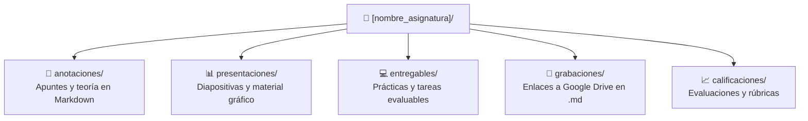

# Clases y Asignaturas Oficiales

Módulos formativos del **Curso de Especialización en Big Data e Inteligencia Artificial** (FP). Este directorio organiza el material pedagógico, apuntes, prácticas y evaluaciones de las asignaturas oficiales del curso.

---

## 📅 Índice Cronológico de Clases y Sesiones

A continuación se detallan las sesiones lectivas del curso ordenadas cronológicamente por fecha:

| Fecha | Asignatura / Módulo | Sesión / Temática | Recursos Asociados |
| :---: | :--- | :--- | :--- |
| **2026-10-01** | [**Presentación**](presentacion/) | Bienvenida institucional, metodología docente y presentación del programa formativo | [📊 Presentación (PDF)](<presentacion/presentaciones/Presentación MASTER IA y BIGDATA.pdf>)<br>[🎥 Grabación](presentacion/grabaciones/2026_10_01_grabacion_presentacion.md) |
| **2026-10-05** | [**Sistemas de Big Data**](sistemas_de_big_data/) | Matemáticas discretas y complejidad computacional | [📊 Material (DOCX)](<sistemas_de_big_data/presentaciones/2026-10-05 - SBD Conceptos Basicos.docx>)<br>[📝 Mat. Discretas](sistemas_de_big_data/anotaciones/matematicas_discretas.md)<br>[📝 Intro. Algoritmos](sistemas_de_big_data/anotaciones/introduccion_algoritmos.md) |

---

## 📝 Índice Cronológico de Anotaciones y Apuntes

Registro detallado de los apuntes teóricos y cuadernos de estudio, ordenados por fecha de publicación:

| Fecha | Asignatura | Documento de Anotaciones | Conceptos Clave Tratados | Acceso Directo |
| :---: | :--- | :--- | :--- | :---: |
| **2026-10-05** | Sistemas de Big Data | [Matemáticas Discretas](sistemas_de_big_data/anotaciones/matematicas_discretas.md) | Teoría de conjuntos, lógica proposicional, tablas de verdad, álgebra de Boole, grafos y árboles aplicados a Big Data con Python | [Leer apunte](sistemas_de_big_data/anotaciones/matematicas_discretas.md) |
| **2026-10-05** | Sistemas de Big Data | [Introducción a Algoritmos](sistemas_de_big_data/anotaciones/introduccion_algoritmos.md) | Complejidad computacional, notación Big O, análisis de tiempo y espacio, clases de complejidad en Python | [Leer apunte](sistemas_de_big_data/anotaciones/introduccion_algoritmos.md) |

> 💡 **Nota:** Cada vez que se incorporen nuevos apuntes teóricos a la subcarpeta `anotaciones/` de cualquier asignatura, deben registrarse en esta tabla cronológica indicando la fecha de impartición correspondiente.

---

## 🏛️ Estructura Estándar de una Asignatura

Cada asignatura sigue rigurosamente el esquema de cinco subcarpetas definido en las especificaciones del proyecto ([`AGENTS.md`](../AGENTS.md)):



### Descripción de Subcarpetas:
1. **`anotaciones/`**: Cuadernos de apuntes en Markdown enriquecido con diagramas Mermaid y ejemplos obligatorios en Python.
2. **`presentaciones/`**: Diapositivas en PDF u otros formatos facilitadas por el profesorado.
3. **`entregables/`**: Enunciados de prácticas, código fuente resuelto y documentación técnica requerida para la entrega.
4. **`grabaciones/`**: Ficheros Markdown con los enlaces directos a las grabaciones en la nube (Google Drive). **Nunca se almacenan vídeos directamente en el repositorio local.**
5. **`calificaciones/`**: Registro de notas obtenidas, rúbricas de corrección y comentarios de retroalimentación docente.

---

## 📂 Directorio de Asignaturas

Navegación por las asignaturas dadas de alta en el sistema:

### 1. [Presentación (`presentacion/`)](presentacion/)
*Fecha de inicio: 2026-10-01*
- [Anotaciones](presentacion/anotaciones/)
- [Presentaciones](presentacion/presentaciones/) (incluye [Presentación MASTER IA y BIGDATA.pdf](<presentacion/presentaciones/Presentación MASTER IA y BIGDATA.pdf>))
- [Entregables](presentacion/entregables/)
- [Grabaciones](presentacion/grabaciones/) (incluye [Grabación Sesión Inaugural](presentacion/grabaciones/2026_10_01_grabacion_presentacion.md))
- [Calificaciones](presentacion/calificaciones/)

### 2. [Sistemas de Big Data (`sistemas_de_big_data/`)](sistemas_de_big_data/)
*Fecha de inicio: 2026-10-05*
- [Anotaciones](sistemas_de_big_data/anotaciones/) (incluye [Matemáticas Discretas](sistemas_de_big_data/anotaciones/matematicas_discretas.md))
- [Presentaciones](sistemas_de_big_data/presentaciones/) (incluye [2026-10-05 - SBD Conceptos Basicos.docx](<sistemas_de_big_data/presentaciones/2026-10-05 - SBD Conceptos Basicos.docx>))
- [Entregables](sistemas_de_big_data/entregables/)
- [Grabaciones](sistemas_de_big_data/grabaciones/)
- [Calificaciones](sistemas_de_big_data/calificaciones/)

### 3. [Big Data Aplicado (`big_data_aplicado/`)](big_data_aplicado/)
*Fecha de inicio: 2026-10-15*
- [Anotaciones](big_data_aplicado/anotaciones/)
- [Presentaciones](big_data_aplicado/presentaciones/)
- [Entregables](big_data_aplicado/entregables/)
- [Grabaciones](big_data_aplicado/grabaciones/)
- [Calificaciones](big_data_aplicado/calificaciones/)

---

## 🐍 Automatización: Listar Anotaciones Cronológicamente en Python

El siguiente script en Python utiliza `pandas` para buscar automáticamente todos los apuntes Markdown y ordenarlos cronológicamente:

```python
from pathlib import Path
import re
import pandas as pd

def listar_anotaciones_por_fecha(directorio_clases: str = ".") -> pd.DataFrame:
    """
    Inspecciona todas las carpetas anotaciones/ en busca de archivos .md
    y extrae la fecha declarada o la fecha de modificación.
    """
    ruta_base = Path(directorio_clases)
    patron_fecha = re.compile(r"📅\s*\*\*Fecha:\*\*\s*(\d{4}-\d{2}-\d{2})")
    
    registros = []
    for archivo in ruta_base.glob("*/anotaciones/*.md"):
        contenido = archivo.read_text(encoding="utf-8")
        coincidencia = patron_fecha.search(contenido)
        
        fecha = coincidencia.group(1) if coincidencia else "Sin fecha"
        asignatura = archivo.parent.parent.name
        
        registros.append({
            "fecha": fecha,
            "asignatura": asignatura,
            "documento": archivo.name,
            "ruta": str(archivo)
        })
        
    df = pd.DataFrame(registros)
    if not df.empty:
        df = df.sort_values(by="fecha", ascending=True)
    return df

if __name__ == "__main__":
    df_anotaciones = listar_anotaciones_por_fecha()
    print(df_anotaciones.to_string(index=False))
```
