# Almacenamiento Masivo y Procesamiento de Datos

> Apuntes y conceptos teóricos de la asignatura **Big Data Aplicado**.  
> 📅 **Fecha:** 2026-10-07  
> 👨‍🏫 **Docente:** Alejandro Delgado  
> 📖 **Módulo:** Big Data Aplicado — Almacenamiento y Procesamiento de Datos  

---

## 📑 Índice de Contenidos

### Parte #1: Fundamentos y Tecnologías de Almacenamiento
1. [Introducción](#1-introducción)
   - 1.1. [Objetivos de la sesión](#11-objetivos-de-la-sesión)
   - 1.2. [Relevancia del Almacenamiento Masivo en la Era Digital](#12-relevancia-del-almacenamiento-masivo-en-la-era-digital)
2. [Definición y Características del Almacenamiento Masivo de Datos](#2-definición-y-características-del-almacenamiento-masivo-de-datos)
   - 2.1. [¿Qué es el almacenamiento masivo?](#21-qué-es-el-almacenamiento-masivo)
   - 2.2. [Características clave (Las 4 V's y Tradicional vs. Masivo)](#22-las-4-vs-aplicadas-al-almacenamiento-masivo)
   - 2.3. [Tipos de datos almacenados](#23-tipos-de-datos-almacenados)
   - 2.4. [Desafíos del almacenamiento masivo](#24-desafíos-del-almacenamiento-masivo)
3. [Evolución de las Tecnologías de Almacenamiento](#3-evolución-de-las-tecnologías-de-almacenamiento)
   - 3.1. [Comienzos (Tarjetas y Cinta)](#31-comienzos)
   - 3.2. [Discos Duros (HDD)](#32-discos-duros-hdd---hard-disk-drive)
   - 3.3. [Unidades de Estado Sólido (SSD)](#33-unidades-de-estado-sólido-ssd---solid-state-drive)
   - 3.4. [Almacenamiento en Red: NAS y SAN](#34-almacenamiento-en-red-nas-y-san)
   - 3.5. [Almacenamiento en la Nube](#35-almacenamiento-en-la-nube-cloud-storage)

### Parte #2: Estrategias, Protección y Gobernanza
4. [Estrategias sobre los Datos](#4-estrategias-sobre-los-datos)
   - 4.1. [Conceptos Básicos de Compresión](#41-conceptos-básicos-de-compresión)
   - 4.2. [Algoritmo Lempel-Ziv-Welch (LZW)](#42-algoritmo-lempel-ziv-welch-lzw)
   - 4.3. [Técnicas de Deduplicación](#43-técnicas-de-deduplicación)
   - 4.4. [Componentes, Beneficios y Consideraciones](#44-componentes-beneficios-y-consideraciones)
5. [Políticas sobre los Datos](#5-políticas-sobre-los-datos)
   - 5.1. [Importancia de las Copias de Seguridad](#51-importancia-de-las-copias-de-seguridad)
   - 5.2. [Tipos de Backup / Respaldo](#52-tipos-de-backup--respaldo)
   - 5.3. Estrategias de recuperación de datos
   - 5.4. Políticas de retención y cumplimiento normativo
6. [Resumen de la Unidad](#6-resumen-de-la-unidad-y-conclusiones)
   - 6.1. Recapitulación de conceptos clave
   - 6.2. Tendencias futuras en almacenamiento masivo
   - 6.3. Sesión de preguntas y respuestas

---

## 1. Introducción

### 1.1 Objetivos de la Sesión

Al finalizar la unidad didáctica, el alumnado será capaz de:
- **Comprender los conceptos fundamentales** que rigen el almacenamiento masivo de datos en entornos empresariales.
- **Identificar las diferentes tecnologías de almacenamiento** y entender su evolución histórica (desde medios secuenciales analógicos hasta almacenamiento distribuido en la nube).
- **Analizar las estrategias de gestión y optimización** de grandes volúmenes de información (reducción de huella física, compresión y deduplicación).
- **Evaluar las mejores prácticas en políticas de backup y recuperación de desastres** para garantizar la continuidad del negocio y el cumplimiento normativo.

---

### 1.2 Relevancia del Almacenamiento Masivo en la Era Digital

La digitalización integral de procesos, la proliferación de dispositivos IoT, el comercio electrónico y el aprendizaje automático han generado una explosión sin precedentes en la generación de datos:

- **Crecimiento exponencial:** La esfera global de datos (*Global Datasphere*) ha pasado de apenas unos pocos Zettabytes al inicio de la década de 2010 a superar los **175–180 Zettabytes** anuales.
  > 📌 **Dato gráfico:** Un volumen de 175 Zettabytes ($175 \times 10^{21}$ bytes) equivaldría metafóricamente a llenar de granos de arena todas las playas del planeta Tierra 8 veces consecutivas.
- **Toma de decisiones basada en datos (*Data-Driven*):** El almacenamiento masivo ya no es un mero repositorio pasivo; es la materia prima para la analítica avanzada, el entrenamiento de modelos predictivos y la inteligencia de negocios (BI).
- **Eje de la transformación digital:** Permite a las corporaciones romper silos informativos, centralizar el conocimiento y operar con arquitecturas escalables.

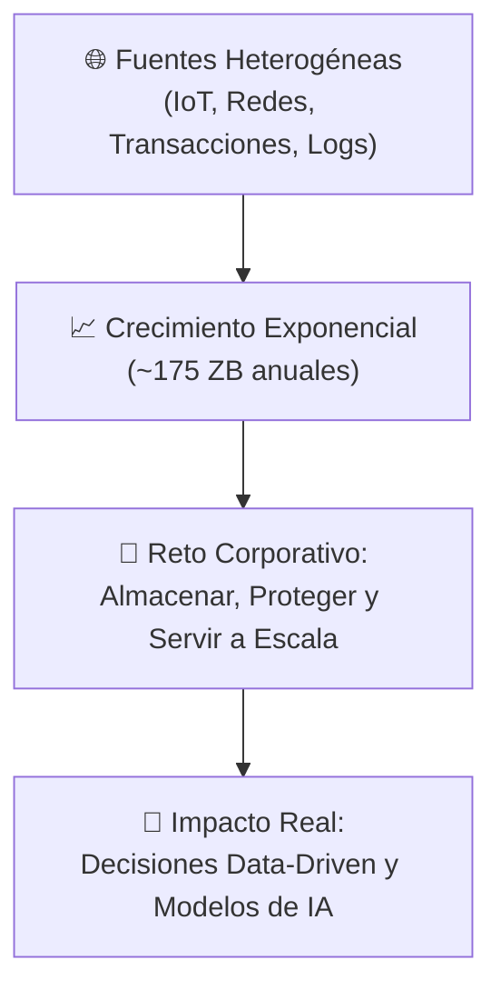


---

## 2. Definición y Características del Almacenamiento Masivo de Datos

### 2.1 ¿Qué es el Almacenamiento Masivo?

El **almacenamiento masivo de datos** (*Massive Data Storage*) hace referencia a las infraestructuras lógicas y de hardware específicamente diseñadas para retener, organizar, proteger y disponibilizar volúmenes de datos que superan ampliamente las capacidades de procesamiento y disco de un único servidor o sistema de almacenamiento tradicional.

A diferencia del almacenamiento convencional centrado en ficheros aislados o bases de datos departamentales, el almacenamiento masivo opera sobre **arquitecturas distribuidas, redundantes y elásticas**, garantizando alta disponibilidad, tolerancia a desastres y acceso continuo con baja latencia para analítica.

---

### 2.2 Las 4 V's Aplicadas al Almacenamiento Masivo

El paradigma clásico de Big Data adquiere implicaciones directas sobre los requerimientos de hardware y software de almacenamiento:

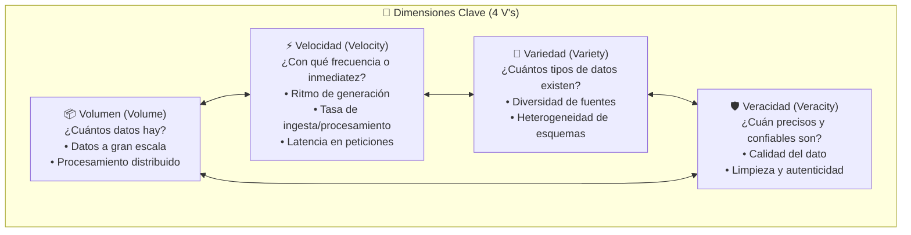

| Dimensión (V) | Pregunta Fundamental | Reto de Almacenamiento | Solución en Arquitectura Masiva |
| :--- | :--- | :--- | :--- |
| **Volumen** | *¿Cuánta información existe?* | Desbordamiento de la capacidad física de discos locales. | Clústeres distribuidos (*scale-out*), Data Lakes y almacenamiento de bloques/objetos elástico. |
| **Velocidad** | *¿Con qué frecuencia o tiempo real se reciben?* | Cuellos de botella en operaciones de entrada/salida (*I/O bottlenecks*) y escrituras concurrentes. | *Buffers* en memoria, almacenamiento NVMe/SSD, y sistemas de ingesta distribuida (ej. Apache Kafka). |
| **Variedad** | *¿Cuántas formas y estructuras tienen?* | Rigidez en motores relacionales tradicionales para albergar datos no tabulares. | Almacenamiento multipropósito: datos estructurados (tablas), semiestructurados (JSON, Parquet, Avro) y no estructurados (vídeos, logs, texto). |
| **Veracidad** | *¿Cuán veraces y exactos son los registros?* | Presencia de ruido, datos corruptos, duplicados o fuentes poco fiables. | Mecanismos de validación, sumas de comprobación (*checksums*), linaje de datos y pipelines de saneamiento. |

---

### 2.2.2 Comparativa: Almacenamiento Tradicional vs. Almacenamiento Masivo

Las diferencias estructurales entre un enfoque tradicional (RDBMS, NAS de oficina) y una infraestructura de datos masivos se resumen en los siguientes pilares organizados en dos filas:

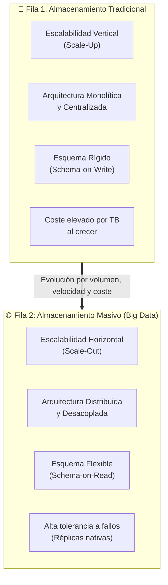

| Criterio | Almacenamiento Tradicional | Almacenamiento Masivo (Big Data) |
| :--- | :--- | :--- |
| **Escalabilidad** | **Vertical (*Scale-Up*):** Ampliar recursos (CPU, RAM, discos) del mismo servidor. Llega a un límite físico y económico insalvable. | **Horizontal (*Scale-Out*):** Añadir más nodos de hardware estándar (*commodity hardware*) interconectados mediante red de alta velocidad. Prácticamente ilimitada. |
| **Arquitectura** | **Centralizada:** Un servidor principal o cabinas de discos especializadas (SAN tradicionales). | **Distribuida y Desacoplada:** La computación y el almacenamiento pueden desacoplarse; los datos se particionan y replican a lo largo del clúster. |
| **Flexibilidad de Esquema** | **Esquema en Escritura (*Schema-on-Write*):** El modelo de datos debe definirse estrictamente antes de insertar los registros. | **Esquema en Lectura (*Schema-on-Read*):** Los datos se almacenan en su formato nativo; la estructura se valida y parsea al momento de la consulta. |
| **Complejidad Operativa** | Baja o moderada en entornos pequeños, pero muy frágil ante picos no planificados de carga. | Mayor complejidad de coordinación y sincronización, resuelta mediante capas de orquestación y tolerancia nativa a fallos. |

---

### 2.3 Tipos de Datos Almacenados

En las arquitecturas de almacenamiento masivo conviven diversas tipologías de datos con distintos grados de organización y flexibilidad:

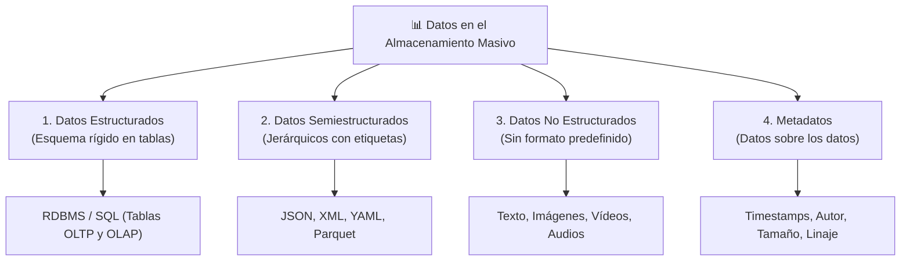

---

#### 1. Datos Estructurados: RDBS (*Relational Database Systems*)

Los **datos estructurados** siguen un modelo de datos rígido y formal definido previamente (**esquema en escritura** o *schema-on-write*). Se organizan en **tablas** compuestas por **filas** (registros o tuplas) y **columnas** (campos o atributos tipados: `Int`, `String`, `Date`, `Money`).

- **Garantías ACID:** Aseguran atomicidad, consistencia, aislamiento y durabilidad en transacciones.
- **Integridad Referencial:** Mediante claves primarias (*Primary Keys - PK*) y claves foráneas (*Foreign Keys - FK*).
- **Modelos relacionales habituales:**
  - **Modelo Transaccional (OLTP):** Normalizado para minimizar redundancias en operaciones de inserción, actualización y borrado concurrentes.
    - *Ejemplo visto en clase:* Tablas maestras `Customers`, `Employees` y `Products` vinculadas mediante la tabla transaccional `Orders`:
  
      | Tabla | Campos y Tipos Clave | Relación |
      | :--- | :--- | :--- |
      | `Customers` | `customerID (Int [PK])`, `firstName (String)`, `lastName (String)`, `birthDate (Date)`, `moneySpent (Money)` | 1 a N con `Orders` |
      | `Products` | `productID (Int [PK])`, `category (String)`, `price (Money)` | 1 a N con `Orders` |
      | `Employees` | `employeeID (Int [PK])`, `firstName (String)`, `lastName (String)`, `birthDate (Date)` | 1 a N con `Orders` |
      | `Orders` | `orderID (Int [PK])`, `customerID (Int [FK])`, `employeeID (Int [FK])`, `productID (Int [FK])`, `orderTotal (Money)`, `orderDate (Date)` | Tabla central |

  - **Modelo Dimensional (OLAP / Data Warehouse):** Diseñado para consultas analíticas masivas y agregaciones mediante esquemas en estrella (*Star Schema*):
    - *Tablas de Dimensión:* `STORE` (`Store_key [PK]`, `City`, `Region`), `PRODUCT` (`Product_key [PK]`, `Description`, `Brand`).
    - *Tabla de Hechos:* `SALES_FACT` (`Store_key [FK]`, `Product_key [FK]`, `Sales`, `Cost`, `Profit`).

##### 📄 Ejemplo de Definición y Registros en RDBS (SQL):
```sql
-- Definición de tabla estructurada con tipos estrictos y restricciones
CREATE TABLE Customers (
    customerID   INT PRIMARY KEY,
    firstName    VARCHAR(50) NOT NULL,
    lastName     VARCHAR(50) NOT NULL,
    birthDate    DATE,
    moneySpent   DECIMAL(10, 2) DEFAULT 0.00,
    anniversary  DATE
);

-- Registros tabulares perfectamente alineados en columnas
INSERT INTO Customers VALUES (1, 'Carlos', 'García', '1990-05-14', 1250.50, '2023-01-10');
INSERT INTO Customers VALUES (2, 'Lucía', 'Martín', '1988-11-23', 3420.00, '2021-06-15');
```

---

#### 2. Datos Semiestructurados: JSON y XML

Los **datos semiestructurados** no encajan en una cuadrícula tabular fija de filas y columnas, pero poseen una organización interna mediante **marcadores, etiquetas o claves autodescriptivas** que separan y jerarquizan los elementos (**esquema en lectura** o *schema-on-read*). Permiten campos opcionales, estructuras anidadas y evolución ágil del modelo.

##### A. JSON (*JavaScript Object Notation*)
Formato textual ligero basado en parejas `clave: valor` y listas ordenadas (arrays). Es el estándar de facto en APIs REST, mensajería de eventos (Kafka) y bases de datos documentales (MongoDB, CouchDB).

```json
{
  "endereco": {
    "cep": "31270901",
    "city": "Belo Horizonte",
    "neighborhood": "Pampulha",
    "service": "correios",
    "state": "MG",
    "street": "Av. Presidente Antônio Carlos, 6627"
  }
}
```

##### B. XML (*Extensible Markup Language*)
Lenguaje de marcado basado en etiquetas jerárquicas personalizables y atributos. Ampliamente utilizado en integración de sistemas legados, intercambio bancario, protocolos SOAP y configuraciones de clúster (ej. `core-site.xml` en Apache Hadoop).

```xml
<?xml version="1.0" encoding="UTF-8"?>
<endereco>
    <cep>31270901</cep>
    <city>Belo Horizonte</city>
    <neighborhood>Pampulha</neighborhood>
    <service>correios</service>
    <state>MG</state>
    <street>Av. Presidente Antônio Carlos, 6627</street>
</endereco>
```

---

#### 3. Datos No Estructurados

Carecen de cualquier tipo de modelo de datos o estructura formal predeterminada. Constituyen aproximadamente el **80% - 90%** del total de datos generados en el mundo y son los que más impulsan la necesidad de almacenamiento masivo y Big Data:

- **Tipos de Datos No Estructurados:**
  - Texto (ej. correos electrónicos, documentos).
  - Imágenes (ej. fotografías, radiografías).
  - Videos (ej. grabaciones, transmisiones).

Para gestionar estos datos masivos, se emplean diferentes enfoques. A continuación, se compara visualmente el almacenamiento clásico en bloques frente al almacenamiento de objetos (ideal para datos no estructurados):

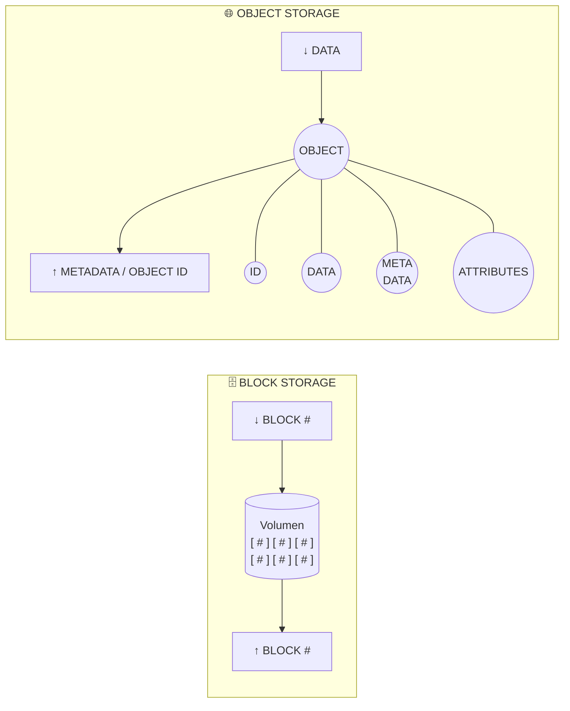

> 💡 **Nota:** Mientras que el **Block Storage** divide los archivos en bloques de tamaño fijo sin contexto adicional, el **Object Storage** empaqueta la información junto a identificadores únicos (`ID`), los propios datos (`DATA`), metadatos (`META DATA`) y atributos (`ATTRIBUTES`), lo que lo hace idóneo y altamente escalable para ecosistemas Big Data y Data Lakes.

---

#### 4. Metadatos (*Datos sobre los datos*)

Los **metadatos** identifican propiedades de los objetos almacenados y especifican cómo se les debe controlar cuando se accede a ellos, proporcionando información contextual vital para el almacenamiento masivo.

Atendiendo a su capacidad de modificación a lo largo del ciclo de vida del dato, se dividen en dos categorías principales:

- **Metadatos Editables:**
  - **Control de acceso:** Permisos de lectura/escritura (ACLs), roles y políticas de seguridad.
  - **Encoding:** Codificación de los datos.
  - **Content-Language y Content-Type:** Idioma y formato del objeto (ej. `application/json`, `image/png`).
  - **Retention time:** Tiempo de retención de los datos antes de su borrado o archivo por políticas de ciclo de vida.

- **Metadatos No Editables:**
  - **Generation / Versiones:** Identificador de la versión del objeto (cuando el versionado está activo en el bucket).
  - **Checksum / Suma de Verificación:** Hashes para control de integridad (ej. MD5, SHA-256) que garantizan que el archivo no ha sido alterado o corrompido.
  - **Hora y Fecha de Modificación:** Timestamps generados automáticamente por el sistema al subir o alterar el objeto.

> 💡 **Nota Práctica:** En soluciones de *Cloud Storage* (como Amazon S3, Google Cloud Storage o un bucket genérico), se suelen exponer estas propiedades a través de la interfaz web, permitiendo al usuario configurar el versionado (para recuperar versiones anteriores si se sobrescribe un objeto) o habilitar registros de acceso (*server access logging*) para auditar quién accede a los datos.

##### 📋 Ejemplo de Cabeceras de Metadatos (Petición HTTP):
```http
Content-Type: image/jpeg
Content-Length: 4194304
Last-Modified: Wed, 07 Oct 2026 19:15:00 GMT
ETag: "68b329da9893e34099c7d8ad5cb9c940"
x-amz-storage-class: GLACIER_IR
x-amz-meta-departamento: Analitica_BigData
x-amz-meta-clasificacion: Confidencial
```

#### 5. Tabla Comparativa Resumen de Tipologías de Datos

| Criterio | Datos Estructurados (RDBS) | Datos Semiestructurados (JSON / XML) | Datos No Estructurados | Metadatos |
| :--- | :--- | :--- | :--- | :--- |
| **Modelo / Esquema** | Rígido (*Schema-on-Write*) | Flexible (*Schema-on-Read*) | Ninguno / Sin modelo | Estructurado o semiestructurado |
| **Organización** | Tablas (filas y columnas) | Claves, árboles, etiquetas | Ficheros binarios o texto plano | Pares clave-valor / cabeceras |
| **Almacenamiento Típico** | RDBMS (PostgreSQL, MySQL, Oracle) | NoSQL documental, Data Lakes | Data Lakes, S3, HDFS | Catálogos de datos, índices |
| **Flexibilidad de Cambio** | Baja (requiere `ALTER TABLE`) | Alta (admite campos dinámicos) | Total (cualquier contenido) | Alta |
| **Facilidad de Búsqueda** | Muy alta con SQL e índices | Alta con motores NoSQL / JSONPath | Requiere indexación/IA/embeddings | Muy alta mediante catálogos |

---

### 2.4 Desafíos del Almacenamiento Masivo

El despliegue y mantenimiento de infraestructuras de almacenamiento a gran escala presenta varios retos críticos para las organizaciones:

- **Gestión de la Complejidad:** Administrar infraestructuras distribuidas, asegurar la disponibilidad de los datos y coordinar múltiples arquitecturas (híbridas, multicloud).
- **Seguridad y Privacidad de los datos:** Proteger la información contra accesos no autorizados, aplicar controles de acceso estrictos, y garantizar el cumplimiento normativo.
- **Costos de Implementación y Mantenimiento:** Gestionar la inversión en infraestructura y el gasto recurrente derivado del almacenamiento, transferencia y personal especializado.
- **Consumo Energético y Huella de Carbono:** El procesamiento masivo y la refrigeración continua de los Data Centers tienen un impacto medioambiental significativo.

#### Sostenibilidad y Huella de Carbono Digital

Uno de los principales focos actuales en la industria es la sostenibilidad tecnológica. La migración de infraestructuras locales (*On-Premises*) hacia proveedores Cloud altamente optimizados puede reducir drásticamente las emisiones.

> 💡 **Impacto Cloud (Ejemplo AWS):** Optimizar las cargas de trabajo migrándolas a proveedores de nube pública como AWS puede reducir la huella de carbono asociada hasta en un **99%**. Esta reducción drástica se alcanza sumando la eficiencia del hardware a escala, la eficiencia de los sistemas de refrigeración de última generación y la inversión en fuentes de energía libre de carbono.

A nivel de organización y usuario, existen acciones cotidianas fundamentales para reducir la **huella de carbono digital**:

1. **Envía menos correos:** Evitar correos y contestaciones innecesarias; cada envío consume CO2.
2. **Limpia tu bandeja de entrada:** No almacenar correos inútiles y darse de baja de suscripciones innecesarias libera espacio en servidores.
3. **Reduce el peso de los mensajes:** Emplear enlaces a repositorios o nubes en lugar de adjuntar archivos pesados.
4. **Cierra o desinstala apps que no utilices:** Evitar programas que consumen recursos (CPU, red) en segundo plano.
5. **Comenta y actualiza con moderación:** Pensar si lo que se va a publicar realmente aporta valor, reduciendo el ruido en la red.
6. **Utiliza proveedores de hosting responsables:** Priorizar a aquellos proveedores (ej. *dinahosting*, AWS, etc.) que aplican medidas reales para cuidar el medioambiente y disminuir su huella de carbono.

---

## 3. Evolución de las Tecnologías de Almacenamiento

La forma en que almacenamos y procesamos la información ha evolucionado drásticamente a lo largo del tiempo para adaptarse a volúmenes cada vez mayores.

### 3.1 Comienzos

- **Tarjetas Perforadas:** Fueron el primer medio empleado para el almacenamiento y procesamiento automatizado de datos. La información se representaba de forma física mediante la presencia o ausencia de agujeros en posiciones específicas de una cartulina, sirviendo como un sistema binario mecánico y rudimentario.
- **Cinta Magnética:**
  - **Contexto:** Es la tecnología de almacenamiento de datos más antigua que aún continúa en uso activo en la actualidad.
  - **Ventajas:** Ofrece un costo de almacenamiento extremadamente bajo por terabyte y una altísima capacidad (como los estándares modernos LTO).
  - **Desventajas:** Su acceso es **secuencial** (para leer un dato concreto, es necesario desenrollar y recorrer físicamente toda la cinta anterior), lo que lo hace muy lento para lectura aleatoria o consultas ágiles.
  - **Uso actual:** Se utiliza masivamente para **Backups a largo plazo** y archivado profundo (*Cold Storage*), donde el tiempo de recuperación no es crítico.

### 3.2 Discos Duros (HDD - *Hard Disk Drive*)

- **Contexto:** Ha sido la tecnología de almacenamiento dominante durante décadas en la informática comercial y personal.
- **Funcionamiento (Mecánico/Magnético):** Su funcionamiento se basa en **platos giratorios** (discos magnéticos) y **cabezales de lectura/escritura** ubicados en el extremo de un brazo móvil (actuador). 
  - *Componentes anatómicos clave:* Disco, Eje central, Cabezal, Brazo y Eje del actuador, además de conectores de energía y datos (IDE/SATA).
- **Ventajas:** Excelente relación **capacidad/precio**. Permiten disponer de grandes volúmenes de almacenamiento a un coste muy asequible para sistemas locales y centros de datos tradicionales.
- **Desventajas:** 
  - Su **velocidad está físicamente limitada** por las RPM (revoluciones por minuto) de los platos y el desplazamiento del cabezal.
  - Al poseer **partes móviles**, son altamente susceptibles a fallos mecánicos por golpes, vibraciones o desgaste físico con el tiempo.

### 3.3 Unidades de Estado Sólido (SSD - *Solid State Drive*)

- **Funcionamiento (Electrónico):** A diferencia de los HDD, no tienen componentes mecánicos. Están basados íntegramente en chips de **memoria flash NAND**.
- **Ventajas:** 
  - **Mayor velocidad:** Tiempos de acceso y tasas de transferencia inmensamente superiores, reduciendo drásticamente la latencia.
  - **Sin partes móviles:** Lo que los hace silenciosos, con menor consumo energético y muy resistentes a golpes o vibraciones.
- **Desventajas:**
  - **Costo más elevado** por gigabyte/terabyte en comparación con los discos mecánicos.
  - **Limitaciones físicas de escritura:** Las celdas de memoria NAND sufren desgaste por cada ciclo de escritura/borrado, lo que limita su vida útil (aunque con tecnologías modernas como *wear leveling* esto se mitiga significativamente).
- **Formatos y Conexiones Habituales (Ecosistema SSD):**
  - **SATA:** El formato clásico (ej. 2.5"), compatible con conexiones de discos duros antiguos pero limitado por el ancho de banda del bus SATA.
  - **PCIe:** Tarjetas conectadas directamente a las ranuras PCIe de la placa base, ofreciendo gran rendimiento.
  - **M.2:** Formato compacto y moderno (como una pequeña placa), que aprovecha los protocolos NVMe a través de líneas PCIe para máxima velocidad.
  - **U.2:** Formato empresarial, con apariencia similar a discos de 2.5" pero diseñado para servidores y cabinas de almacenamiento con interfaces NVMe.
- **Uso actual:** Existe una **tendencia creciente en adopción** absoluta, convirtiéndose en el estándar para almacenamiento primario, cachés de bases de datos y procesamiento en caliente (*Hot Data*).

### 3.4 Almacenamiento en Red: NAS y SAN

A medida que crecieron las necesidades, el almacenamiento dejó de estar físicamente anclado a un único ordenador (*Direct Attached Storage* o DAS) para independizarse a través de la red:

#### NAS (*Network Attached Storage*)
- **Concepto:** Dispositivos dedicados (servidores de almacenamiento) que se conectan directamente a la red local (LAN) estándar de la empresa.
- **Ventajas:** Muy **fácil implementación y gestión**. Permite que múltiples clientes (PC 1, PC 2) accedan a los mismos archivos compartidos de forma simultánea.

#### SAN (*Storage Area Network*)
- **Concepto:** Es una **red dedicada de alta velocidad** exclusiva para el almacenamiento, independiente de la red local de usuarios.
- **Ventajas:** Proporciona un **mayor rendimiento y escalabilidad**. Los servidores (como hipervisores o servidores de correo) ven el almacenamiento SAN como si fuera un disco local (por ejemplo, mediante protocolos como iSCSI o Fibre Channel).
- **Uso clave:** Es el pilar fundamental para la **Virtualización** empresarial y bases de datos críticas.

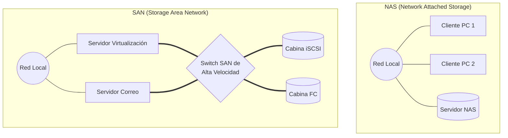

> 💡 **Diferencia clave:** En NAS, el almacenamiento viaja por la misma red que usan los usuarios (nivel de archivo). En SAN, existe una sub-red trasera hiper-rápida y exclusiva entre los servidores y las cabinas de almacenamiento (nivel de bloque).

### 3.5 Almacenamiento en la Nube (*Cloud Storage*)

El paso definitivo en la evolución es externalizar el almacenamiento y delegarlo en grandes proveedores de nube pública, accediendo a los datos de forma ubicua a través de Internet.

- **Ventajas:**
  - **Escalabilidad bajo demanda:** Capacidad de almacenamiento virtualmente ilimitada que crece o decrece instantáneamente según las necesidades.
  - **Reducción de costos de infraestructura:** Elimina la necesidad de inversión inicial (CAPEX) en hardware y mantenimiento, pasando a un modelo de pago por uso (OPEX).
  - **Accesibilidad global:** Los datos están disponibles desde cualquier ubicación geográfica con conexión a Internet.
- **Desafíos:**
  - **Seguridad y Privacidad:** Delegar los datos a un tercero implica retos en cifrado, soberanía del dato y confianza en la nube.
  - **Dependencia de la Conectividad:** Sin conexión a Internet o ante caídas de red, los datos quedan temporalmente inaccesibles.
  - **Costos a largo plazo (FinOps):** Si no se gestiona correctamente el ciclo de vida de los datos o las cuotas, el pago por uso recurrente puede disparar los costes empresariales.
- **Principales Proveedores y Soluciones:**
  - **Amazon Web Services (AWS):** Amazon S3 (Object Storage) y Amazon Elastic Block Store - EBS (Block Storage).
  - **Microsoft Azure:** Azure Blob Storage (Object Storage) y Azure Managed Disks (Block Storage).
  - **Google Cloud Platform (GCP):** Google Cloud Storage (Object Storage) y Persistent Disk (Block Storage).

---

## 4. Estrategias sobre los Datos

### 4.1 Conceptos Básicos de Compresión

**Definición:** Consiste en reducir el tamaño físico que ocupan los datos en el medio de almacenamiento con el fin de optimizar el espacio y acelerar las transferencias, idealmente sin perder información original.

#### Tipos de Compresión

- **Compresión Sin Pérdida (*Lossless*):** 
  - Al descomprimir el archivo, se recupera el 100% de los datos originales exactos, bit a bit.
  - *Ejemplo conceptual (Run-Length Encoding):* En lugar de almacenar textualmente cientos de caracteres idénticos ("AAAAAAAAA..."), el algoritmo guarda una instrucción lógica como "Repetir 'A' 143 veces".
  - *Formatos y algoritmos comunes:* ZIP, GZIP, DEFLATE, **PNG** (imágenes sin pérdida).
- **Compresión Con Pérdida (*Lossy*):** 
  - Al descomprimir, el archivo resultante es una aproximación del original (se descarta información no vital o imperceptible para los sentidos humanos). Es el estándar para formatos multimedia para ahorrar gran cantidad de espacio.
  - *Formatos comunes:* **JPG/JPEG** (imágenes), MP3 (audio), MP4 (vídeo).

> 🖼️ **Ejemplo Práctico (Impacto en almacenamiento):** Al aplicar ambos métodos a una misma fotografía, un archivo en formato **PNG (Lossless)** puede ocupar por ejemplo **377 KB**, preservando cada píxel intacto. Si esa misma imagen se comprime a **JPG (Lossy)**, su tamaño puede reducirse drásticamente a **60.3 KB**; a simple vista el ser humano apenas notará la diferencia, pero a nivel binario se habrán descartado millones de datos prescindibles.

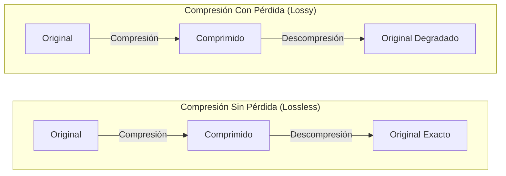

### 4.2 Algoritmo Lempel-Ziv-Welch (LZW)

Uno de los algoritmos de **compresión sin pérdida (*lossless*)** universales más famosos y utilizados (base de formatos como GIF o herramientas ZIP) es el **LZW**.

Su lógica se fundamenta en la creación de un diccionario dinámico durante la lectura de los datos. En lugar de guardar secuencias de caracteres completas repetidas, el algoritmo sustituye las cadenas por referencias a entradas previas en el diccionario.

- **Ejemplo de funcionamiento (Prefijos comunes):**
  Si analizamos una lista de palabras ordenadas alfabéticamente:
  1. `a`
  2. `abandon` → Almacena `1 bandon` (reutiliza el prefijo de longitud 1 de la línea 1).
  3. `ability` → Almacena `2 ility` (reutiliza el prefijo "ab" de longitud 2).
  4. `able` → Almacena `2 le` (reutiliza el prefijo "ab").
  5. `abortion` → Almacena `2 ortion`.
  6. `about` → Almacena `3 ut` (reutiliza "abo" de la palabra anterior, longitud 3).
  
  Con este método, se evita almacenar textualmente partes de los datos que ya han aparecido, reduciendo el tamaño total del archivo mediante punteros lógicos.

> 🔗 **Recurso Adicional (Compartido en clase):** [Técnica de Compresión LZW (GeeksforGeeks)](https://www.geeksforgeeks.org/computer-networks/lzw-lempel-ziv-welch-compression-technique/)

### 4.3 Técnicas de Deduplicación

**Definición:** Proceso que consiste en escanear el almacenamiento para encontrar y **eliminar copias redundantes** de datos, dejando una única copia física y reemplazando las copias repetidas por punteros o referencias a la original.

#### Niveles de Deduplicación

La granularidad con la que se analizan las redundancias puede variar:
1. **A nivel de archivo:** Analiza ficheros enteros. Si dos usuarios suben el mismo PDF, solo se guarda uno. Es muy rápido pero menos eficiente si solo cambia una coma del fichero.
2. **A nivel de bloque:** Divide los ficheros en bloques de tamaño fijo o variable. Si cambia un archivo, solo se almacena el bloque modificado, el resto de bloques se reutilizan. Es el estándar de facto en almacenamiento corporativo y copias de seguridad.
3. **A nivel de byte:** Máxima granularidad. Muy preciso pero exige un coste computacional extremadamente alto.

#### Estrategias de Implementación

- **Inline (en tiempo real):** Los datos se deduplican en la propia memoria RAM o controladora de almacenamiento *antes* de ser escritos en los discos. Ahorra muchísimo espacio físico y ancho de banda, pero requiere CPUs muy potentes para no penalizar el rendimiento.
- **Post-process (diferido):** Los datos se escriben tal cual llegan (con redundancias) para máxima velocidad de ingesta. Posteriormente, en momentos de baja carga del sistema (por la noche), un proceso escanea los discos, detecta duplicados, los elimina y los reemplaza por punteros.

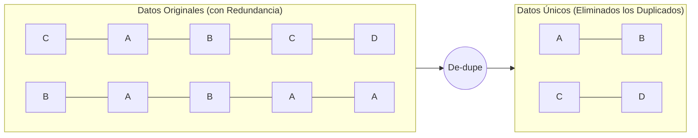

### 4.4 Componentes, Beneficios y Consideraciones

Antes de profundizar en técnicas específicas (como compresión o deduplicación), es necesario establecer una **Estrategia de Datos (Analytics Strategy)** sólida. Esta estrategia funciona como una brújula que alinea los esfuerzos técnicos con los objetivos de la organización.

#### 4.4.1 Pilares de una Analytics Strategy

Una estrategia analítica integral se sostiene sobre seis dimensiones fundamentales interconectadas:

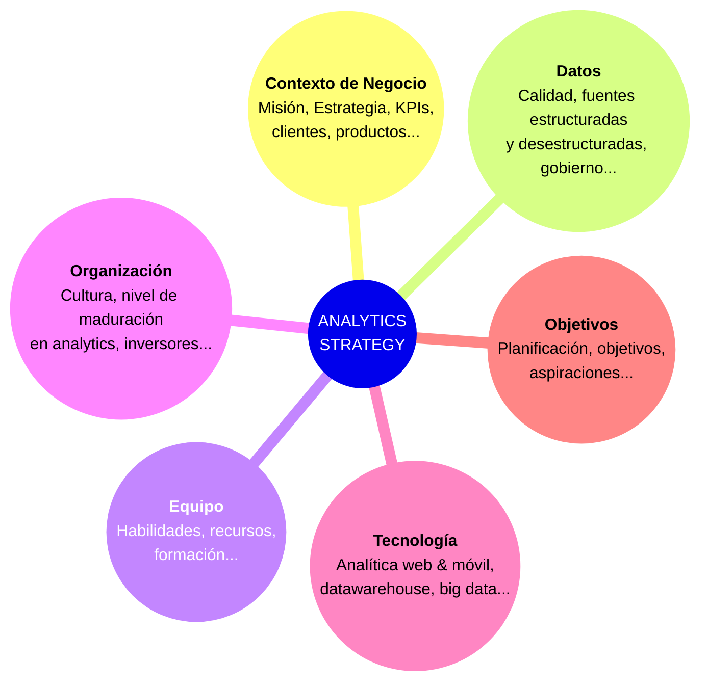

#### 4.4.2 Elementos de una Estrategia de Almacenamiento

Al descender al nivel puramente técnico de los datos (almacenamiento), toda estrategia debe contemplar:

- **Componentes:**
  - Herramientas de **Catálogo de Datos**.
  - Herramientas de **Administración de Datos**.
  - Herramientas de **Análisis de Datos**.

- **Beneficios esperados (aplicando técnicas como compresión/deduplicación):**
  - Reducción del espacio físico de almacenamiento necesario.
  - Optimización del ancho de banda en las transferencias de red.
  - Reducción general de costes operativos (OPEX) y de infraestructura (CAPEX).

- **Consideraciones técnicas:**
  - **Impacto en el Rendimiento:** Las técnicas de optimización consumen ciclos de CPU y RAM.
  - **Compatibilidad con Aplicaciones:** Asegurar que los sistemas dependientes puedan leer los formatos comprimidos o deduplicados de forma transparente.
  - **Equilibrio Coste-Beneficio:** Encontrar el *sweet spot* (punto ideal) entre la tasa de compresión lograda y el tiempo extra de procesamiento requerido.

---

## 5. Políticas sobre los Datos

La gestión y salvaguarda de la información es tan crítica como su almacenamiento. Implementar políticas de datos robustas garantiza que la información esté disponible y protegida ante desastres o requerimientos legales.

### 5.1 Importancia de las Copias de Seguridad

- **Protección contra Pérdida de Datos:**
  - Evitar el impacto por borrado o eliminación (accidental o malintencionada).
  - Preservar la confidencialidad e integridad de la información frente a brechas de seguridad.
  
- **Principio de Responsabilidad Proactiva, Compromisos y Cumplimientos:**
  - Obligatoriedad de adherirse al **GDPR (General Data Protection Regulation)** en el marco europeo.
  - Garantizar que los datos recogidos se basan en un uso con consentimiento explícito de los usuarios.
  
- **Cumplimiento Normativo:**
  - Respetar las normativas impuestas por Organismos Reguladores específicos del sector (ej. banca, salud, administraciones públicas).
  
- **Continuidad del Negocio:**
  - Ayuda a **prevenir, identificar y minimizar o eliminar los riesgos** asociados a la pérdida temporal o permanente de los datos operacionales de la empresa.

### 5.2 Tipos de Backup / Respaldo

Dependiendo de la estrategia de redundancia y el espacio disponible, las políticas de datos implementan diferentes aproximaciones para los respaldos diarios.

#### 1. Copia de Seguridad Completa
- **Todos los datos son completamente copiados** en cada ejecución.
- **Característica principal:** Fácil administración (para restaurar el sistema solo se necesita el backup del día deseado).

```mermaid
%%{init: {
  'theme': 'base',
  'themeVariables': {
    'activeTaskBkgColor': '#3b82f6',
    'activeTaskBorderColor': '#2563eb',
    'critBkgColor': '#f97316',
    'critBorderColor': '#ea580c',
    'doneTaskBkgColor': '#22c55e',
    'doneTaskBorderColor': '#16a34a',
    'taskTextLightColor': '#ffffff'
  }
}}%%
gantt
    title Copia de Seguridad Completa
    dateFormat X
    axisFormat %s
    
    section Dom
    Completa :active, 0, 10
    section Lun
    Completa :active, 0, 11
    section Mar
    Completa :active, 0, 11
    section Mie
    Completa :active, 0, 12
    section Jue
    Completa :active, 0, 12
    section Vie
    Completa :active, 0, 13
    section Sab
    Completa :active, 0, 13
    section Dom 
    Completa :active, 0, 14
```

#### 2. Copia de Seguridad Incremental Acumulativa
- Copia de seguridad completa una vez a la semana (ej. Domingo).
- En el resto de la semana, la **diferencia con la última copia de seguridad completa** es copiada cada día.

```mermaid
%%{init: {
  'theme': 'base',
  'themeVariables': {
    'activeTaskBkgColor': '#3b82f6',
    'activeTaskBorderColor': '#2563eb',
    'critBkgColor': '#f97316',
    'critBorderColor': '#ea580c',
    'doneTaskBkgColor': '#22c55e',
    'doneTaskBorderColor': '#16a34a',
    'taskTextLightColor': '#ffffff'
  }
}}%%
gantt
    title Copia Incremental Acumulativa
    dateFormat X
    axisFormat %s

    section Dom
    Completa :active, 0, 10
    section Lun
    Inc. Acum. :crit, 0, 1
    section Mar
    Inc. Acum. :crit, 0, 2
    section Mie
    Inc. Acum. :crit, 0, 3
    section Jue
    Inc. Acum. :crit, 0, 4
    section Vie
    Inc. Acum. :crit, 0, 5
    section Sab
    Inc. Acum. :crit, 0, 6
    section Dom 
    Completa :active, 0, 10
```

#### 3. Copia de Seguridad Incremental Diferencial
- Copia de seguridad completa una vez a la semana.
- El resto de la semana, la **diferencia de datos con la última copia de seguridad** es copiada cada día.

```mermaid
%%{init: {
  'theme': 'base',
  'themeVariables': {
    'activeTaskBkgColor': '#3b82f6',
    'activeTaskBorderColor': '#2563eb',
    'critBkgColor': '#f97316',
    'critBorderColor': '#ea580c',
    'doneTaskBkgColor': '#22c55e',
    'doneTaskBorderColor': '#16a34a',
    'taskTextLightColor': '#ffffff'
  }
}}%%
gantt
    title Copia Incremental Diferencial
    dateFormat X
    axisFormat %s

    section Dom
    Completa :active, 0, 10
    section Lun
    Diferencial :done, 0, 1
    section Mar
    Diferencial :done, 0, 1
    section Mie
    Diferencial :done, 0, 1
    section Jue
    Diferencial :done, 0, 1
    section Vie
    Diferencial :done, 0, 1
    section Sab
    Diferencial :done, 0, 1
    section Dom 
    Completa :active, 0, 10
```


---

## 6. Resumen de la Unidad y Conclusiones

*(Pendiente de impartición: recapitulación de ideas clave y tendencias en almacenamiento masivo)*
