# Introducción a los Algoritmos, Estructuras de Datos y Complejidad Computacional

> Apuntes y ampliación de teoría de la asignatura **Sistemas de Big Data**.  
> 📅 **Fecha:** 2026-10-05  
> 📖 **Documento de referencia:** `2026-10-05 - SBD Conceptos Basicos.docx` (Bloque 3: Algorítmica)

---

## 1. Fundamentos de Algoritmos

En ciencias de la computación e ingeniería de datos, un **algoritmo** es una secuencia ordenada, unívoca y finita de instrucciones o pasos lógicos bien definidos que toma un conjunto de datos de entrada (*input*), realiza una serie de transformaciones computacionales y produce una salida o solución (*output*).

Los algoritmos son las "recetas" analíticas que permiten automatizar la resolución de problemas complejos. En entornos de **Big Data**, donde los volúmenes de datos superan con creces la memoria de una única máquina, la elección y diseño de algoritmos eficientes determina si un pipeline de procesamiento tarda segundos o semanas en ejecutarse.

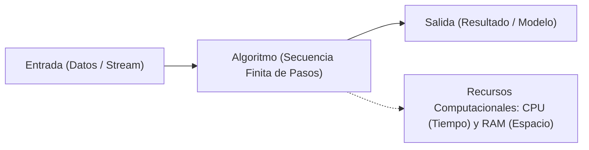

### 1.1 Características Formales de un Algoritmo

Para que una secuencia de pasos sea considerada formalmente un algoritmo, debe satisfacer tres características esenciales:

1. **Finitud (*Finiteness*):** El algoritmo debe finalizar obligatoriamente tras un número finito de pasos para cualquier conjunto de datos de entrada válido. No puede quedar atrapado en bucles infinitos no intencionados ni consumir ciclos de cálculo indefinidamente.
2. **Definición (*Definiteness* / Precisión):** Cada paso o instrucción debe estar definido de forma exacta, rigurosa y libre de ambigüedades. Ante las mismas entradas, la ejecución debe seguir sistemáticamente el mismo comportamiento y arrojar el mismo resultado determinista.
3. **Efectividad (*Effectiveness*):** Cada operación básica debe ser realizable de manera exacta utilizando una cantidad finita de recursos de hardware (tiempo de procesador y memoria física disponible).

---

### 1.2 Pseudocódigo: Planificando la Solución

El **pseudocódigo** es una descripción informal de alto nivel de un algoritmo que combina lenguaje natural con estructuras sintácticas de programación. Funciona como un **puente conceptual** entre la formulación abstracta de la solución y su implementación final en un lenguaje concreto (como Python, Scala o Java):

- **Independencia del lenguaje:** Permite centrarse exclusivamente en la lógica algorítmica sin preocuparse por tipados estrictos, gestión manual de punteros o particularidades sintácticas.
- **Estructura legible:** Emplea palabras clave universales como `SI`, `ENTONCES`, `SINO`, `MIENTRAS`, `PARA` y `RETORNAR`, utilizando la **indentación** para delimitar bloques y jerarquías.
- **Herramienta de diseño y comunicación:** Facilita la discusión técnica, la revisión por pares (*peer review*) y el diseño de la arquitectura antes de escribir código de producción.

#### Ejemplo Comparativo: Pseudocódigo vs Implementación en Python

```text
ALGORITMO CalcularMediaSuperiores(lista_valores, umbral)
    suma <- 0
    contador <- 0
    PARA CADA valor EN lista_valores HACER
        SI valor > umbral ENTONCES
            suma <- suma + valor
            contador <- contador + 1
        FIN SI
    FIN PARA
    SI contador > 0 ENTONCES
        RETORNAR suma / contador
    SINO
        RETORNAR 0
    FIN SI
FIN ALGORITMO
```

*Implementación en Python:*
```python
def calcular_media_superiores(lista_valores: list, umbral: float) -> float:
    """Calcula la media de los valores que superan un umbral determinado."""
    superiores = [v for v in lista_valores if v > umbral]
    return sum(superiores) / len(superiores) if superiores else 0.0

# Prueba
valores = [12.5, 45.0, 78.2, 10.0, 95.4]
media = calcular_media_superiores(valores, umbral=40.0)
print(f"Media de valores superiores a 40.0: {media:.2f}")
```

---

### 1.3 Estructuras de Control: Dirigiendo el Flujo

El teorema de la estructura de Böhm-Jacopini demostró que cualquier algoritmo computable puede expresarse combinando únicamente tres estructuras de control básicas:

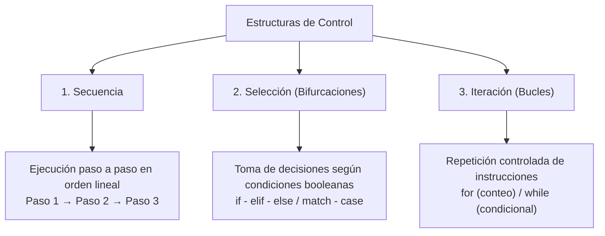

1. **Secuencia:** Flujo lineal donde las instrucciones se ejecutan estrictamente una tras otra en el orden en que fueron escritas.
2. **Selección:** Ramificación condicional basada en el valor de verdad ($V$ o $F$) de una expresión booleana (`if`, `if-else`, `match-case`).
3. **Iteración:** Repetición controlada de un bloque de código:
   - Bucles por conteo (`for`): Se repiten un número predeterminado de veces o sobre una colección iterable.
   - Bucles por condición (`while`): Se repiten mientras una condición booleana permanezca verdadera.

---

## 2. Tipos de Datos y Estructuras en Memoria

La forma en que se estructuran y almacenan los datos en memoria determina la velocidad y la eficiencia con la que los algoritmos pueden operar sobre ellos:

| Categoría | Descripción | Ejemplos en Computación | Representación en Python |
| :--- | :--- | :--- | :--- |
| **Primitivos** | Bloques básicos atómicos almacenados directamente en registros o celdas de memoria. | Enteros (`int`), flotantes (`float`), booleanos (`bool`), caracteres (`char`). | `int`, `float`, `bool`, `str` |
| **Estructurados** | Composiciones que agrupan primitivos u otras estructuras en un formato contiguo o enlazado. | Arreglos contiguos (*Arrays*), listas dinámicas, tuplas, registros (*Structs*). | `list`, `tuple`, `dict` |
| **Abstractos (TAD)** | Modelos conceptuales que definen el comportamiento de una estructura (operaciones permitidas) sin ligarse a su implementación interna. | Pilas (*Stacks*), Colas (*Queues*), Grafos, Árboles, Tablas Hash. | Clases especializadas (`deque`, `heapq`) |

### 2.1 Tipos Abstractos de Datos: Pilas y Colas

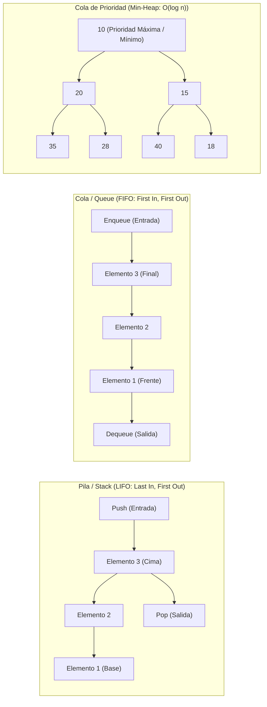

- **Pila (*Stack* - LIFO):** El último elemento en entrar es el primero en salir. Fundamental para la gestión de llamadas a funciones (*Call Stack*), operaciones de deshacer (*Undo*) y algoritmos de recorrido en profundidad (DFS).
- **Cola (*Queue* - FIFO):** El primer elemento en entrar es el primero en salir. Indispensable en arquitecturas de Big Data para procesar flujos de mensajes en streaming (buffers en Apache Kafka, colas de tareas en RabbitMQ o Celery).
- **Cola de Prioridad (*Heap*):** Árbol binario semiordenado que mantiene siempre el elemento de máxima prioridad en la raíz. Permite extracciones en $O(1)$ e inserciones en $O(\log n)$ (utilizado por el algoritmo de Dijkstra y planificadores de tareas en clústeres YARN/Kubernetes).

#### Ejemplo Práctico en Python: Procesamiento de Mensajes con `collections.deque`

```python
from collections import deque

# Modelado de una cola de ingestión de eventos en streaming (FIFO)
cola_ingesta = deque(maxlen=100)

# Productores envían eventos
cola_ingesta.append({"id": "evt-01", "sensor": "temp-A", "valor": 23.4})
cola_ingesta.append({"id": "evt-02", "sensor": "temp-B", "valor": 25.1})
cola_ingesta.append({"id": "evt-03", "sensor": "temp-A", "valor": 24.0})

print("Eventos encolados para procesamiento:", len(cola_ingesta))

# Consumidor procesa eventos en orden estricto de llegada
while cola_ingesta:
    evento = cola_ingesta.popleft() # O(1) tiempo constante
    print(f" -> Procesando {evento['id']}: Sensor {evento['sensor']} = {evento['valor']} °C")
```

---

## 3. Complejidad Computacional y Notación Big O

El análisis de la complejidad computacional permite evaluar y predecir el comportamiento y la escalabilidad de un algoritmo a medida que el tamaño de la entrada de datos ($n$) tiende a infinito ($n \to \infty$).

El rendimiento se mide en dos dimensiones fundamentales:
- **Complejidad Temporal ($T(n)$):** Número de operaciones primitivas ejecutadas por la CPU.
- **Complejidad Espacial ($S(n)$):** Cantidad de memoria RAM adicional requerida durante la ejecución.

### 3.1 La Notación Big O ($O$)

La notación **Big O** describe la **cota superior asintótica** de un algoritmo; es decir, representa el **peor escenario posible** de consumo de recursos. Clasifica los algoritmos según su tasa de crecimiento frente a variaciones en el tamaño de la entrada $n$.
##### Gráfico de Curvas en Mermaid (Plano Cartesiano Extendido $n$ vs Operaciones)

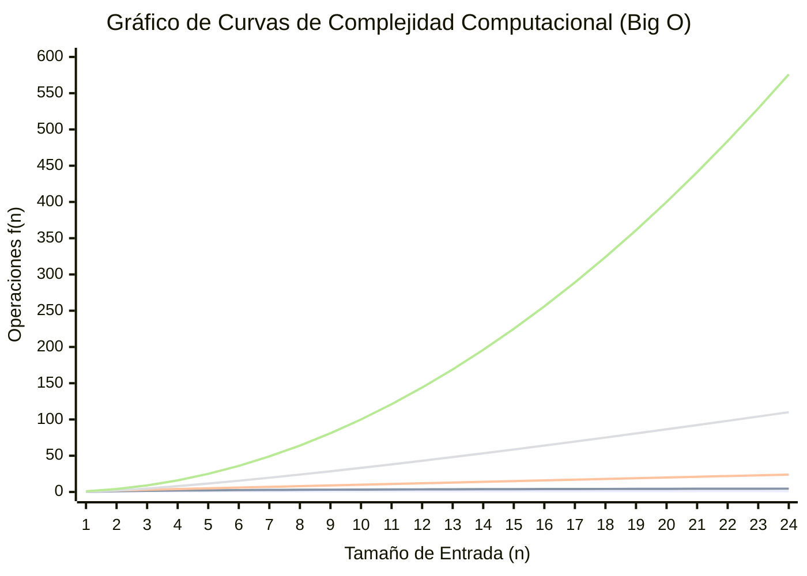

> 📊 **Correspondencia de Curvas en el Gráfico Mermaid Extendido ($n = 1 \dots 24$):**  
> - **Línea 1 (Horizontal plana en la base):** $O(1)$ — Constante ($y = 1$)  
> - **Línea 2 (Sublineal, amortiguada):** $O(\log_2 n)$ — Logarítmica ($y \approx 4.58$ en $n = 24$, crece extremadamente despacio)  
> - **Línea 3 (Diagonal uniforme 1:1):** $O(n)$ — Lineal ($y = 24$ en $n = 24$)  
> - **Línea 4 (Curva ascendente acelerada):** $O(n \log_2 n)$ — Lineal-logarítmica ($y \approx 110$ en $n = 24$, estándar óptimo de ordenación)  
> - **Línea 5 (Parábola empinada):** $O(n^2)$ — Cuadrática ($y = 576$ en $n = 24$, se dispara verticalmente y domina el consumo)  
> - *(Fuera de escala vertical):* $O(2^n)$ — Exponencial ($2^{24} \approx 1.67 \times 10^7$ operaciones, totalmente intratable)

##### Diagrama Estructural de Zonas y Escalabilidad en Big Data
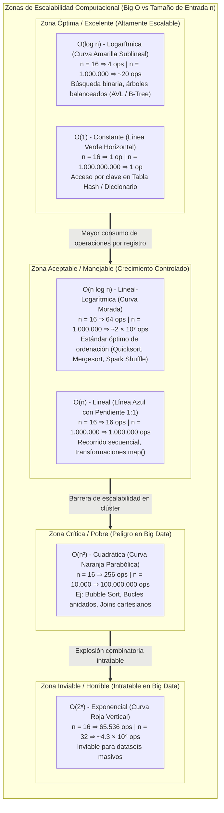

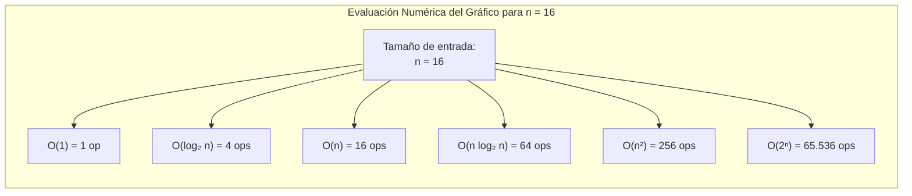

> 💡 **Nota sobre las curvas:**  
> Para una muestra de tamaño $n = 16$:  
> - $(1, \log_2 n, n) = (1, 4, 16)$  
> - $(n \log_2 n, n^2) = (64, 256)$  
> - $2^n = 65.536$ ops. Mientras que un algoritmo $O(1)$ o $O(\log n)$ se ejecuta en nanosegundos, un algoritmo $O(2^n)$ se dispara de forma inasumible en procesamiento distribuido.

#### Jerarquía de Órdenes de Complejidad (de más a menos eficiente):
$$O(1) < O(\log n) < O(n) < O(n \log n) < O(n^2) < O(2^n) < O(n!)$$

| Complejidad | Nombre | Descripción del Crecimiento | Impacto en Big Data ($n = 10^8$ registros) |
| :--- | :--- | :--- | :--- |
| **$O(1)$** | Constante | Tiempo independiente del tamaño de entrada. | **Instantáneo:** Mismo tiempo para 10 filas que para 100 millones. |
| **$O(\log n)$** | Logarítmica | Cada iteración descarta una fracción de la entrada (divide entre 2). | **Excelente:** $\approx 27$ operaciones para $10^8$ datos. |
| **$O(n)$** | Lineal | Crece proporcionalmente al tamaño de entrada. | **Aceptable:** $10^8$ operaciones básicas (segundos). |
| **$O(n \log n)$** | Lineal-logarítmica | Límite inferior óptimo para ordenación basada en comparaciones. | **Estándar:** $\approx 2.7 \times 10^9$ operaciones (minutos). |
| **$O(n^2)$** | Cuadrática | Bucles anidados sobre la colección completa. | **Inviable:** $10^{16}$ operaciones (semanas de cálculo). |
| **$O(2^n)$** | Exponencial | Se duplica con cada elemento adicional (fuerza bruta). | **Imposible:** Requiere métodos heurísticos o aproximaciones. |

---

### 3.2 Análisis Asintótico: Comportamiento a Largo Plazo

El análisis asintótico estudia el comportamiento de un algoritmo con entradas arbitrariamente grandes, abstrayéndose de constantes dependientes del hardware (velocidad de reloj de la CPU, compilador, etc.):

1. **Regla de omisión de constantes:** Las constantes multiplicativas no modifican el orden asintótico.  
   $$O(5n) \equiv O(n) \quad \text{y} \quad O(100) \equiv O(1)$$
2. **Regla del término dominante:** Se descartan los términos de menor orden, conservando únicamente el que crece más rápido.  
   $$O(3n^2 + 50n + 1000) \implies O(n^2)$$  
   *Justificación:* Para $n = 10^6$, $n^2 = 10^{12}$, mientras que $50n = 5 \times 10^7$. El término cuadrático representa más del $99.999\%$ del tiempo de cálculo total.

> 💡 **Nota sobre escalabilidad:** En arquitecturas distribuidas de Big Data, cualquier solución con complejidad cuadrática $O(n^2)$ (como productos cartesianos no particionados en consultas SQL o joins cruzados) debe evitarse estrictamente. En su lugar, se utilizan particiones hash ($O(1)$ o $O(n)$) y ordenamiento previo ($O(n \log n)$).

---

### 3.3 Clases de Complejidad: P, NP y NP-Completitud

En la teoría de la complejidad computacional, los problemas matemáticos se clasifican en función de la dificultad intrínseca para resolverlos o verificar sus soluciones:

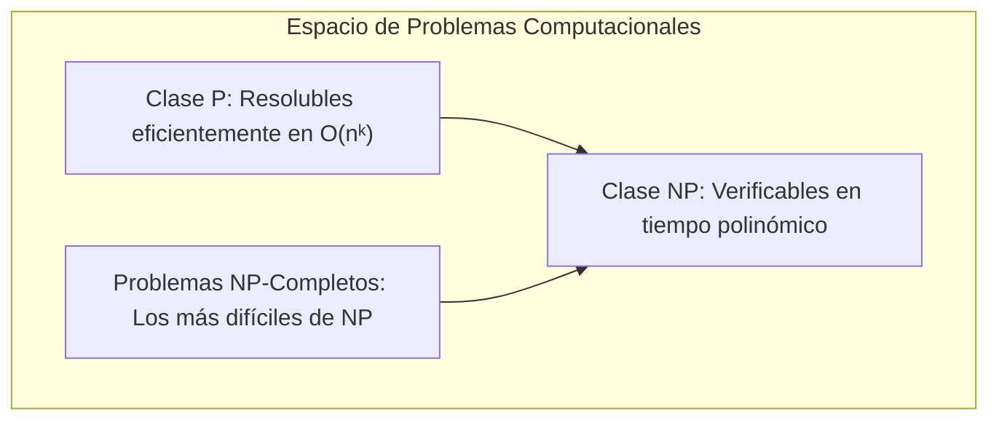

- **Clase P (*Polynomial Time*):** Problemas resolubles mediante algoritmos que operan en **tiempo polinómico** ($O(n^k)$ para una constante $k$). Se consideran **computacionalmente tratables**.  
  *Ejemplos:* Búsqueda binaria ($O(\log n)$), ordenación por mezcla ($O(n \log n)$), caminos mínimos de Dijkstra.
- **Clase NP (*Nondeterministic Polynomial Time*):** Problemas cuyas soluciones, una vez propuestas, pueden ser **verificadas** en tiempo polinómico, aunque encontrar dicha solución pueda requerir un tiempo exponencial.  
  *Nota:* La clase $P$ está contenida en $NP$ ($P \subseteq NP$). La cuestión de si $P = NP$ es uno de los problemas del milenio sin resolver más famosos.
- **Problemas NP-Completos:** Los problemas más difíciles dentro de $NP$. Si se encontrase un algoritmo en tiempo polinómico para cualquiera de ellos, **todos** los problemas en $NP$ podrían resolverse en tiempo polinómico.  
  *Ejemplos clásicos:*  
  - *Problema del Viajante de Comercio (TSP - Traveling Salesperson Problem):* Encontrar la ruta más corta que visita $n$ ciudades y regresa al origen.  
  - *Satisfacibilidad Booleana (SAT / 3-SAT):* Determinar si existe una asignación de variables que haga verdadera una fórmula booleana.  
  - *Problema de la Mochila (Knapsack):* Maximizar el valor de objetos transportables bajo una restricción de peso.  
  *Estrategia en Big Data e IA:* Dado que el cálculo exacto es intratable para grafos o catálogos reales, se emplean **algoritmos de aproximación y metaheurísticas** (algoritmos genéticos, optimización por enjambre de partículas, recocido simulado, algoritmos voraces / *greedy*).

---

## 4. Algoritmos de Búsqueda: Encontrando Información

Localizar registros específicos dentro de conjuntos masivos de datos es una de las tareas computacionales más frecuentes:

### 4.1 Búsqueda Lineal / Secuencial ($O(n)$)
Recorre la estructura elemento por elemento desde el principio hasta encontrar el objetivo o llegar al final.
- **Ventajas:** No requiere que la colección esté previamente ordenada.
- **Desventajas:** Ineficiente para grandes colecciones. En el peor caso realiza $n$ comparaciones.

### 4.2 Búsqueda Binaria ($O(\log n)$)
Aplica la técnica de **divide y vencerás**. Requiere obligatoriamente que la colección de datos esté previamente ordenada.
- **Mecanismo:** Compara el objetivo con el elemento central de la colección. Si coincide, finaliza; si el objetivo es menor, descarta toda la mitad derecha; si es mayor, descarta la mitad izquierda.
- **Eficiencia:** Reduce a la mitad el espacio de búsqueda en cada paso. Para 1.000.000 de registros, requiere un máximo de 20 comparaciones ($\log_2(10^6) \approx 19.9$).

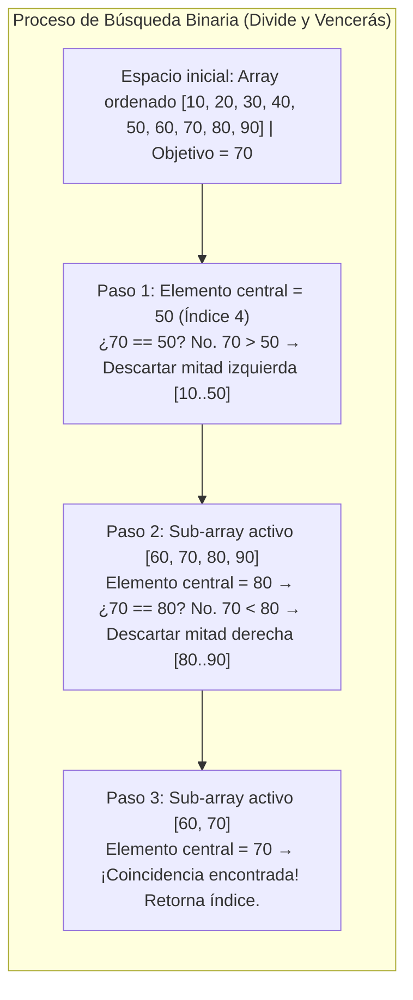

### 4.3 Árboles de Búsqueda (ABB / AVL)
Estructuras jerárquicas dinámicas donde cada nodo mantiene la propiedad de búsqueda: elementos menores a la izquierda y mayores a la derecha. Los árboles balanceados (AVL o Rojo-Negro) garantizan que la altura no supere $O(\log n)$, evitando la degradación a listas lineales.

#### Ejemplo Práctico en Python: Comparativa de Rendimiento (Lineal vs Binaria vs Hash)

```python
import time
import bisect

# Dataset ordenado de 1.000.000 de enteros
tamano = 1_000_000
datos_lista = list(range(tamano))
datos_hash = set(datos_lista) # Hash Table O(1)
objetivo = 999_995           # Buscar un elemento cerca del final

# 1. Búsqueda Lineal O(n)
inicio = time.perf_counter()
encontrado_lineal = objetivo in datos_lista
tiempo_lineal = time.perf_counter() - inicio

# 2. Búsqueda Binaria O(log n) utilizando bisect
inicio = time.perf_counter()
pos = bisect.bisect_left(datos_lista, objetivo)
encontrado_binario = (pos < len(datos_lista) and datos_lista[pos] == objetivo)
tiempo_binario = time.perf_counter() - inicio

# 3. Búsqueda en Tabla Hash O(1)
inicio = time.perf_counter()
encontrado_hash = objetivo in datos_hash
tiempo_hash = time.perf_counter() - inicio

print("--- Comparativa de Algoritmos de Búsqueda (n = 1.000.000) ---")
print(f"1. Búsqueda Lineal  O(n):     {tiempo_lineal:.8f} s")
print(f"2. Búsqueda Binaria O(log n): {tiempo_binario:.8f} s")
print(f"3. Búsqueda Hash    O(1):     {tiempo_hash:.8f} s")
print(f"-> Aceleración Binaria respecto a Lineal: {tiempo_lineal / max(tiempo_binario, 1e-9):.1f}x veces")
```

---

## 5. Algoritmos de Ordenamiento: Poniendo Orden

Ordenar datos es una fase previa indispensable para realizar búsquedas binarias, agrupaciones agregadas (`GROUP BY`) y cruces de tablas eficientes (*Merge Joins*).

| Algoritmo | Mejor Caso | Caso Promedio | Peor Caso | Espacio Adicional | Paradigma / Estabilidad |
| :--- | :---: | :---: | :---: | :---: | :--- |
| **Bubble Sort** | $O(n)$ | $O(n^2)$ | $O(n^2)$ | $O(1)$ | Comparación adyacente. Inestable y desaconsejado en Big Data. |
| **Quicksort** | $O(n \log n)$ | $O(n \log n)$ | $O(n^2)$ | $O(\log n)$ | **Divide y Vencerás.** Particionado in-place alrededor de un pivote. Muy rápido en RAM. |
| **Mergesort** | $O(n \log n)$ | $O(n \log n)$ | $O(n \log n)$ | $O(n)$ | **Divide y Vencerás.** Estable. Base del *External Sort* y Shuffle distribuido en Spark/MapReduce. |

### 5.1 Quicksort (Divide y Vencerás)
Selecciona un elemento como **pivote** y reorganiza el array de modo que todos los elementos menores queden a la izquierda y los mayores a la derecha. A continuación, aplica recursivamente el mismo proceso sobre los dos sub-arrays resultantes.

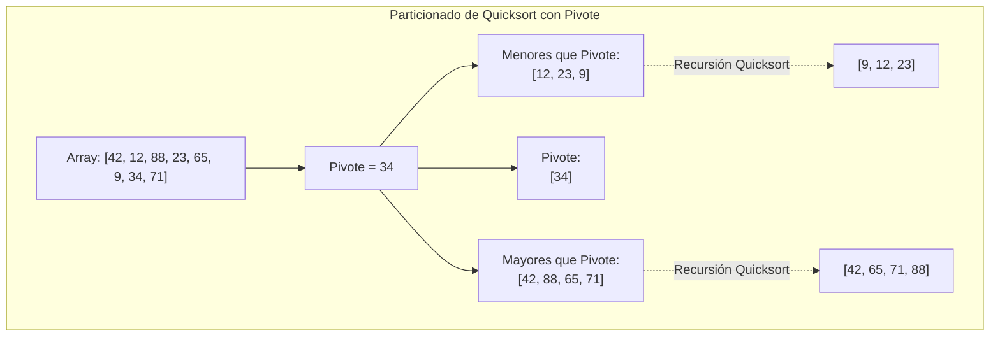

### 5.2 Mergesort (Mezcla Ordenada)
Divide repetidamente la colección por la mitad hasta llegar a sub-listas de un único elemento (que ya están trivialmente ordenadas). Luego combina (*merge*) ordenadamente los pares de sub-listas de abajo hacia arriba. Es el algoritmo estándar cuando los datos no caben en memoria y deben ordenarse en disco (*External Sorting*).

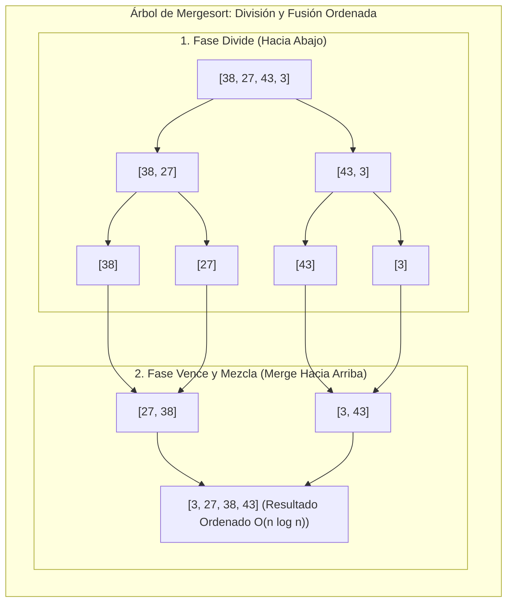

#### Ejemplo Práctico en Python: Implementación de Quicksort y Mergesort

```python
def quicksort(arr: list) -> list:
    """Implementación funcional de Quicksort (O(n log n) promedio)."""
    if len(arr) <= 1:
        return arr
    pivote = arr[len(arr) // 2]
    menores = [x for x in arr if x < pivote]
    iguales = [x for x in arr if x == pivote]
    mayores = [x for x in arr if x > pivote]
    return quicksort(menores) + iguales + quicksort(mayores)

def mergesort(arr: list) -> list:
    """Implementación de Mergesort (O(n log n) garantizado en el peor caso)."""
    if len(arr) <= 1:
        return arr
    medio = len(arr) // 2
    izq = mergesort(arr[:medio])
    der = mergesort(arr[medio:])
    
    # Fusión ordenada (Merge)
    resultado = []
    i = j = 0
    while i < len(izq) and j < len(der):
        if izq[i] <= der[j]:
            resultado.append(izq[i])
            i += 1
        else:
            resultado.append(der[j])
            j += 1
    resultado.extend(izq[i:])
    resultado.extend(der[j:])
    return resultado

# Comprobación de ordenación
datos_muestra = [42, 12, 88, 23, 65, 9, 34, 71]
print("Lista original:", datos_muestra)
print("Ordenado con Quicksort:", quicksort(datos_muestra))
print("Ordenado con Mergesort:", mergesort(datos_muestra))
```

---

## 6. Modelado con Estructuras No Lineales: Grafos y Árboles

### 6.1 Grafos: Modelando Relaciones Complejas

Un **grafo** $G = (V, E)$ es una estructura discreta no lineal compuesta por un conjunto de **vértices o nodos** ($V$) y un conjunto de **aristas o enlaces** ($E$) que conectan pares de vértices:
- **Grafos No Dirigidos:** Las aristas no tienen dirección; la relación es simétrica y bidireccional (ej. amistades en redes sociales o enlaces físicos de red).
- **Grafos Dirigidos (DAG - *Directed Acyclic Graph*):** Las aristas tienen un sentido determinado y no forman ciclos cerrados. En Big Data, los **planes físicos de Apache Spark** y las dependencias de tareas en **Apache Airflow** son DAGs.
- **Grafos Ponderados:** Cada arista posee un coste, distancia o latencia asociada (ej. latencia entre servidores en un clúster).

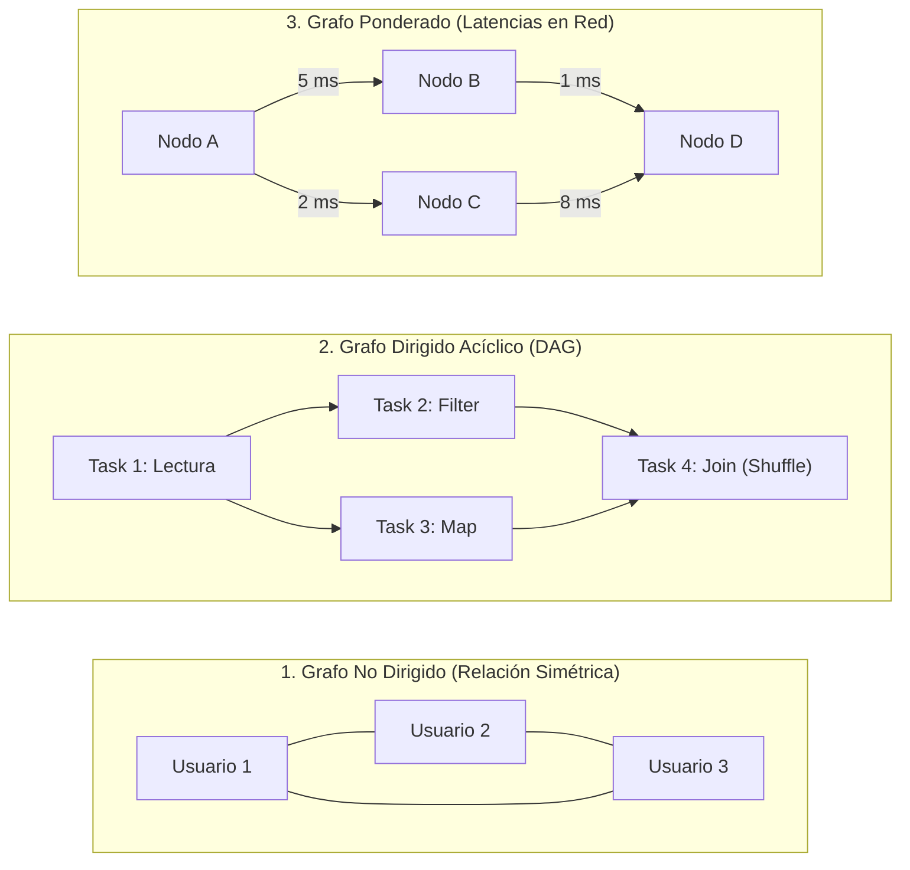

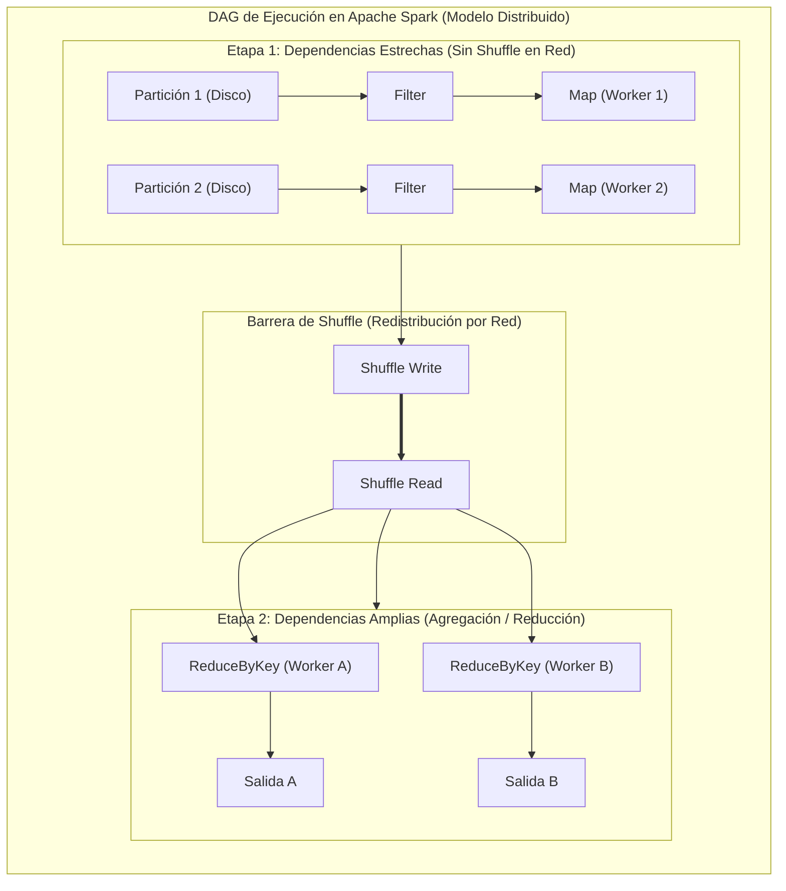

#### Comparativa Visual de Recorridos en Grafos: BFS vs DFS

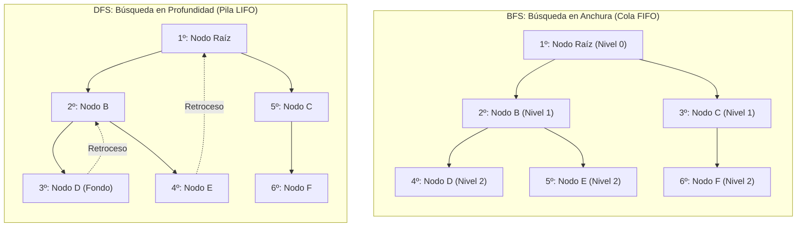

#### Algoritmos Fundamentales sobre Grafos:
1. **BFS (*Breadth-First Search* / Búsqueda en Anchura):** Explora nivel a nivel utilizando una cola FIFO. Calcula distancias mínimas en grafos no ponderados.
2. **DFS (*Depth-First Search* / Búsqueda en Profundidad):** Explora una rama hasta el fondo antes de retroceder (pila LIFO o recursión). Detecta ciclos y analiza conectividad.
3. **Algoritmo de Dijkstra:** Determina el camino de menor coste desde un nodo origen a todos los demás en grafos ponderados con pesos no negativos ($O((|V| + |E|) \log |V|)$).

#### Ejemplo Práctico en Python: Algoritmo de Dijkstra con Cola de Prioridad (`heapq`)

```python
import heapq

def dijkstra(grafo: dict, inicio: str) -> dict:
    """Calcula distancias mínimas desde el nodo de inicio usando una cola de prioridad."""
    distancias = {nodo: float('infinity') for nodo in grafo}
    distancias[inicio] = 0
    cola_prioridad = [(0, inicio)] # Tupla: (distancia_acumulada, nodo)
    
    while cola_prioridad:
        dist_actual, nodo_actual = heapq.heappop(cola_prioridad)
        
        if dist_actual > distancias[nodo_actual]:
            continue
            
        for vecino, peso in grafo[nodo_actual].items():
            distancia = dist_actual + peso
            if distancia < distancias[vecino]:
                distancias[vecino] = distancia
                heapq.heappush(cola_prioridad, (distancia, vecino))
                
    return distancias

# Grafo representativo de latencias entre servidores en un clúster
red_servidores = {
    "Srv_A": {"Srv_B": 5, "Srv_C": 2},
    "Srv_B": {"Srv_D": 1},
    "Srv_C": {"Srv_D": 8, "Srv_E": 4},
    "Srv_D": {"Srv_E": 3},
    "Srv_E": {}
}

distancias = dijkstra(red_servidores, "Srv_A")
print("Rutas óptimas de latencia desde Srv_A:")
for destino, latencia in distancias.items():
    print(f" -> Destino {destino}: latencia mínima de {latencia} ms")
```

---

### 6.2 Árboles: Jerarquía y Organización

Un **árbol** es un grafo conexo y acíclico con un nodo especial llamado **raíz**, donde cada nodo hijo tiene exactamente un único padre:
- **Árboles Binarios de Búsqueda (ABB):** Cada nodo tiene como máximo dos hijos.
- **Árboles AVL:** Árboles autobalanceados que garantizan altura $O(\log n)$.
- **Árboles B y B+ (*B-Trees*):** Árboles multicamino autobalanceados optimizados para sistemas de almacenamiento en bloques de disco. Son el estándar en los **índices de bases de datos relacionales** (PostgreSQL, MySQL, Oracle) y motores analíticos.

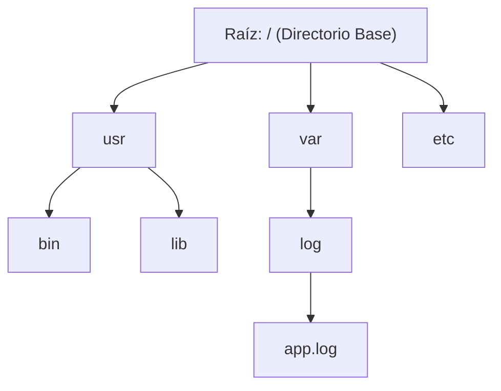

#### Estructuras de Árboles en Computación y Bases de Datos

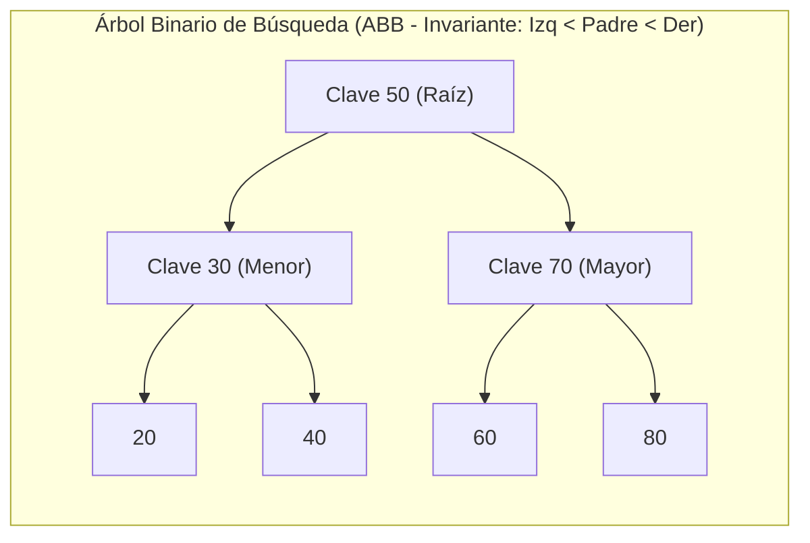

#### Comparativa Visual: Árbol Balanceado vs Árbol Degenerado

La propiedad de auto-balanceo es la que asegura que la altura del árbol sea logarítmica ($h = \lfloor \log_2 n \rfloor$):

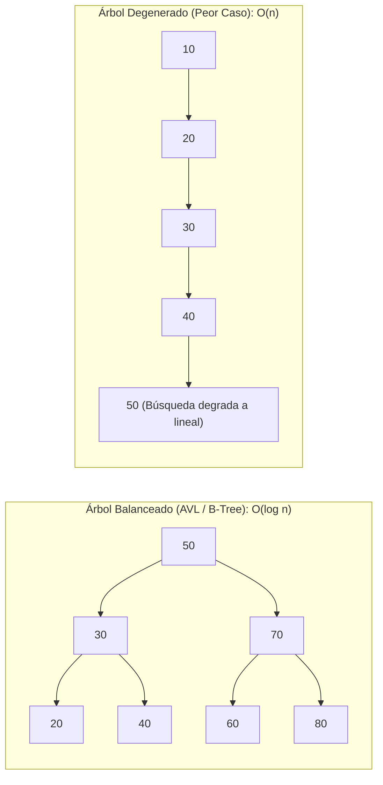

#### Arquitectura B+ Tree y Salto de Bloques (Data Skipping) en Big Data

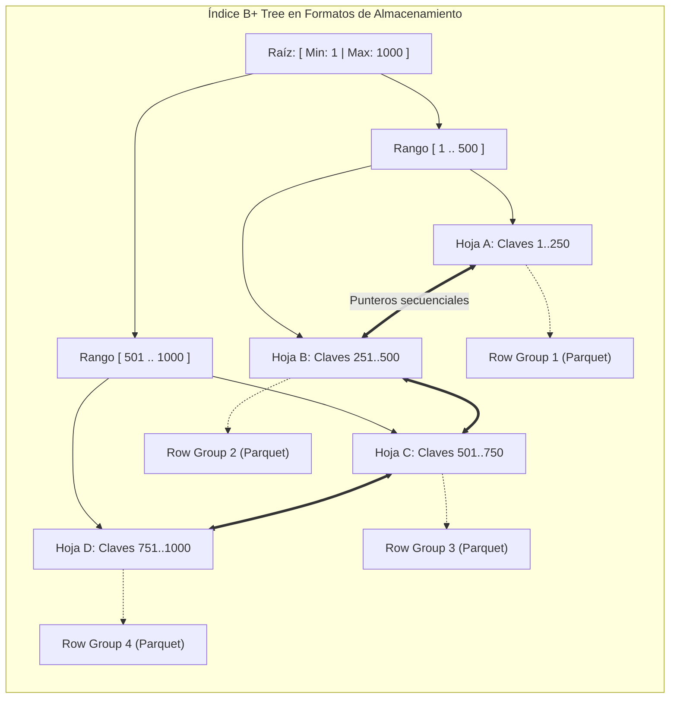

#### Aplicaciones en Big Data e Inteligencia Artificial:
1. **Índices en Bases de Datos:** Permiten localizar cualquier registro entre miles de millones en $O(\log n)$ lecturas de disco.
2. **Árboles de Sintaxis Abstracta (AST):** El optimizador *Catalyst* de Apache Spark representa los planes lógicos y físicos de ejecución como árboles de operaciones para aplicar optimizaciones algebraicas.
3. **Machine Learning:** Algoritmos de árboles de decisión (CART, Random Forest, XGBoost) que segmentan el espacio de datos mediante decisiones jerárquicas sucesivas.

#### Ejemplo Práctico en Python: Clasificador de Árbol de Decisión Binario

```python
class NodoDecision:
    """Nodo para modelar un árbol de decisión jerárquico."""
    def __init__(self, caracteristica=None, umbral=None, izq=None, der=None, resultado=None):
        self.caracteristica = caracteristica
        self.umbral = umbral
        self.izq = izq
        self.der = der
        self.resultado = resultado

    def es_hoja(self):
        return self.resultado is not None

def clasificar(nodo: NodoDecision, datos: dict) -> str:
    """Recorre el árbol de decisión recursivamente hasta una hoja de predicción."""
    if nodo.es_hoja():
        return nodo.resultado
    
    valor = datos[nodo.caracteristica]
    if valor <= nodo.umbral:
        return clasificar(nodo.izq, datos)
    else:
        return clasificar(nodo.der, datos)

# Construcción de un clasificador de riesgo crediticio
# Raíz: ingresos <= 2500 -> Denegado / Verificar deuda
arbol_credito = NodoDecision(
    caracteristica="ingresos", umbral=2500,
    izq=NodoDecision(resultado="❌ Préstamo Denegado (Ingresos insuficientes)"),
    der=NodoDecision(
        caracteristica="deuda", umbral=5000,
        izq=NodoDecision(resultado="✅ Préstamo Concedido (Riesgo bajo)"),
        der=NodoDecision(resultado="⚠️ Requiere Aval Adicional (Riesgo moderado)")
    )
)

solicitud = {"ingresos": 3500, "deuda": 2100}
resultado = clasificar(arbol_credito, solicitud)
print("Evaluación con Árbol de Decisión:", solicitud)
print("Dictamen:", resultado)
```

---

## 7. Aplicando lo Aprendido: Análisis de Datos y Arquitecturas Big Data

El diseño de las plataformas modernas de Big Data es la aplicación directa de estos principios algorítmicos y estructuras de datos discretas:

| Concepto Algorítmico | Implementación en Arquitecturas de Big Data | Beneficio Tecnológico |
| :--- | :--- | :--- |
| **Tablas Hash ($O(1)$)** | *Broadcast Hash Join* en Apache Spark y bases de datos analíticas (DuckDB, ClickHouse) | Cruces de tablas ultrarrápidos en memoria sin necesidad de ordenar previamente los datos. |
| **Árboles B+ / Balanceados** | Índices primarios en RDBMS, pies de fichero Parquet (*Zone Maps* / *Min-Max Indexes*) | Lectura selectiva de bloques de disco (*Data Skipping*), evitando escanear terabytes irrelevantes. |
| **Divide y Vencerás ($O(n \log n)$)** | Paradigma MapReduce y particiones de DataFrames en Spark | Paralelización horizontal masiva de tareas complejas en clústeres de cientos de nodos. |
| **Grafos Acíclicos Dirigidos (DAG)** | Planificadores de ejecución física en Spark y motores de linaje/orquestación (Apache Airflow) | Detección de dependencias entre tareas, tolerancia a fallos y reejecución selectiva de particiones fallidas. |
| **Pilas y Colas (LIFO/FIFO)** | Brokers de mensajería (Apache Kafka, RabbitMQ) y buffers de streaming | Desacoplamiento temporal entre productores y consumidores de datos a alta velocidad. |

---

## 8. Resumen Global de Estructuras y Complejidades

| Estructura de Datos | Acceso | Búsqueda | Inserción | Borrado | Caso de Uso Principal en Big Data |
| :--- | :---: | :---: | :---: | :---: | :--- |
| **Array / Lista Contigua** | $O(1)$ | $O(n)$ | $O(n)$ | $O(n)$ | Almacenamiento en bloques de memoria contigua en formatos columnares. |
| **Tabla Hash (Dict / Set)** | N/A | $O(1)$ | $O(1)$ | $O(1)$ | Búsqueda rápida por clave primaria, cachés de sesión y joins en memoria. |
| **Árbol Balanceado (AVL / B-Tree)**| $O(\log n)$ | $O(\log n)$ | $O(\log n)$ | $O(\log n)$ | Índices en motores de almacenamiento persistente y consultas por rango numérico. |
| **Grafo (Lista de Adyacencia)** | N/A | $O(\|V\| + \|E\|)$ | $O(1)$ | $O(\|E\|)$ | Detección de fraude, análisis de redes sociales y modelado de linaje de datos. |
| **Cola FIFO / Pila LIFO** | $O(n)$ | $O(n)$ | $O(1)$ | $O(1)$ | Ingestión de eventos en streaming y evaluación de árboles de sintaxis. |
