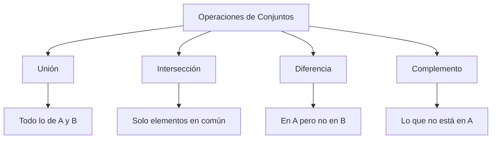
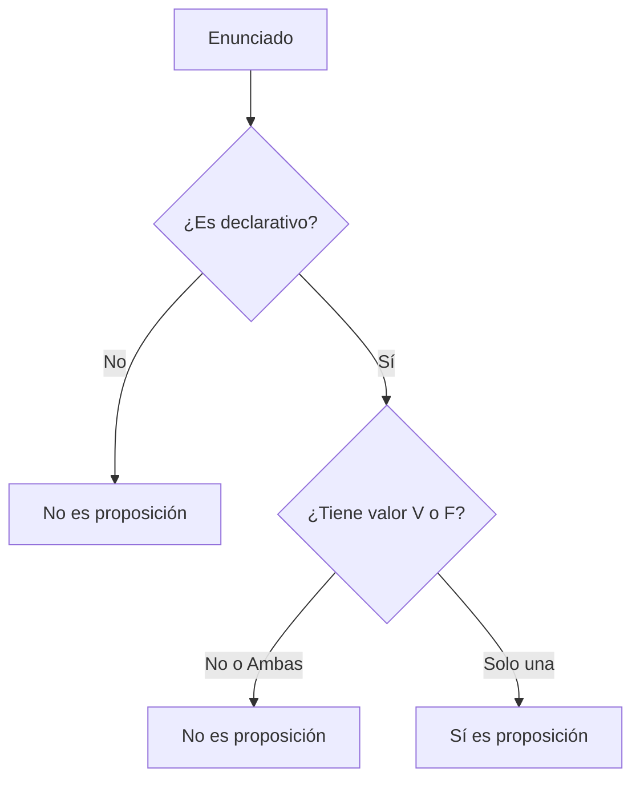

# Matemáticas Discretas

> Apuntes y ampliación de teoría de la asignatura **Sistemas de Big Data**.

---

## 1. Teoría de Conjuntos

Un **conjunto** es una colección bien definida de objetos o entidades, llamados *elementos* o *miembros*. En matemáticas discretas y Big Data, los conjuntos son la base para estructurar y relacionar datos.

### Operaciones Básicas entre Conjuntos

A continuación, se resumen las principales operaciones que puedes realizar entre dos conjuntos $A$ y $B$, asumiendo un conjunto universal $U$.

| Operación | Símbolo | Definición (Lógica) | Descripción |
| :--- | :---: | :--- | :--- |
| **Unión** | $A \cup B$ | $\{x \mid x \in A \lor x \in B\}$ | Elementos que pertenecen a $A$, a $B$, o a ambos. Se combinan todos los elementos sin repetir. |
| **Intersección**| $A \cap B$ | $\{x \mid x \in A \land x \in B\}$ | Elementos que son comunes tanto a $A$ como a $B$. |
| **Diferencia** | $A \setminus B$ | $\{x \mid x \in A \land x \notin B\}$ | Elementos que pertenecen exclusivamente a $A$ y que no están en $B$. |
| **Complemento**| $A^c$ o $A'$ | $\{x \mid x \in U \land x \notin A\}$ | Todos los elementos del conjunto universal $U$ que **no** pertenecen a $A$. |

#### Mapa Conceptual de Operaciones


#### Ejemplo Práctico (Analítica de Datos)
Imagina que analizamos los clientes de un e-commerce:
- **Conjunto A**: Clientes que compraron tecnología en Black Friday $\rightarrow \{Ana, Luis, Carlos, Marta\}$
- **Conjunto B**: Clientes que son usuarios "Premium" $\rightarrow \{Carlos, Marta, Pedro, Sofia\}$

- **Unión ($A \cup B$)**: $\{Ana, Luis, Carlos, Marta, Pedro, Sofia\}$ *(Todos los clientes que impactan en una campaña combinada)*.
- **Intersección ($A \cap B$)**: $\{Carlos, Marta\}$ *(Clientes Premium que compraron tecnología)*.
- **Diferencia ($A \setminus B$)**: $\{Ana, Luis\}$ *(Clientes que compraron tecnología pero **no** son Premium, ideal para ofrecerles la suscripción)*.
- **Complemento ($A^c$)**: Si el universo $U$ es toda la base de datos (1.000 usuarios), el complemento serían los 996 usuarios que **no** compraron tecnología.

> [!TIP]
> **Analogía en Bases de Datos (SQL):** 
> - **Unión** equivale a un `UNION`.
> - **Intersección** equivale a un `INNER JOIN` (en algunos contextos).
> - **Diferencia** equivale a usar un `LEFT JOIN` con exclusión (`WHERE B.id IS NULL`).

---

## 2. Lógica Proposicional

### La Proposición (Afirmación)
Una **proposición lógica** o **afirmación** es un enunciado declarativo que tiene un único valor de verdad: **Verdadero (V)** o **Falso (F)**. Nunca puede ser ambas cosas a la vez ni ninguna de ellas.

**Ejemplos:**
- ✅ *"Hadoop es un framework de Big Data."* -> Es una proposición (Verdadera).
- ✅ *"2 + 2 = 5."* -> Es una proposición (Falsa).
- ❌ *"¡Cierra la puerta!"* -> **No** es una proposición (Es una orden, no se puede evaluar como V o F).
- ❌ *"¿Qué hora es?"* -> **No** es una proposición (Es una pregunta).

#### Árbol de Decisión: ¿Es una proposición?



### Conectores Lógicos Básicos

Los conectores lógicos nos permiten construir proposiciones compuestas a partir de proposiciones simples. Operan de forma muy similar a las compuertas lógicas en sistemas informáticos.

#### 1. Negación ($\neg$ o $\sim$)
La negación invierte el valor de verdad de una proposición. Si $p$ es Verdadera, $\neg p$ es Falsa, y viceversa. En programación suele representarse con `!` o `NOT`.

**Tabla de Verdad:**
| $p$ | $\neg p$ |
| :---: | :---: |
| **V** | F |
| **F** | V |

#### 2. Conjunción ($\land$)
La conjunción de dos proposiciones $p$ y $q$ (leído "$p$ y $q$") es verdadera **solo si ambas** proposiciones son verdaderas simultáneamente. En programación suele representarse con `&&` o `AND`.

**Tabla de Verdad:**
| $p$ | $q$ | $p \land q$ |
| :---: | :---: | :---: |
| **V** | **V** | **V** |
| **V** | **F** | F |
| **F** | **V** | F |
| **F** | **F** | F |

#### Ejemplo Práctico (Filtrado de Logs)
Imagina que estás procesando un flujo de datos (logs) de un servidor y evalúas dos proposiciones para cada línea de log:
- **$p$**: "El registro es de tipo ERROR"
- **$q$**: "El registro se generó HOY"

1. **Aplicando Negación ($\neg p$)**: Extraemos todos los registros que **NO** son errores (es decir, nos quedamos con advertencias e información). 
   *En SQL:* `WHERE type != 'ERROR'`
2. **Aplicando Conjunción ($p \land q$)**: Filtramos buscando exclusivamente las líneas que cumplan ambas condiciones estrictamente (Errores de hoy).
   *En código (Python):* `if log.type == "ERROR" and log.date == "today":`

#### 3. Disyunción ($\lor$)
La disyunción de dos proposiciones $p$ y $q$ (leído "$p$ o $q$") es verdadera si **al menos una** de las proposiciones es verdadera. Solo es falsa cuando ambas son falsas. En programación suele representarse con `||` o `OR`.

**Tabla de Verdad:**
| $p$ | $q$ | $p \lor q$ |
| :---: | :---: | :---: |
| **V** | **V** | **V** |
| **V** | **F** | **V** |
| **F** | **V** | **V** |
| **F** | **F** | F |

#### 4. Implicación o Condicional ($\rightarrow$)
La implicación $p \rightarrow q$ (leído "si $p$, entonces $q$") establece que si la condición $p$ (antecedente) se cumple, entonces $q$ (consecuente) debe cumplirse obligatoriamente. 
La implicación es verdadera siempre, **excepto** en un único caso: cuando el antecedente es Verdadero y el consecuente Falso (es decir, una premisa verdadera no puede llevar a una conclusión falsa).

**Tabla de Verdad:**
| $p$ | $q$ | $p \rightarrow q$ |
| :---: | :---: | :---: |
| **V** | **V** | **V** |
| **V** | **F** | F |
| **F** | **V** | **V** |
| **F** | **F** | **V** |

#### Ejemplo Práctico (Limpieza y Calidad de Datos)
Veamos cómo aplicaríamos estos dos conectores en un pipeline de datos (Data Pipeline):

1. **Disyunción ($\lor$) - Filtrado Flexible:**
   Al limpiar perfiles de clientes, queremos descartar aquellos que estén completamente vacíos. Descartamos el registro si el email es nulo ($p$) **O** si el teléfono es nulo ($q$). Basta con que se cumpla uno de los dos vacíos para requerir revisión.
   *En SQL:* `WHERE email IS NULL OR telefono IS NULL`

2. **Implicación ($\rightarrow$) - Reglas de Negocio y Data Quality:**
   
   **Caso A: Límite de crédito VIP**
   Supongamos una regla en nuestro almacén de datos: "Si un usuario tiene el estado 'VIP' ($p$), entonces su límite de crédito es > 10.000 ($q$)".
   - Si es VIP (**V**) y su límite es > 10.000 (**V**), la regla está bien (**V**).
   - Si es VIP (**V**) pero su límite es menor a 10.000 (**F**), salta una alarma de calidad, esto rompe la regla (**F**).
   - Si **NO** es VIP (**F**), no nos importa si su crédito es alto o bajo, la regla del sistema no se está violando, así que la lógica no falla (**V**).

   **Caso B: Regla de E-commerce (Promoción de Envío Gratis)**
   - **$p$ (Antecedente / Premisa):** "El importe del pedido supera los 100 €"
   - **$q$ (Consecuente / Conclusión):** "El envío es gratis"
   - **Fórmula:** $p \rightarrow q$ (*"Si el pedido supera los 100 €, entonces el envío es gratis"*)

   | $p$ (Importe > 100 €) | $q$ (Envío gratis) | $p \rightarrow q$ | Significado en el Negocio | Estado de la Regla |
   | :---: | :---: | :---: | :--- | :---: |
   | **V** | **V** | **V** | Pedido de 120 € con envío gratis. | ✅ Cumple la promesa |
   | **V** | **F** | **F** | Pedido de 120 € con gastos de envío cobrados. | ❌ **Error / Violación de regla** |
   | **F** | **V** | **V** | Pedido de 40 € con envío gratis (por promoción/cupón). | ✅ Válido (no contradice la regla) |
   | **F** | **F** | **V** | Pedido de 40 € con gastos de envío cobrados. | ✅ Válido (caso estándar) |

   > [!NOTE]
   > **Intuición del caso $F \rightarrow V$:**  
   > La regla garantiza envío gratis *a partir de 100 €*, pero no prohíbe regalarlo en importes inferiores (por ejemplo, con cupones o campañas especiales). Por ello, que el antecedente sea falso no hace que la regla sea falsa.

   ```mermaid
   flowchart TD
       Inicio["Evaluación del Pedido"] --> P{"¿Importe > 100 €? (p)"}
       
       P -->|"Sí (V)"| Q1{"¿Envío gratis? (q)"}
       Q1 -->|"Sí (V)"| V1["Regla Válida (V)"]
       Q1 -->|"No (F)"| F1["Regla Violada (F) - Error en cobro"]
       
       P -->|"No (F)"| Q2{"¿Envío gratis? (q)"}
       Q2 -->|"Sí (V)"| V2["Regla Válida (V) - Promoción aplicada"]
       Q2 -->|"No (F)"| V3["Regla Válida (V) - Cobro estándar"]
   ```

   ##### Equivalencia Lógica y Calidad de Datos (SQL / Python)
   En álgebra booleana, la implicación equivale a:
   $$p \rightarrow q \equiv \neg p \lor q$$

   *(«O bien el pedido no supera los 100 € ($\neg p$), o bien el envío es gratis ($q$)»)*

   Para auditar una base de datos y detectar pedidos con anomalías que violen la implicación, buscamos registros donde se cumpla $p \land \neg q$:
   ```sql
   -- Detección de pedidos erróneos (violan la regla de negocio)
   SELECT id_pedido, importe, envio_gratis
   FROM pedidos
   WHERE importe > 100 AND envio_gratis = FALSE;
   ```

*(Pendiente: Bicondicional, equivalencias lógicas u otros temas...)*
