# Matemáticas Discretas y Fundamentos Computacionales

> Apuntes y ampliación de teoría de la asignatura **Sistemas de Big Data**.  
> 📅 **Fecha:** 2026-10-05  
> 📖 **Documento de referencia:** `2026-10-05 - SBD Conceptos Basicos.docx`

---

## Introducción

La **matemática discreta** constituye la base teórica y conceptual sobre la que se asientan las ciencias de la computación, la ingeniería de software y el análisis masivo de datos (**Big Data**). A diferencia del cálculo infinitesimal o las matemáticas continuas (que operan con números reales y variaciones continuas), la matemática discreta estudia estructuras compuestas por elementos diferenciados, individuales y contables.

Conceptos fundamentales como **conjuntos**, **relaciones**, **funciones**, **lógica formal** y **algorítmica** son esenciales para modelar, estructurar, transformar y optimizar la información en arquitecturas distribuidas. Dominar estos fundamentos permite a los ingenieros y científicos de datos comprender los principios internos de los motores de procesamiento (como Apache Spark, Hadoop o motores relacionales), diseñar algoritmos escalables y prevenir cuellos de botella computacionales.

### Lecturas Recomendadas y Recursos de Autoformación
- 🌐 [Math is Fun - Set Theory Index](https://www.mathsisfun.com/sets/): Guía interactiva de fundamentos de teoría de conjuntos.
- 🎥 [Matemática Discreta 1: Inducción Completa (Sesión 1)](https://youtu.be/8Ag507fO62w): Demostraciones por inducción matemática y razonamiento deductivo.
- 🎥 [Matemática Discreta 1: Inducción Completa (Sesión 2)](https://youtu.be/uB1K-a414yI): Ejercicios y aplicaciones del principio de inducción.

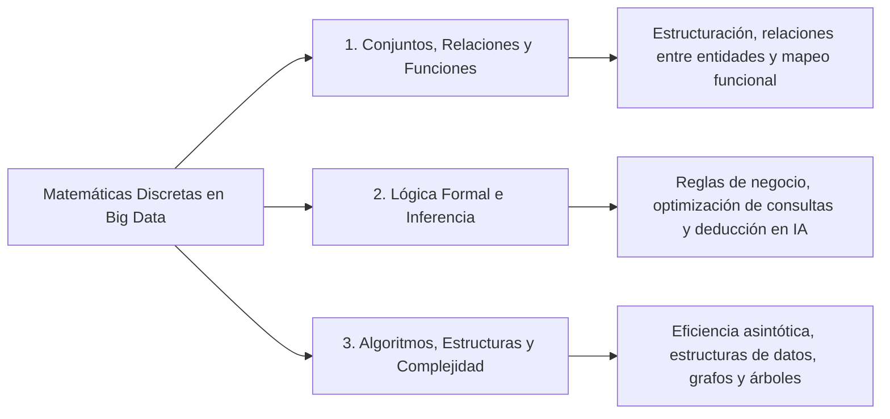
```mermaid
flowchart LR
    MD["Matemáticas Discretas en Big Data"] --> P1["1. Conjuntos, Relaciones y Funciones"]
    MD --> P2["2. Lógica Formal e Inferencia"]
    MD --> P3["3. Algoritmos, Estructuras y Complejidad"]

    P1 --> P1_desc["Estructuración, relaciones entre entidades y mapeo funcional"]
    P2 --> P2_desc["Reglas de negocio, optimización de consultas y deducción en IA"]
    P3 --> P3_desc["Eficiencia asintótica, estructuras de datos, grafos y árboles"]
```

---

## 1. Conjuntos, Relaciones y Funciones

### 1.1 ¿Por qué Matemática Discreta en Big Data e IA?

El procesamiento de datos a gran escala no opera sobre flujos continuos indeterminados, sino sobre registros atómicos, particiones, tablas y grafos. La matemática discreta aporta:

1. **Fundamento computacional esencial:** Toda la arquitectura de procesadores y sistemas binarios descansa en estados discretos (0 y 1). Proporciona la base teórica para las estructuras de datos (arrays, listas, colas, grafos, árboles) y algoritmos.
2. **Lógica de programación y diseño de consultas:** La semántica de las consultas SQL, el cálculo relacional y las expresiones booleanas en condicionales (`if-else`, filtros) son aplicaciones directas de la lógica proposicional y de conjuntos.
3. **Modelado de problemas en Big Data:** Representación de redes sociales mediante grafos, modelado de particionado de datos mediante funciones hash y particiones de conjuntos, y optimización de hiperparámetros en Machine Learning.
4. **Pensamiento lógico y analítico:** Fomenta el razonamiento estructurado, la demostración de corrección de algoritmos y la capacidad sistemática de resolución de problemas técnicos complejos.

---

### 1.2 Conjuntos: La Base de Todo

Un **conjunto** es una colección bien definida de objetos o entidades, llamados *elementos* o *miembros*. Un elemento solo puede pertenecer o no pertenecer a un conjunto ($\in$ o $\notin$), y los elementos de un conjunto son **únicos y distintos** (no hay duplicados por definición).

Los conjuntos pueden ser:
- **Finitos:** Poseen un número contable determinado de elementos (por ejemplo, el catálogo de productos de una tienda o los nodos de un clúster).
- **Infinitos:** Poseen infinitos elementos (por ejemplo, el conjunto de los números enteros $\mathbb{Z}$ o los posibles flujos continuos de números reales).

#### Operaciones Básicas entre Conjuntos

Considerando dos conjuntos $A$ y $B$ dentro de un conjunto universal $U$:

| Operación | Símbolo | Definición (Lógica) | Descripción |
| :--- | :---: | :--- | :--- |
| **Unión** | $A \cup B$ | $\{x \mid x \in A \lor x \in B\}$ | Elementos que pertenecen a $A$, a $B$, o a ambos (todos combinados sin duplicados). |
| **Intersección**| $A \cap B$ | $\{x \mid x \in A \land x \in B\}$ | Elementos comunes que pertenecen simultáneamente a $A$ y a $B$. |
| **Diferencia** | $A \setminus B$ | $\{x \mid x \in A \land x \notin B\}$ | Elementos que pertenecen exclusivamente a $A$ y no están en $B$. |
| **Complemento**| $A^c$ o $A'$ | $\{x \mid x \in U \land x \notin A\}$ | Todos los elementos del universo $U$ que **no** pertenecen a $A$. |

#### Mapa Conceptual y Diagrama de Regiones (Estilo Venn)

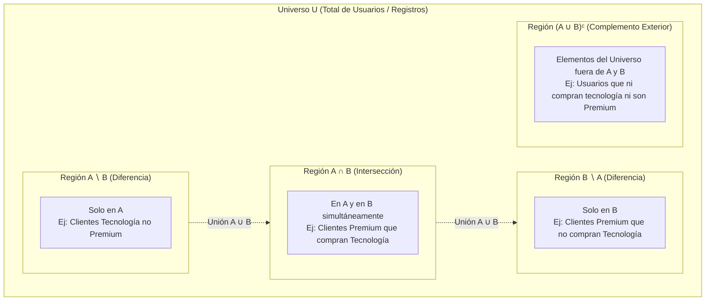
```mermaid
flowchart TD
    subgraph Universo["Universo U (Total de Usuarios / Registros)"]
        subgraph SoloA["Región A ∖ B (Diferencia)"]
            A_elem["Solo en A<br/>Ej: Clientes Tecnología no Premium"]
        end
        subgraph Interseccion["Región A ∩ B (Intersección)"]
            AB_elem["En A y en B simultáneamente<br/>Ej: Clientes Premium que compran Tecnología"]
        end
        subgraph SoloB["Región B ∖ A (Diferencia)"]
            B_elem["Solo en B<br/>Ej: Clientes Premium que no compran Tecnología"]
        end
        subgraph ComplementoExt["Región (A ∪ B)ᶜ (Complemento Exterior)"]
            U_elem["Elementos del Universo fuera de A y B<br/>Ej: Usuarios que ni compran tecnología ni son Premium"]
        end
    end

    SoloA -.->|"Unión A ∪ B"| Interseccion
    Interseccion -.->|"Unión A ∪ B"| SoloB
```

#### Relaciones de Inclusión y Particionado de Conjuntos en Big Data

En sistemas distribuidos, un conjunto universal de datos $U$ se divide mediante **particionamiento disjunto** para su procesamiento paralelo en clústeres:

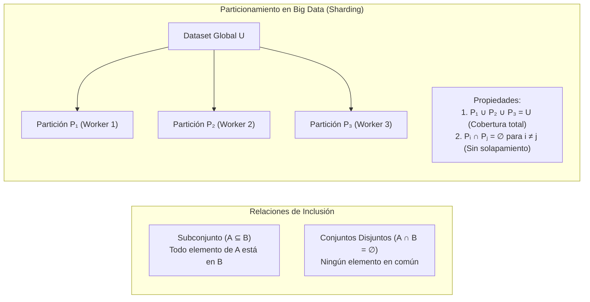
```mermaid
flowchart LR
    subgraph Inclusion["Relaciones de Inclusión"]
        direction TB
        Sub["Subconjunto (A ⊆ B)<br/>Todo elemento de A está en B"]
        Disj["Conjuntos Disjuntos (A ∩ B = ∅)<br/>Ningún elemento en común"]
    end

    subgraph Particionado["Particionamiento en Big Data (Sharding)"]
        direction TB
        U["Dataset Global U"] --> P1["Partición P₁ (Worker 1)"]
        U --> P2["Partición P₂ (Worker 2)"]
        U --> P3["Partición P₃ (Worker 3)"]
        Prop["Propiedades:<br/>1. P₁ ∪ P₂ ∪ P₃ = U (Cobertura total)<br/>2. Pᵢ ∩ Pⱼ = ∅ para i ≠ j (Sin solapamiento)"]
    end
```

> 💡 **Representación Visual (Diagramas de Venn):**  
> Los diagramas de Venn representan conjuntos mediante curvas cerradas (habitualmente círculos) en un plano. Las áreas superpuestas ilustran las relaciones e intersecciones entre los conjuntos, mientras que la región exterior dentro del rectángulo delimitador representa el universo $U$.

#### Ejemplo Práctico en Python (Analítica de Datos)

Imaginemos que analizamos usuarios de una plataforma e-commerce en Python utilizando `set` y un DataFrame de `pandas`:

```python
import pandas as pd

# Definición de universos y conjuntos de usuarios
universo_usuarios = {"Ana", "Luis", "Carlos", "Marta", "Pedro", "Sofia", "Jorge", "Elena"}
compradores_tecnologia = {"Ana", "Luis", "Carlos", "Marta"}      # Conjunto A
usuarios_premium = {"Carlos", "Marta", "Pedro", "Sofia"}          # Conjunto B

# Operaciones con tipos set en Python
union = compradores_tecnologia | usuarios_premium
interseccion = compradores_tecnologia & usuarios_premium
diferencia = compradores_tecnologia - usuarios_premium
complemento = universo_usuarios - compradores_tecnologia

print("Unión (A ∪ B):", union)
print("Intersección (A ∩ B):", interseccion)
print("Diferencia (A ∖ B - candidatos a suscripción):", diferencia)
print("Complemento (Aᶜ - usuarios que no compraron tecnología):", complemento)

# Equivalencia vectorial con Pandas
df_clientes = pd.DataFrame([
    {"usuario": u, "compro_tec": u in compradores_tecnologia, "es_premium": u in usuarios_premium}
    for u in universo_usuarios
])

# Filtrado por intersección y diferencia
premium_con_tecnologia = df_clientes[df_clientes["compro_tec"] & df_clientes["es_premium"]]
candidatos_promo = df_clientes[df_clientes["compro_tec"] & (~df_clientes["es_premium"])]

print("\n--- Vista en Pandas: Compraron tecnología y NO son Premium ---")
print(candidatos_promo[["usuario", "compro_tec", "es_premium"]])
```

---

### 1.3 Relaciones: Conexiones entre Elementos

Una **relación binaria** $R$ entre dos conjuntos $A$ y $B$ es formalmente un subconjunto de su producto cartesiano: $R \subseteq A \times B$. Representa una correspondencia o vínculo entre pares ordenados $(a, b)$ que satisfacen una condición específica (se escribe $a R b$ si $(a, b) \in R$).

**Ejemplo numérico:** Dado el conjunto $A = \{2, 3, 4, 6\}$, la relación *"es múltiplo de"* genera pares como $(4, 2)$, $(6, 2)$ y $(6, 3)$, pero no $(3, 2)$ ni $(2, 4)$.

#### Propiedades Fundamentales de las Relaciones

Sea una relación $R$ sobre un mismo conjunto $A$ ($R \subseteq A \times A$):

| Propiedad | Definición Formal | Explicación |
| :--- | :--- | :--- |
| **Reflexiva** | $\forall a \in A, \, (a, a) \in R$ | Todo elemento está relacionado consigo mismo. |
| **Simétrica** | $\forall a, b \in A, \, (a, b) \in R \implies (b, a) \in R$ | Si $a$ se relaciona con $b$, entonces obligatoriamente $b$ se relaciona con $a$ (relación bidireccional). |
| **Transitiva**| $\forall a, b, c \in A, \, ((a, b) \in R \land (b, c) \in R) \implies (a, c) \in R$ | Si $a$ se relaciona con $b$ y $b$ con $c$, entonces $a$ se relaciona directamente con $c$. |

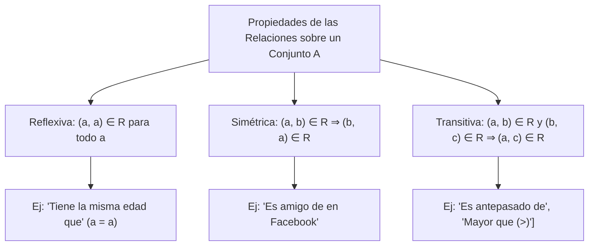
```mermaid
flowchart TD
    Prop["Propiedades de las Relaciones sobre un Conjunto A"]
    Prop --> Ref["Reflexiva: (a, a) ∈ R para todo a"]
    Prop --> Sim["Simétrica: (a, b) ∈ R ⇒ (b, a) ∈ R"]
    Prop --> Tra["Transitiva: (a, b) ∈ R y (b, c) ∈ R ⇒ (a, c) ∈ R"]

    Ref --> Ref_ej["Ej: 'Tiene la misma edad que' (a = a)"]
    Sim --> Sim_ej["Ej: 'Es amigo de en Facebook'"]
    Tra --> Tra_ej["Ej: 'Es antepasado de', 'Mayor que (>)']"]
```

#### Representación de Relaciones mediante Grafos Dirigidos (Digrafos)

Toda relación binaria sobre un conjunto finito puede representarse rigurosamente mediante un **grafo dirigido** donde los vértices son los elementos del conjunto y las aristas dirigidas representan los pares ordenados pertenecientes a la relación:

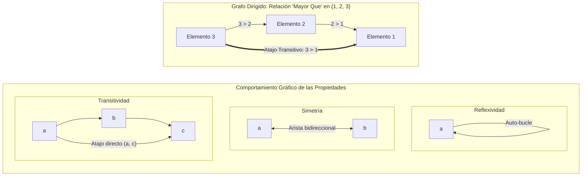
```mermaid
flowchart LR
    subgraph PropGrafos["Comportamiento Gráfico de las Propiedades"]
        direction TB
        subgraph Refl["Reflexividad"]
            R_a["a"] -->|"Auto-bucle"| R_a
        end
        subgraph Sime["Simetría"]
            S_a["a"] <-->|"Arista bidireccional"| S_b["b"]
        end
        subgraph Tran["Transitividad"]
            T_a["a"] --> T_b["b"]
            T_b --> T_c["c"]
            T_a -->|"Atajo directo (a, c)"| T_c
        end
    end

    subgraph CasoMayorQue["Grafo Dirigido: Relación 'Mayor Que' en {1, 2, 3}"]
        direction LR
        N3["Elemento 3"] -->|"3 > 2"| N2["Elemento 2"]
        N2 -->|"2 > 1"| N1["Elemento 1"]
        N3 ==>|"Atajo Transitivo: 3 > 1"| N1
    end
```

> 💡 **Interpretación del Grafo "Mayor Que":**  
> - **Sin bucles propios:** Ningún nodo tiene una arista hacia sí mismo ($a \ngtr a$) $\implies$ **No reflexiva**.  
> - **Sin aristas de retorno:** No existen caminos en sentido inverso ($2 \ngtr 3$) $\implies$ **No simétrica** (es asimétrica).  
> - **Atajo directo presente:** El camino $3 \to 2 \to 1$ está cerrado por la arista directa $3 \to 1$ $\implies$ **Transitiva**.

#### Caso de Estudio: La Relación "Es Mayor Que" ($>$)
Analicemos la relación $R = \{(a, b) \in \mathbb{R} \times \mathbb{R} \mid a > b\}$:
- **¿Es reflexiva?** ❌ **No**. Ningún número es estrictamente mayor que sí mismo ($a \ngtr a$).
- **¿Es simétrica?** ❌ **No**. Si $5 > 2$, es imposible que $2 > 5$.
- **¿Es transitiva?** ✅ **Sí**. Si $a > b$ y $b > c$, necesariamente $a > c$ (ej. $10 > 5$ y $5 > 2 \implies 10 > 2$).

> 📌 **Aplicación en Big Data:**  
> Las relaciones modelan las **claves foráneas (Foreign Keys)** en bases de datos relacionales, los vínculos de linaje entre transformaciones (DAG de dependencias), las interacciones en redes sociales (seguidores en Twitter son relaciones no simétricas, amigos en LinkedIn son simétricas) y los pares clave-valor `(K, V)` en MapReduce.

#### Ejemplo Práctico en Python: Validador de Propiedades Relacionales

```python
def evaluar_propiedades_relacion(conjunto: set, relacion: set) -> dict:
    """
    Evalúa si una relación binaria sobre un conjunto es reflexiva, simétrica y transitiva.
    """
    # 1. Reflexividad: (a, a) in relacion para todo a in conjunto
    es_reflexiva = all((a, a) in relacion for a in conjunto)
    
    # 2. Simetría: (a, b) in relacion => (b, a) in relacion
    es_simetrica = all((b, a) in relacion for (a, b) in relacion)
    
    # 3. Transitividad: (a, b) in relacion y (b, c) in relacion => (a, c) in relacion
    es_transitiva = True
    for (a, b) in relacion:
        for (x, c) in relacion:
            if b == x and (a, c) not in relacion:
                es_transitiva = False
                break
        if not es_transitiva:
            break
            
    return {
        "reflexiva": es_reflexiva,
        "simetrica": es_simetrica,
        "transitiva": es_transitiva
    }

# Prueba con el conjunto {1, 2, 3} y la relación ">" (Mayor que)
A = {1, 2, 3}
relacion_mayor_que = {(2, 1), (3, 1), (3, 2)}
resultados = evaluar_propiedades_relacion(A, relacion_mayor_que)

print("Relación 'Mayor que' en {1, 2, 3}:", relacion_mayor_que)
print("Evaluación formal:")
for prop, val in resultados.items():
    print(f"  - {prop.capitalize()}: {'✅ Sí' if val else '❌ No'}")
```

---

### 1.4 Funciones: Mapeo entre Conjuntos

Una **función** $f: A \to B$ es un tipo especial de relación matemática que asigna a **cada** elemento de un conjunto de entrada $A$ exactamente **un único** elemento de un conjunto de salida $B$.

- **Dominio ($A$):** Conjunto de todos los posibles valores de entrada para los cuales la función está definida.
- **Codominio ($B$):** Conjunto de todos los posibles valores de salida declarados.
- **Imagen o Rango ($f(A) \subseteq B$):** Subconjunto de valores del codominio que realmente son producidos por algún elemento del dominio.
- **Regla de correspondencia:** Expresión lógica o algoritmo que determina cómo transformar una entrada en su salida (ej. $f(x) = x^2 + 1$).

#### Clasificación de Funciones

| Tipo | Definición Formal | Explicación | Impacto Práctico |
| :--- | :--- | :--- | :--- |
| **Inyectiva** (*Uno a uno*) | $f(x_1) = f(x_2) \implies x_1 = x_2$ | Cada elemento del codominio tiene a lo sumo **una preimagen**. No hay dos entradas distintas con la misma salida. | Claves primarias únicas (`Primary Keys`), IDs generados sin colisiones. |
| **Suprayectiva** (*Sobreyectiva / Sobre*) | $\forall y \in B, \, \exists x \in A \text{ tq } f(x) = y$ | Todo elemento del codominio tiene al menos **una preimagen**. La imagen cubre por completo el codominio ($f(A) = B$). | Transformaciones completas de categorización donde todas las clases de salida son pobladas. |
| **Biyectiva** | Inyectiva $\land$ Suprayectiva | Correspondencia biunívoca perfecta y exacta entre $A$ y $B$. Tiene **función inversa** $f^{-1}$. | Codificación y decodificación reversible (cifrado, serialización/deserialización de datos). |

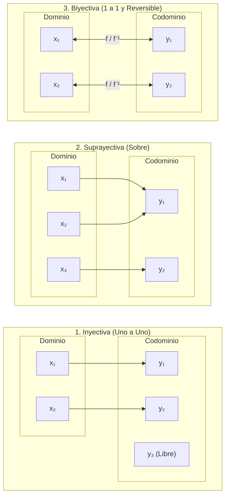
```mermaid
flowchart LR
    subgraph Inyectiva["1. Inyectiva (Uno a Uno)"]
        direction LR
        subgraph Dom1["Dominio"]
            i1["x₁"]
            i2["x₂"]
        end
        subgraph Cod1["Codominio"]
            iy1["y₁"]
            iy2["y₂"]
            iy3["y₃ (Libre)"]
        end
        i1 --> iy1
        i2 --> iy2
    end

    subgraph Suprayectiva["2. Suprayectiva (Sobre)"]
        direction LR
        subgraph Dom2["Dominio"]
            s1["x₁"]
            s2["x₂"]
            s3["x₃"]
        end
        subgraph Cod2["Codominio"]
            sy1["y₁"]
            sy2["y₂"]
        end
        s1 --> sy1
        s2 --> sy1
        s3 --> sy2
    end

    subgraph Biyectiva["3. Biyectiva (1 a 1 y Reversible)"]
        direction LR
        subgraph Dom3["Dominio"]
            b1["x₁"]
            b2["x₂"]
        end
        subgraph Cod3["Codominio"]
            by1["y₁"]
            by2["y₂"]
        end
        b1 <-->|"f / f⁻¹"| by1
        b2 <-->|"f / f⁻¹"| by2
    end
```

#### Diagrama de Función Hash y Sharding en Big Data

En almacenamiento distribuido y motores de procesamiento, una función de dispersión (*Hash Function*) mapea el espacio continuo o discreto de claves hacia un número finito de particiones o nodos de cómputo:

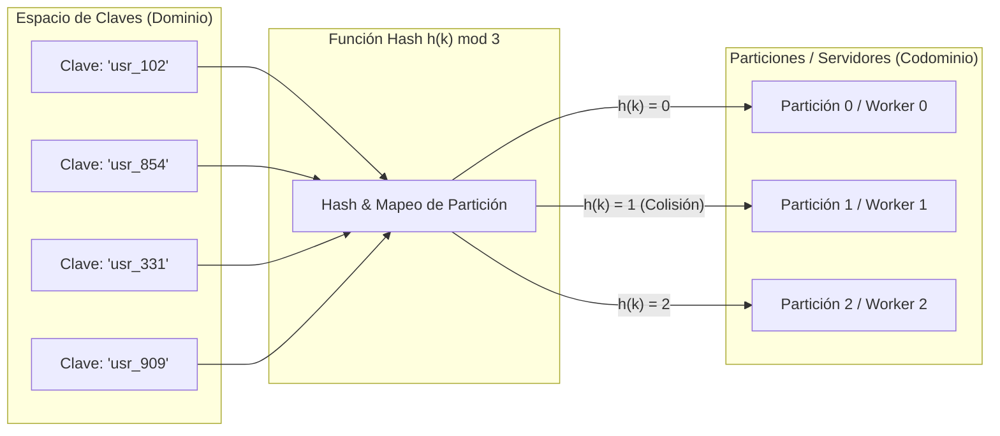
```mermaid
flowchart LR
    subgraph Claves["Espacio de Claves (Dominio)"]
        K1["Clave: 'usr_102'"]
        K2["Clave: 'usr_854'"]
        K3["Clave: 'usr_331'"]
        K4["Clave: 'usr_909'"]
    end

    subgraph Hash["Función Hash h(k) mod 3"]
        H["Hash & Mapeo de Partición"]
    end

    subgraph Workers["Particiones / Servidores (Codominio)"]
        W0["Partición 0 / Worker 0"]
        W1["Partición 1 / Worker 1"]
        W2["Partición 2 / Worker 2"]
    end

    K1 --> H
    K2 --> H
    K3 --> H
    K4 --> H

    H -->|"h(k) = 0"| W0
    H -->|"h(k) = 1 (Colisión)"| W1
    H -->|"h(k) = 2"| W2
```

> 📌 **Aplicaciones en Big Data:**  
> - **Funciones Hash:** Mapean un espacio de claves arbitrario a un rango finito de enteros. Si la función no es inyectiva, surgen *colisiones de hash*, lo que requiere algoritmos de resolución (encadenamiento o direccionamiento abierto) en tablas hash y sharding distribuido.
> - **Transformaciones ETL / MapReduce:** La primitiva `map(f)` toma un conjunto de datos y aplica la función determinista $f$ a cada registro en paralelo a través de los nodos del clúster.

#### Ejemplo Práctico en Python: Clasificación Funcional y Transformaciones

```python
import pandas as pd

def analizar_mapeo_funcional(dominio: list, codominio: list, mapeo: dict):
    """
    Determina si un mapeo entre dominio y codominio es inyectivo, suprayectivo y biyectivo.
    """
    imagenes = [mapeo[x] for x in dominio]
    valores_unicos_imagen = set(imagenes)
    
    # Inyectiva: longitud de entradas igual a salidas únicas (no hay dos x con igual y)
    es_inyectiva = len(dominio) == len(valores_unicos_imagen)
    
    # Suprayectiva: todos los elementos del codominio tienen al menos una preimagen
    es_suprayectiva = set(codominio).issubset(valores_unicos_imagen)
    
    # Biyectiva: ambas
    es_biyectiva = es_inyectiva and es_suprayectiva
    
    return {
        "inyectiva": es_inyectiva,
        "suprayectiva": es_suprayectiva,
        "biyectiva": es_biyectiva
    }

# Prueba con función de categorización de clientes por nivel de gasto
dom = ["Cliente_1", "Cliente_2", "Cliente_3"]
codom = ["Bajo", "Medio", "Alto"]
regla_mapeo = {"Cliente_1": "Medio", "Cliente_2": "Alto", "Cliente_3": "Medio"}

res_func = analizar_mapeo_funcional(dom, codom, regla_mapeo)
print("Mapeo analizado:", regla_mapeo)
print(f"  - Inyectiva: {res_func['inyectiva']} (Cliente_1 y Cliente_3 colisionan en 'Medio')")
print(f"  - Suprayectiva: {res_func['suprayectiva']} (La categoría 'Bajo' no tiene preimagen)")
print(f"  - Biyectiva: {res_func['biyectiva']}")

# Mapeo con Pandas en pipelines
df_transacciones = pd.DataFrame({"cliente_id": [101, 102, 103], "gasto": [45, 1200, 310]})
# Aplicación de una función determinista sobre una columna
df_transacciones["categoria"] = df_transacciones["gasto"].apply(
    lambda g: "Alto" if g > 500 else ("Medio" if g > 100 else "Bajo")
)
print("\n--- Pipeline con Pandas .apply() ---")
print(df_transacciones)
```

---

## 2. Lógica Proposicional y Lógica de Predicados

### 2.1 Lógica Proposicional: El Arte de Razonar

La **lógica proposicional** estudia las proposiciones y las formas en que se combinan mediante conectores lógicos para estructurar razonamientos válidos. Es el fundamento directo para el diseño de circuitos digitales (compuertas lógicas como AND, OR, NOT) y las sentencias condicionales en el código de cualquier lenguaje.

#### La Proposición (Afirmación)
Una **proposición** es un enunciado declarativo que posee un único valor de verdad bien determinado: **Verdadero (V)** o **Falso (F)**. No puede ser ambiguo, subjetivo, ni ambas cosas simultáneamente.

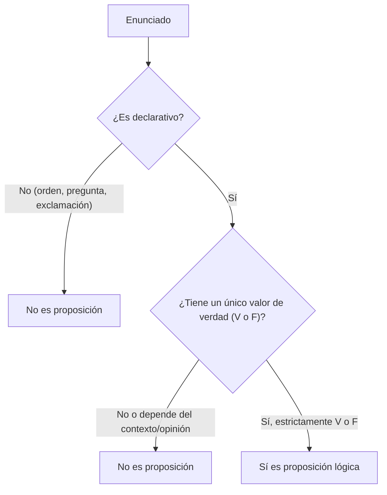
```mermaid
flowchart TD
    A["Enunciado"] --> B{"¿Es declarativo?"}
    B -->|"No (orden, pregunta, exclamación)"| C["No es proposición"]
    B -->|"Sí"| D{"¿Tiene un único valor de verdad (V o F)?"}
    D -->|"No o depende del contexto/opinión"| E["No es proposición"]
    D -->|"Sí, estrictamente V o F"| F["Sí es proposición lógica"]
```

#### Conectores Lógicos Básicos

| Conector | Nombre | Símbolo | Operador Python | Condición de Verdad |
| :--- | :--- | :---: | :---: | :--- |
| **Negación** | NOT | $\neg$ o $\sim$ | `not` o `~` | Invierte el valor: $\neg V = F$, $\neg F = V$. |
| **Conjunción** | AND | $\land$ | `and` o `&` | Verdadera **únicamente si ambas** proposiciones son verdaderas. |
| **Disyunción** | OR | $\lor$ | `or` o `\|` | Verdadera si **al menos una** de las proposiciones es verdadera. |
| **Implicación** | Si... entonces | $\rightarrow$ | `not p or q` | Verdadera siempre, **excepto** si el antecedente es $V$ y el consecuente $F$. |
| **Bicondicional**| Si y solo si | $\leftrightarrow$ | `p == q` | Verdadera cuando ambas proposiciones tienen **el mismo valor de verdad**. |

#### Tablas de Verdad Combinadas

| $p$ | $q$ | $\neg p$ | $p \land q$ | $p \lor q$ | $p \rightarrow q$ | $p \leftrightarrow q$ |
| :---: | :---: | :---: | :---: | :---: | :---: | :---: |
| **V** | **V** | F | **V** | **V** | **V** | **V** |
| **V** | **F** | F | F | **V** | F | F |
| **F** | **V** | **V** | F | **V** | **V** | F |
| **F** | **F** | **V** | F | F | **V** | **V** |

#### Casos de Negocio en Data Quality y Filtrado (Pandas)

```python
import pandas as pd
import numpy as np

# DataFrame con logs y pedidos
df_pedidos = pd.DataFrame([
    {"id": 1, "importe": 120, "envio_gratis": True,  "vip": True,  "email": "a@test.com"},
    {"id": 2, "importe": 130, "envio_gratis": False, "vip": False, "email": np.nan},
    {"id": 3, "importe": 40,  "envio_gratis": True,  "vip": True,  "email": "c@test.com"},
    {"id": 4, "importe": 35,  "envio_gratis": False, "vip": False, "email": np.nan}
])

# 1. Conjunción: Importe > 100 AND VIP
pedidos_vip_grandes = df_pedidos[(df_pedidos["importe"] > 100) & (df_pedidos["vip"] == True)]

# 2. Implicación: "Si el pedido > 100 €, entonces el envío DEBE ser gratis"
# Violación de regla: Antecedente Verdadero Y Consecuente Falso (p and not q)
p = df_pedidos["importe"] > 100
q = df_pedidos["envio_gratis"]
violaciones_regla_envio = df_pedidos[p & (~q)]

# 3. Bicondicional: "Es VIP si y solo si tiene email corporativo válido"
df_pedidos["bicondicional_email"] = df_pedidos["vip"] == df_pedidos["email"].notna()

print("Violaciones de la regla de envío gratis (Implicación rota):")
print(violaciones_regla_envio[["id", "importe", "envio_gratis"]])
print("\nRegistros con consistencia bicondicional (VIP <=> Email presente):")
print(df_pedidos[["id", "vip", "email", "bicondicional_email"]])
```

---

### 2.2 Tablas de Verdad y Clasificación de Proposiciones Compuestas

Al evaluar la tabla de verdad exhaustiva de cualquier fórmula lógica proposicional, la columna final nos permite clasificarla en tres categorías fundamentales:

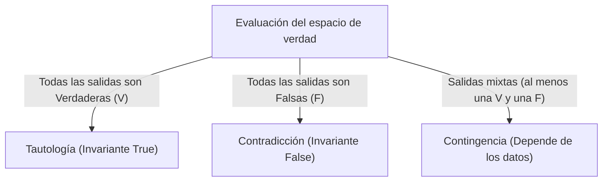
```mermaid
flowchart TD
    Eval["Evaluación del espacio de verdad"]
    Eval -->|"Todas las salidas son Verdaderas (V)"| Taut["Tautología (Invariante True)"]
    Eval -->|"Todas las salidas son Falsas (F)"| Contra["Contradicción (Invariante False)"]
    Eval -->|"Salidas mixtas (al menos una V y una F)"| Contin["Contingencia (Depende de los datos)"]
```

| Tipo | Resultado en Tabla | Significado Lógico | Impacto en Motores de Big Data / Optimización |
| :--- | :---: | :--- | :--- |
| **Tautología** | Siempre **V** | Verdad universal invariante ($p \lor \neg p$) | **Predicado trivial:** Motores como Catalyst (Spark) simplifican la cláusula a `True` y eliminan la evaluación para ahorrar CPU. |
| **Contradicción** | Siempre **F** | Imposibilidad lógica ($p \land \neg p$) | **Poda de particiones (*Partition Pruning*):** El planificador descarta leer archivos de disco porque la relación retornará 0 registros. |
| **Contingencia** | Mixto (**V** y **F**) | Depende de los datos ($p \land q$) | **Filtro selectivo:** Condición de negocio habitual que selecciona un subconjunto dinámico de filas. |

#### Ejemplo en Python: Clasificador Exhaustivo de Fórmulas Lógicas

```python
import itertools

def clasificar_formula_logica(nombre: str, func, n_variables: int = 2):
    """
    Evalúa exhaustivamente el espacio booleano {True, False}^n para clasificar una expresión.
    """
    combinaciones = list(itertools.product([True, False], repeat=n_variables))
    resultados = [func(*comb) for comb in combinaciones]
    
    if all(resultados):
        categoria = "TAUTOLOGÍA (Siempre Verdadera)"
    elif not any(resultados):
        categoria = "CONTRADICCIÓN (Siempre Falsa)"
    else:
        categoria = "CONTINGENCIA (Dependiente del estado)"
        
    print(f"Fórmula: {nombre:15} -> {categoria} | Resultados: {resultados}")

# Pruebas de expresiones:
clasificar_formula_logica("p ∨ ¬p", lambda p: p or not p, n_variables=1)
clasificar_formula_logica("p ∧ ¬p", lambda p: p and not p, n_variables=1)
clasificar_formula_logica("p ∧ q",  lambda p, q: p and q, n_variables=2)
clasificar_formula_logica("p → (p ∨ q)", lambda p, q: (not p) or (p or q), n_variables=2)
```

---

### 2.3 Lógica de Predicados: Más Allá de lo Binario

La lógica proposicional trata a las afirmaciones como cajas negras atómicas ($p, q$). Sin embargo, en el análisis de datos necesitamos modelar **propiedades sobre objetos específicos** y **relaciones entre múltiples variables**. Aquí entra la **lógica de primer orden o lógica de predicados**.

Un **predicado** $P(x)$ es una función proposicional que toma una o más variables de un dominio de discurso $D$ y devuelve un valor de verdad.
- Ejemplo: $P(x) = \text{“}x \text{ es un servidor activo”}$. Si $x = \text{“Nodo-1”}$, $P(\text{Nodo-1})$ evalúa a $V$ o $F$.

#### Cuantificadores Lógicos

Los cuantificadores determinan cuántos elementos del dominio satisfacen un predicado:

| Cuantificador | Símbolo | Lectura | Significado Formal | Equivalencia Discreta |
| :--- | :---: | :--- | :--- | :--- |
| **Universal** | $\forall$ | *"Para todo"* | $\forall x \, P(x)$: La propiedad $P(x)$ es verdadera para **todos y cada uno** de los elementos $x \in D$. | $P(x_1) \land P(x_2) \land \dots \land P(x_n)$ |
| **Existencial** | $\exists$ | *"Existe al menos uno"* | $\exists x \, P(x)$: Existe **al menos un** elemento $x \in D$ tal que $P(x)$ es verdadero. | $P(x_1) \lor P(x_2) \lor \dots \lor P(x_n)$ |

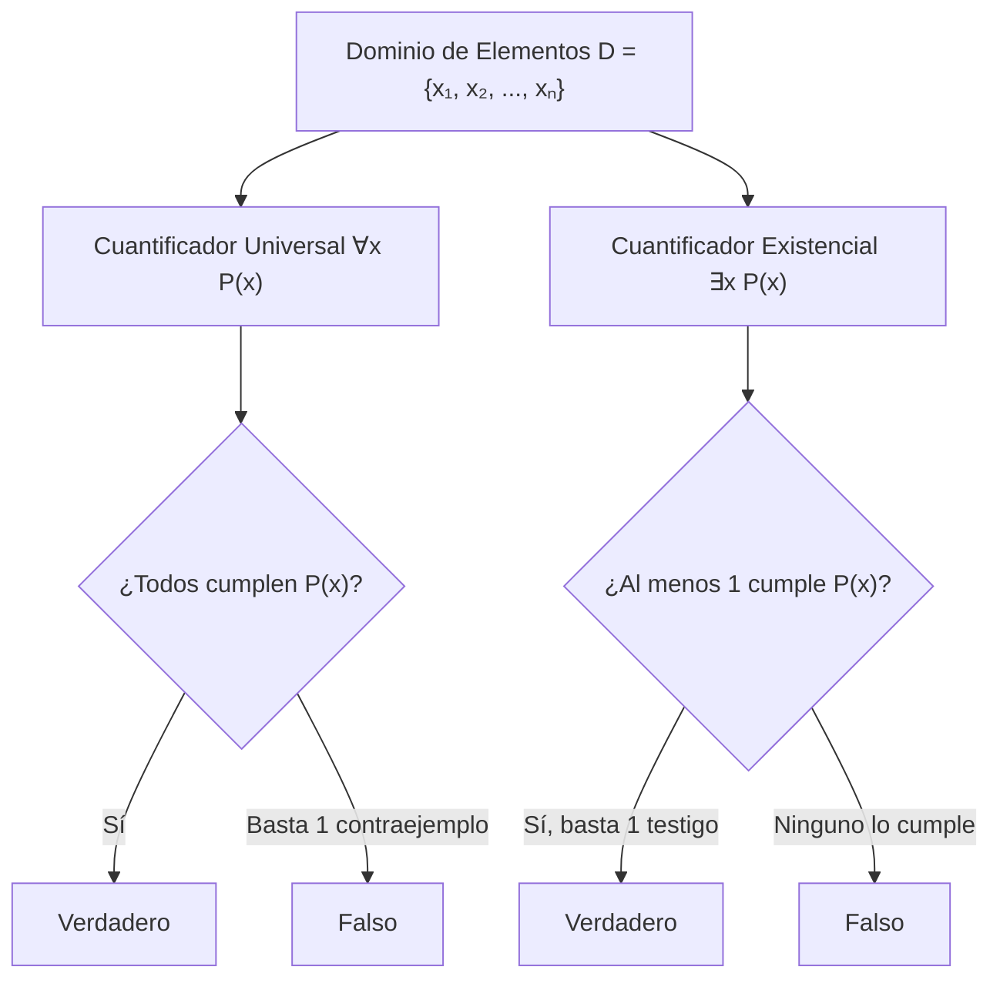
```mermaid
flowchart TD
    Dominio["Dominio de Elementos D = {x₁, x₂, ..., xₙ}"]
    Dominio --> CuantUniv["Cuantificador Universal ∀x P(x)"]
    Dominio --> CuantExist["Cuantificador Existencial ∃x P(x)"]

    CuantUniv --> CU_res{"¿Todos cumplen P(x)?"}
    CU_res -->|"Sí"| CU_V["Verdadero"]
    CU_res -->|"Basta 1 contraejemplo"| CU_F["Falso"]

    CuantExist --> CE_res{"¿Al menos 1 cumple P(x)?"}
    CE_res -->|"Sí, basta 1 testigo"| CE_V["Verdadero"]
    CE_res -->|"Ninguno lo cumple"| CE_F["Falso"]
```

#### Negación de Cuantificadores (Leyes de De Morgan Generalizadas)
- Negar que *todos* cumplan una propiedad equivale a afirmar que *existe al menos uno* que no la cumple:
  $$\neg(\forall x \, P(x)) \equiv \exists x \, \neg P(x)$$
- Negar que *exista alguien* que cumpla una propiedad equivale a decir que *todos* la incumplen:
  $$\neg(\exists x \, P(x)) \equiv \forall x \, \neg P(x)$$

> 📌 **Aplicaciones en Inteligencia Artificial y Big Data:**  
> - **Representación del conocimiento en IA:** Modelado de ontologías (OWL), razonamiento en grafos de conocimiento y procesamiento del lenguaje natural.
> - **Verificación formal de software:** Especificación de invariantes de bucles, precondiciones y postcondiciones en arquitecturas críticas.
> - **Consultas analíticas:** Cláusulas SQL del tipo `WHERE NOT EXISTS (...)`, o validaciones en pipelines `all()` y `any()`.

#### Ejemplo Práctico en Python: Evaluación de Predicados y Cuantificadores

```python
import pandas as pd

# Servidores de un cluster distribuido
df_cluster = pd.DataFrame([
    {"nodo": "srv-01", "cpu_pct": 45, "activo": True,  "version_os": "Ubuntu 22.04"},
    {"nodo": "srv-02", "cpu_pct": 78, "activo": True,  "version_os": "Ubuntu 22.04"},
    {"nodo": "srv-03", "cpu_pct": 92, "activo": True,  "version_os": "Ubuntu 22.04"},
    {"nodo": "srv-04", "cpu_pct": 15, "activo": False, "version_os": "Ubuntu 20.04"}
])

# Predicado P(x): "El nodo x está activo"
# Predicado Q(x): "La CPU de x supera el 85%"
# Predicado R(x): "La versión de OS de x es Ubuntu 22.04"

# 1. Cuantificador Universal: ∀x P(x) -> "¿Están TODOS los nodos activos?"
todos_activos = df_cluster["activo"].all()
print(f"∀x P(x) [Todos activos]: {todos_activos}")

# 2. Cuantificador Existencial: ∃x Q(x) -> "¿Existe AL MENOS UN nodo con sobrecarga de CPU (>85%)?"
existe_sobrecarga = (df_cluster["cpu_pct"] > 85).any()
print(f"∃x Q(x) [Existe sobrecarga]: {existe_sobrecarga}")

# 3. Demostración De Morgan: ¬(∀x R(x)) <=> ∃x ¬R(x)
neg_para_todo_os = not (df_cluster["version_os"] == "Ubuntu 22.04").all()
existe_distinto_os = (df_cluster["version_os"] != "Ubuntu 22.04").any()
print(f"¬(∀x R(x)) equivale a ∃x ¬R(x): {neg_para_todo_os == existe_distinto_os} ({neg_para_todo_os})")
```

---

### 2.4 Inferencia Lógica: Sacando Conclusiones

La **inferencia lógica** es el proceso formal mediante el cual se deducen nuevas proposiciones o conclusiones válidas a partir de un conjunto de premisas asumidas como verdaderas. Si las premisas son verdaderas y la regla de inferencia es válida, la conclusión está **garantizada** como verdadera.

#### Reglas Fundamentales de Inferencia

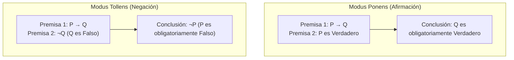
```mermaid
flowchart TD
    subgraph MP["Modus Ponens (Afirmación)"]
        MP_P["Premisa 1: P → Q<br/>Premisa 2: P es Verdadero"] --> MP_C["Conclusión: Q es obligatoriamente Verdadero"]
    end
    subgraph MT["Modus Tollens (Negación)"]
        MT_P["Premisa 1: P → Q<br/>Premisa 2: ¬Q (Q es Falso)"] --> MT_C["Conclusión: ¬P (P es obligatoriamente Falso)"]
    end
```

1. **Modus Ponens (Modo que afirma al afirmar):**
   - **Regla formal:** $[(P \rightarrow Q) \land P] \implies Q$
   - **Esquema:**
     - Si ocurre $P$, entonces ocurre $Q$. *(Premisa 1)*
     - Se constata que ocurre $P$. *(Premisa 2)*
     - **Conclusión:** Ocurre $Q$.
   - **Ejemplo en Big Data:**
     - *P1:* Si el volumen de datos supera 1 TB/hora ($P$), el motor activa particionado distribuido ($Q$).
     - *P2:* El volumen actual es 1.5 TB/hora ($P$ es $V$).
     - *Conclusión:* El motor activa particionado distribuido ($Q$ es $V$).

2. **Modus Tollens (Modo que niega al negar):**
   - **Regla formal:** $[(P \rightarrow Q) \land \neg Q] \implies \neg P$
   - **Esquema:**
     - Si ocurre $P$, entonces ocurre $Q$. *(Premisa 1)*
     - Se constata que no ocurre $Q$ ($\neg Q$). *(Premisa 2)*
     - **Conclusión:** No ocurrió $P$ ($\neg P$).
   - **Ejemplo en Seguridad:**
     - *P1:* Si la transacción es legítima ($P$), la firma criptográfica es válida ($Q$).
     - *P2:* La firma criptográfica no es válida ($\neg Q$).
     - *Conclusión:* La transacción no es legítima ($\neg P$, activar alerta de fraude).

> 📌 **Base para Sistemas Expertos e Inteligencia Artificial:**  
> - **Sistemas basados en reglas (Rule-Based Expert Systems):** Compuestos por una base de conocimientos (hechos) y un conjunto de reglas `SI (condición) ENTONCES (acción)`.
> - **Motores de Inferencia (Inference Engines):**
>   - *Encadenamiento hacia adelante (Forward Chaining):* Parte de los datos conocidos y aplica *Modus Ponens* repetidamente para derivar todas las conclusiones posibles (típico en monitoreo y alertas en tiempo real).
>   - *Encadenamiento hacia atrás (Backward Chaining):* Parte de una hipótesis meta y busca premisas que la sustenten (típico en sistemas de diagnóstico médico o resolución de incidencias).

#### Ejemplo Práctico en Python: Motor de Inferencia Deductivo

```python
class MotorInferenciaReglas:
    """
    Motor básico de inferencia lógica que aplica Modus Ponens y Modus Tollens.
    """
    def __init__(self):
        self.hechos_verdaderos = set()
        self.hechos_falsos = set()
        self.reglas_implicacion = [] # Lista de tuplas (P, Q) representando P -> Q

    def registrar_hecho(self, hecho: str, valor: bool):
        if valor:
            self.hechos_verdaderos.add(hecho)
        else:
            self.hechos_falsos.add(hecho)

    def agregar_regla(self, antecedente: str, consecuente: str):
        self.reglas_implicacion.append((antecedente, consecuente))

    def inferir(self) -> dict:
        nuevas_inferencias = {}
        cambios = True
        
        while cambios:
            cambios = False
            for P, Q in self.reglas_implicacion:
                # Modus Ponens: P -> Q y P es V => Q es V
                if P in self.hechos_verdaderos and Q not in self.hechos_verdaderos:
                    self.hechos_verdaderos.add(Q)
                    nuevas_inferencias[Q] = ("Verdadero", f"Modus Ponens derivado de {P}")
                    cambios = True
                
                # Modus Tollens: P -> Q y Q es F => P es F
                if Q in self.hechos_falsos and P not in self.hechos_falsos:
                    self.hechos_falsos.add(P)
                    nuevas_inferencias[P] = ("Falso", f"Modus Tollens derivado de ¬{Q}")
                    cambios = True
                    
        return nuevas_inferencias

# Simulación de un sistema de diagnóstico de clúster Big Data
motor = MotorInferenciaReglas()

# Reglas del sistema:
# 1. Pérdida_Heartbeat -> Nodo_Caído
# 2. Nodo_Caído -> Rebalanceo_Particiones
# 3. Respuesta_Ping_OK -> Red_Operativa
motor.agregar_regla("Perdida_Heartbeat", "Nodo_Caido")
motor.agregar_regla("Nodo_Caido", "Rebalanceo_Particiones")
motor.agregar_regla("Transaccion_Legitima", "Firma_Valida")

# Hechos observados:
motor.registrar_hecho("Perdida_Heartbeat", True) # Se detecta pérdida de heartbeat
motor.registrar_hecho("Firma_Valida", False)       # La firma de la transacción falló

conclusiones = motor.inferir()
print("--- Conclusiones obtenidas por el Motor de Inferencia ---")
for hecho, (val, razon) in conclusiones.items():
    print(f"• Hecho derivado: {hecho:25} = {val:10} | Justificación: {razon}")
```

---

## 3. Algorítmica, Estructuras de Datos y Complejidad Computacional

### 3.1 Algoritmos: Recetas para Resolver Problemas

Un **algoritmo** es una secuencia ordenada, unívoca y finita de instrucciones o pasos lógicos bien definidos que toma un conjunto de datos de entrada, los procesa y produce una solución o resultado de salida.

#### Características Formales de un Algoritmo
1. **Finitud:** El algoritmo debe finalizar obligatoriamente tras un número finito de pasos para cualquier entrada válida. Nunca puede quedar en bucles infinitos no intencionados.
2. **Definición (Precisión):** Cada paso debe estar libre de ambigüedades. Dadas las mismas entradas, la ejecución debe producir exactamente el mismo comportamiento paso a paso.
3. **Efectividad:** Cada instrucción debe ser lo suficientemente básica y realizable con recursos computacionales finitos (tiempo y memoria finitos).

---

### 3.2 Pseudocódigo: Planificando la Solución

El **pseudocódigo** es una descripción informal de alto nivel de un algoritmo que combina lenguaje natural estructurado con convenciones de programación. Actúa como puente entre la conceptualización del algoritmo y su implementación en un lenguaje específico (como Python, Scala o Java).

- Permite abstraerse de detalles sintácticos estrictos (punteros, llaves, tipos rígidos) y centrarse en la corrección lógica.
- Utiliza palabras clave estándar: `SI-ENTONCES-SINO`, `MIENTRAS`, `PARA`, `RETORNAR`.
- Facilita la comunicación algorítmica entre ingenieros y científicos de datos antes de escribir código de producción.

---

### 3.3 Estructuras de Control: Dirigiendo el Flujo

Todo algoritmo computacional puede implementarse utilizando únicamente tres estructuras de control fundamentales:

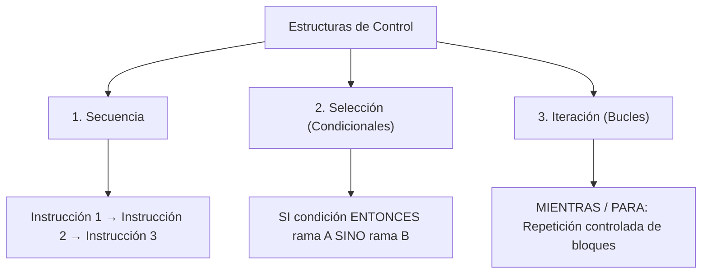
```mermaid
flowchart TD
    EC["Estructuras de Control"]
    EC --> Sec["1. Secuencia"]
    EC --> Sel["2. Selección (Condicionales)"]
    EC --> Ite["3. Iteración (Bucles)"]

    Sec --> Sec_d["Instrucción 1 → Instrucción 2 → Instrucción 3"]
    Sel --> Sel_d["SI condición ENTONCES rama A SINO rama B"]
    Ite --> Ite_d["MIENTRAS / PARA: Repetición controlada de bloques"]
```

---

### 3.4 Tipos de Datos: Organizando la Información

La organización de los datos en memoria determina la velocidad con la que un algoritmo puede acceder, buscar y modificar información:

1. **Tipos Primitivos:** Elementos atómicos gestionados directamente por los registros del procesador (`int`, `float`, `bool`, `char`).
2. **Tipos Estructurados:** Agrupaciones de tipos primitivos u otras estructuras (`arrays`, listas contiguas, tuplas, diccionarios).
3. **Tipos Abstractos de Datos (TAD):** Modelos conceptuales que definen qué operaciones se pueden realizar sobre los datos sin importar la implementación física:
   - **Pila (*Stack*):** Estructura **LIFO** (*Last In, First Out*). El último elemento insertado es el primero en salir (ej. historial de navegación, llamadas a funciones en la pila de ejecución).
   - **Cola (*Queue*):** Estructura **FIFO** (*First In, First Out*). El primer elemento insertado es el primero en ser procesado (ej. buffers de ingesta de mensajes como Apache Kafka o RabbitMQ).
   - **Grafos y Árboles:** Estructuras no lineales que modelan jerarquías y redes interconectadas.

#### Ejemplo Práctico en Python: Implementación de Pilas y Colas con `collections.deque`

```python
from collections import deque

# 1. TAD Cola (FIFO) para ingesta de eventos de streaming
cola_eventos = deque()
cola_eventos.append("Evento_01: Login")
cola_eventos.append("Evento_02: Clic_Boton")
cola_eventos.append("Evento_03: Compra")

print("Cola inicial (FIFO):", list(cola_eventos))
evento_procesado = cola_eventos.popleft() # Extrae el más antiguo
print(f"Evento atendido: {evento_procesado}")
print("Cola restante:", list(cola_eventos))

# 2. TAD Pila (LIFO) para backtracking o reversión de transacciones
pila_operaciones = []
pila_operaciones.append("UPDATE saldo SET 100")
pila_operaciones.append("INSERT INTO auditoria")
pila_operaciones.append("LOCK TABLE")

print("\nPila inicial (LIFO):", pila_operaciones)
rollback = pila_operaciones.pop() # Extrae la última operación ejecutada
print(f"Operación revertida (Undo): {rollback}")
print("Pila restante:", pila_operaciones)
```

---

### 3.5 Complejidad Computacional: Midiendo Eficiencia

El rendimiento de un algoritmo se evalúa analizando el consumo de dos recursos esenciales en función del tamaño de entrada $n$:
- **Tiempo ($T(n)$):** Número de operaciones elementales ejecutadas por la CPU.
- **Espacio ($S(n)$):** Cantidad de memoria volátil RAM consumida.

#### La Notación Big O ($O$)
La notación **Big O** define el límite superior asintótico del crecimiento de un algoritmo. Nos indica el **peor escenario posible** de consumo de recursos cuando el volumen de datos tiende a infinito ($n \to \infty$).

##### 1. Gráfico de Curvas en Mermaid (Plano Cartesiano $n$ vs Operaciones)

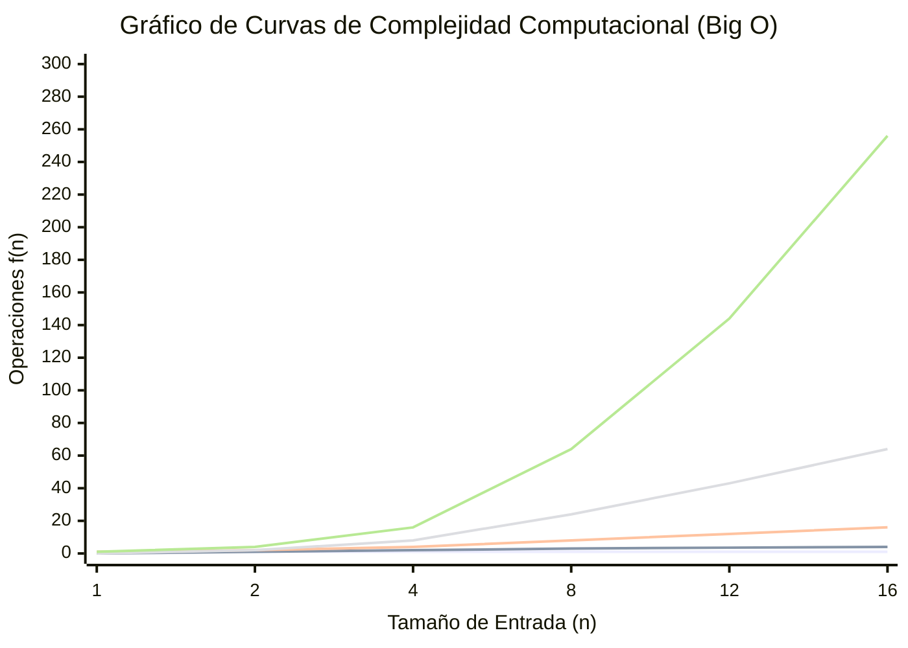
```mermaid
xychart-beta
    title "Gráfico de Curvas de Complejidad Computacional (Big O)"
    x-axis "Tamaño de Entrada (n)" [1, 2, 4, 8, 12, 16]
    y-axis "Operaciones f(n)" 0 --> 300
    line [1, 1, 1, 1, 1, 1]
    line [0, 1, 2, 3, 3.58, 4]
    line [1, 2, 4, 8, 12, 16]
    line [0, 2, 8, 24, 43, 64]
    line [1, 4, 16, 64, 144, 256]
```

> 📊 **Correspondencia de Curvas en el Gráfico Mermaid (hasta $n = 16$):**  
> - **Curva 1 (Horizontal plana):** $O(1)$ — Constante ($y = 1$)  
> - **Curva 2 (Sublineal):** $O(\log_2 n)$ — Logarítmica ($y = 4$ para $n = 16$)  
> - **Curva 3 (Diagonal 1:1):** $O(n)$ — Lineal ($y = 16$ para $n = 16$)  
> - **Curva 4 (Ascendente):** $O(n \log_2 n)$ — Lineal-logarítmica ($y = 64$ para $n = 16$)  
> - **Curva 5 (Parabólica):** $O(n^2)$ — Cuadrática ($y = 256$ para $n = 16$)  
> - *(Fuera de escala vertical):* $O(2^n)$ — Exponencial ($2^{16} = 65.536$ operaciones, escala verticalmente disparada)

##### 2. Infografía de Referencia de Curvas y Zonas de Rendimiento
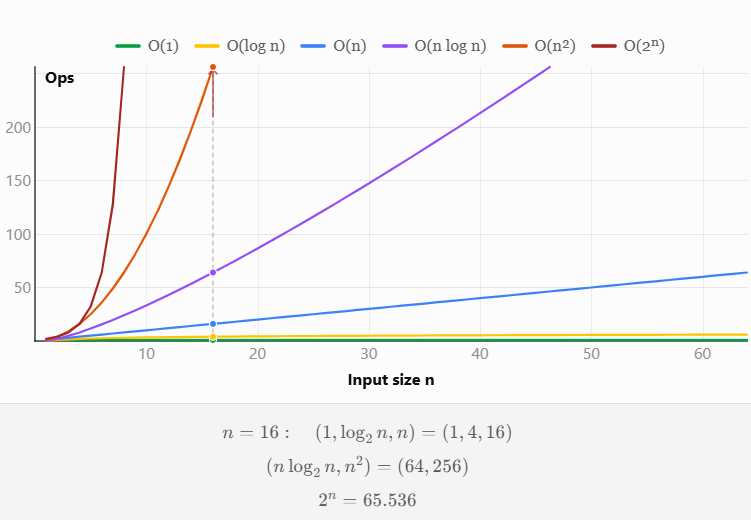

##### 3. Diagrama Estructural de Zonas y Escalabilidad en Big Data
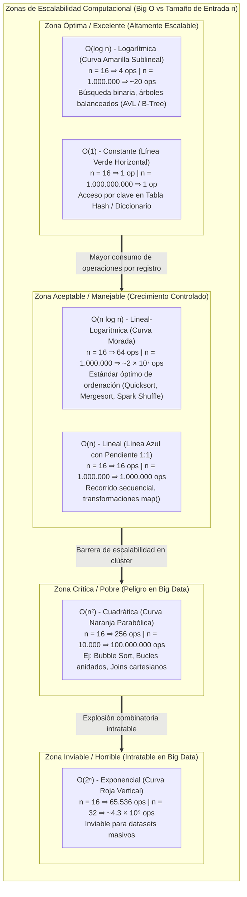
```mermaid
flowchart TD
    subgraph BigOChart["Zonas de Escalabilidad Computacional (Big O vs Tamaño de Entrada n)"]
        direction TB

        subgraph Inviable["Zona Inviable / Horrible (Intratable en Big Data)"]
            O2n["O(2ⁿ) - Exponencial (Curva Roja Vertical)<br/>n = 16 ⇒ 65.536 ops | n = 32 ⇒ ~4.3 × 10⁹ ops<br/>Inviable para datasets masivos"]
        end

        subgraph Critico["Zona Crítica / Pobre (Peligro en Big Data)"]
            On2["O(n²) - Cuadrática (Curva Naranja Parabólica)<br/>n = 16 ⇒ 256 ops | n = 10.000 ⇒ 100.000.000 ops<br/>Ej: Bubble Sort, Bucles anidados, Joins cartesianos"]
        end

        subgraph Aceptable["Zona Aceptable / Manejable (Crecimiento Controlado)"]
            Onlogn["O(n log n) - Lineal-Logarítmica (Curva Morada)<br/>n = 16 ⇒ 64 ops | n = 1.000.000 ⇒ ~2 × 10⁷ ops<br/>Estándar óptimo de ordenación (Quicksort, Mergesort, Spark Shuffle)"]
            On["O(n) - Lineal (Línea Azul con Pendiente 1:1)<br/>n = 16 ⇒ 16 ops | n = 1.000.000 ⇒ 1.000.000 ops<br/>Recorrido secuencial, transformaciones map()"]
        end

        subgraph Optima["Zona Óptima / Excelente (Altamente Escalable)"]
            Ologn["O(log n) - Logarítmica (Curva Amarilla Sublineal)<br/>n = 16 ⇒ 4 ops | n = 1.000.000 ⇒ ~20 ops<br/>Búsqueda binaria, árboles balanceados (AVL / B-Tree)"]
            O1["O(1) - Constante (Línea Verde Horizontal)<br/>n = 16 ⇒ 1 op | n = 1.000.000.000 ⇒ 1 op<br/>Acceso por clave en Tabla Hash / Diccionario"]
        end

        Optima ==>|"Mayor consumo de operaciones por registro"| Aceptable
        Aceptable ==>|"Barrera de escalabilidad en clúster"| Critico
        Critico ==>|"Explosión combinatoria intratable"| Inviable
    end
```

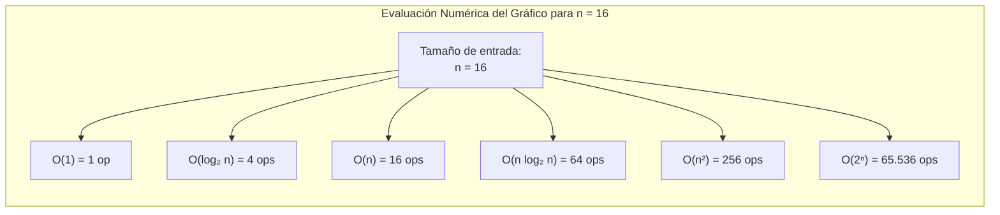
```mermaid
flowchart LR
    subgraph EvalN16["Evaluación Numérica del Gráfico para n = 16"]
        direction TB
        N16["Tamaño de entrada:<br/>n = 16"]
        N16 --> E1["O(1) = 1 op"]
        N16 --> E2["O(log₂ n) = 4 ops"]
        N16 --> E3["O(n) = 16 ops"]
        N16 --> E4["O(n log₂ n) = 64 ops"]
        N16 --> E5["O(n²) = 256 ops"]
        N16 --> E6["O(2ⁿ) = 65.536 ops"]
    end
```

> 💡 **Nota sobre las curvas:**  
> Para una muestra de tamaño $n = 16$:  
> - $(1, \log_2 n, n) = (1, 4, 16)$  
> - $(n \log_2 n, n^2) = (64, 256)$  
> - $2^n = 65.536$ ops. Mientras que un algoritmo $O(1)$ o $O(\log n)$ se ejecuta en nanosegundos, un algoritmo $O(2^n)$ se dispara de forma inasumible.

| Complejidad | Nombre | Ejemplo Típico | Comportamiento en Big Data |
| :--- | :--- | :--- | :--- |
| $O(1)$ | Constante | Acceso por clave en tabla hash / índice de array | **Óptimo:** Mismo tiempo para 10 filas que para $10^9$ filas. |
| $O(\log n)$ | Logarítmica | Búsqueda binaria, búsqueda en árboles balanceados | **Excelente:** Duplicar los datos añade solo 1 operación adicional. |
| $O(n)$ | Lineal | Búsqueda secuencial, recorrido de filtrado simple | **Aceptable:** Crece proporcionalmente al tamaño del dataset. |
| $O(n \log n)$ | Lineal-logarítmica | Quicksort, Mergesort, ordenamiento distribuido | **Estándar:** Límite teórico inferior de ordenación por comparación. |
| $O(n^2)$ | Cuadrática | Bucles anidados, Bubble Sort, producto cartesiano | **Crítico:** Totalmente inviable para $n > 10^5$ registros. |
| $O(2^n)$ | Exponencial | Fuerza bruta, subconjuntos de un grafo | **Inviable:** Requiere heurísticas o aproximaciones. |

---

### 3.6 Análisis Asintótico: Comportamiento a Largo Plazo

El análisis asintótico estudia la tendencia de crecimiento de una función matemática ignorando detalles irrelevantes de hardware específico:

1. **Se ignoran las constantes multiplicativas:**  
   $O(3n) \to O(n)$  
   $O(500) \to O(1)$  
2. **Se descartan los términos de menor orden:**  
   $O(n^2 + 100n + 5000) \to O(n^2)$  
   Porque cuando $n = 1.000.000$, $n^2 = 10^{12}$, mientras que $100n$ es apenas $10^8$. El término $n^2$ domina abrumadoramente el tiempo de ejecución.

---

### 3.7 Clases de Complejidad: Categorización de Problemas

En la teoría de la computación, los problemas de decisión se clasifican según los recursos requeridos para resolverlos o verificarlos:

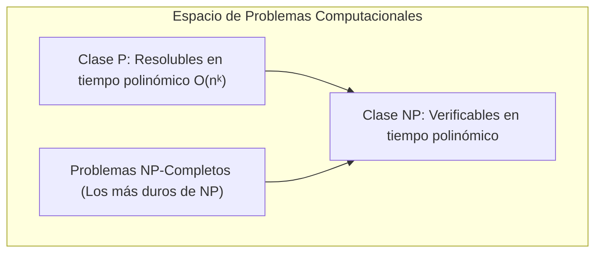
```mermaid
flowchart TD
    subgraph Espacio["Espacio de Problemas Computacionales"]
        NP["Clase NP: Verificables en tiempo polinómico"]
        P["Clase P: Resolubles en tiempo polinómico O(nᵏ)"]
        NPC["Problemas NP-Completos (Los más duros de NP)"]
        
        P --> NP
        NPC --> NP
    end
```

- **Clase P (*Polynomial time*):** Problemas resolubles en tiempo polinómico ($O(n^k)$ para alguna constante $k$). Son computacionalmente **tratables**.  
  *Ejemplos:* Búsqueda binaria ($O(\log n)$), ordenación ($O(n \log n)$), camino mínimo de Dijkstra.
- **Clase NP (*Nondeterministic Polynomial time*):** Problemas cuyas soluciones, una vez obtenidas, pueden **verificarse** en tiempo polinómico, aunque encontrarlas pueda ser extremadamente costoso.
- **Problemas NP-Completos:** Los problemas más difíciles dentro de $NP$. Si se descubriera un algoritmo polinómico para cualquiera de ellos, **todos** los problemas en $NP$ podrían resolverse en tiempo polinómico ($P = NP$).  
  *Ejemplos clásicos:* Problema del viajante de comercio (TSP), Satisfacibilidad Booleana (SAT), Problema de la Mochila (*Knapsack*).  
  *Tratamiento en Big Data:* No se busca la solución exacta óptima por su coste astronómico; se aplican **algoritmos de aproximación y metaheurísticas** (algoritmos genéticos, greedy algorithms, recocido simulado).

---

### 3.8 Algoritmos de Búsqueda: Encontrando Información

La búsqueda de elementos en memoria o disco es una de las operaciones más recurrentes en ingeniería de datos:

1. **Búsqueda Lineal ($O(n)$):** Recorre la colección elemento a elemento. No exige orden previo, pero es muy lenta para millones de registros.
2. **Búsqueda Binaria ($O(\log n)$):** Requiere que los datos estén previamente ordenados. En cada paso compara con el elemento central y descarta la mitad del espacio restante.
3. **Árboles de Búsqueda (ABB / AVL):** Estructuras jerárquicas dinámicas donde cada nodo tiene a su izquierda elementos menores y a su derecha elementos mayores. Los árboles balanceados (AVL) garantizan búsquedas, inserciones y borrados en $O(\log n)$.

#### Ejemplo Práctico en Python: Comparativa de Búsqueda Lineal vs Binaria vs Hash

```python
import time
import bisect

# Dataset sintético ordenado de 1.000.000 de enteros
n = 1_000_000
datos_lista = list(range(n))
datos_set = set(datos_lista) # Hash Table O(1)
objetivo = 999_998           # Elemento cercano al final

# 1. Búsqueda Lineal O(n)
t0 = time.perf_counter()
encontrado_lineal = objetivo in datos_lista
t_lineal = time.perf_counter() - t0

# 2. Búsqueda Binaria O(log n) usando bisect sobre lista ordenada
t0 = time.perf_counter()
idx = bisect.bisect_left(datos_lista, objetivo)
encontrado_binario = (idx < len(datos_lista) and datos_lista[idx] == objetivo)
t_binario = time.perf_counter() - t0

# 3. Búsqueda en Tabla Hash O(1)
t0 = time.perf_counter()
encontrado_hash = objetivo in datos_set
t_hash = time.perf_counter() - t0

print(f"Tiempo Búsqueda Lineal  O(n):     {t_lineal:.8f} s")
print(f"Tiempo Búsqueda Binaria O(log n): {t_binario:.8f} s")
print(f"Tiempo Búsqueda Hash    O(1):     {t_hash:.8f} s")
print(f"Aceleración Binaria vs Lineal:    {t_lineal / max(t_binario, 1e-9):.1f}x veces más rápida")
```

---

### 3.9 Algoritmos de Ordenamiento: Poniendo Orden

Ordenar colecciones es indispensable antes de realizar búsquedas binarias, agregaciones grupales (`GROUP BY`) o uniones de tablas (`Merge Join`).

| Algoritmo | Mejor Caso | Caso Promedio | Peor Caso | Espacio | Paradigma / Características |
| :--- | :---: | :---: | :---: | :---: | :--- |
| **Bubble Sort** | $O(n)$ | $O(n^2)$ | $O(n^2)$ | $O(1)$ | Comparación adyacente simple. Desaconsejado en producción. |
| **Quicksort** | $O(n \log n)$ | $O(n \log n)$ | $O(n^2)$ | $O(\log n)$ | **Divide y Vencerás.** Elige pivote y particiona en memoria. Muy rápido en la práctica. |
| **Mergesort** | $O(n \log n)$ | $O(n \log n)$ | $O(n \log n)$ | $O(n)$ | **Divide y Vencerás.** Estable. Base del *External Sort* y Shuffle en MapReduce/Spark. |

#### Ejemplo Práctico en Python: Implementación de Quicksort y Mergesort

```python
def quicksort(arr: list) -> list:
    """Implementación funcional de Quicksort (O(n log n) promedio)."""
    if len(arr) <= 1:
        return arr
    pivote = arr[len(arr) // 2]
    menores = [x for x in arr if x < pivote]
    iguales = [x for x in arr if x == pivote]
    mayores = [x for x in arr if x > pivote]
    return quicksort(menores) + iguales + quicksort(mayores)

def mergesort(arr: list) -> list:
    """Implementación de Mergesort (O(n log n) garantizado)."""
    if len(arr) <= 1:
        return arr
    medio = len(arr) // 2
    izq = mergesort(arr[:medio])
    der = mergesort(arr[medio:])
    
    # Fusión ordenada (Merge)
    resultado = []
    i = j = 0
    while i < len(izq) and j < len(der):
        if izq[i] <= der[j]:
            resultado.append(izq[i]); i += 1
        else:
            resultado.append(der[j]); j += 1
    resultado.extend(izq[i:])
    resultado.extend(der[j:])
    return resultado

# Prueba de ordenación
muestra = [64, 34, 25, 12, 22, 11, 90, 8]
print("Array original:", muestra)
print("Ordenado con Quicksort:", quicksort(muestra))
print("Ordenado con Mergesort:", mergesort(muestra))
```

---

### 3.10 Grafos: Modelando Relaciones Complejas

Un **grafo** $G = (V, E)$ es una estructura discreta no lineal formada por un conjunto de **vértices o nodos** ($V$) y un conjunto de **aristas o enlaces** ($E$) que conectan pares de vértices.

- **Grafos Dirigidos (DAG - Directed Acyclic Graph):** Las aristas tienen dirección. En Big Data, los pipelines de Apache Airflow y los planes físicos de Apache Spark se modelan como DAGs.
- **Grafos Ponderados:** Las aristas tienen un coste, distancia o peso asociado.

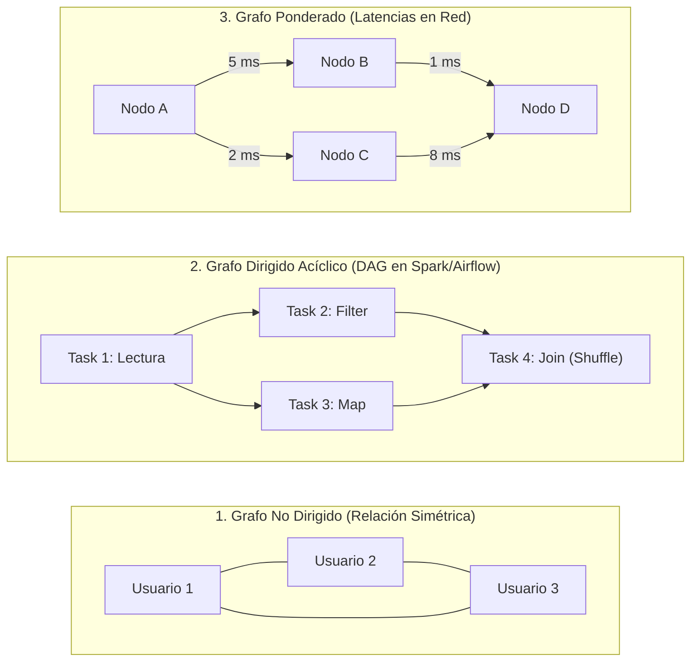
```mermaid
flowchart LR
    subgraph NoDirigido["1. Grafo No Dirigido (Relación Simétrica)"]
        direction LR
        U1["Usuario 1"] --- U2["Usuario 2"]
        U2 --- U3["Usuario 3"]
        U1 --- U3
    end

    subgraph DAG_Spark["2. Grafo Dirigido Acíclico (DAG en Spark/Airflow)"]
        direction LR
        T1["Task 1: Lectura"] --> T2["Task 2: Filter"]
        T1 --> T3["Task 3: Map"]
        T2 --> T4["Task 4: Join (Shuffle)"]
        T3 --> T4
    end

    subgraph Ponderado["3. Grafo Ponderado (Latencias en Red)"]
        direction LR
        S1["Nodo A"] -->|"5 ms"| S2["Nodo B"]
        S1 -->|"2 ms"| S3["Nodo C"]
        S2 -->|"1 ms"| S4["Nodo D"]
        S3 -->|"8 ms"| S4
    end
```

#### Comparativa Visual de Recorridos en Grafos (BFS vs DFS)

La forma en que se exploran los vértices define la idoneidad del algoritmo para resolver problemas específicos (caminos más cortos vs análisis topológico/ciclos):

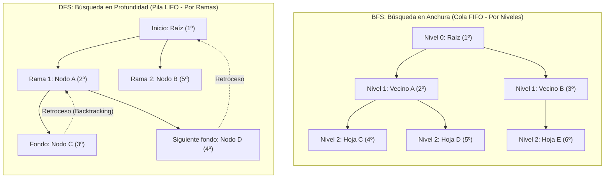
```mermaid
flowchart TD
    subgraph BFS_Visual["BFS: Búsqueda en Anchura (Cola FIFO - Por Niveles)"]
        direction TB
        B0["Nivel 0: Raíz (1º)"] --> B1["Nivel 1: Vecino A (2º)"]
        B0 --> B2["Nivel 1: Vecino B (3º)"]
        B1 --> B3["Nivel 2: Hoja C (4º)"]
        B1 --> B4["Nivel 2: Hoja D (5º)"]
        B2 --> B5["Nivel 2: Hoja E (6º)"]
    end

    subgraph DFS_Visual["DFS: Búsqueda en Profundidad (Pila LIFO - Por Ramas)"]
        direction TB
        D0["Inicio: Raíz (1º)"] --> D1["Rama 1: Nodo A (2º)"]
        D1 --> D2["Fondo: Nodo C (3º)"]
        D2 -.->|"Retroceso (Backtracking)"| D1
        D1 --> D3["Siguiente fondo: Nodo D (4º)"]
        D3 -.->|"Retroceso"| D0
        D0 --> D4["Rama 2: Nodo B (5º)"]
    end
```

#### Algoritmos Fundamentales sobre Grafos
1. **BFS (*Breadth-First Search* / Búsqueda en Anchura):** Explora nivel por nivel utilizando una cola FIFO. Calcula el camino más corto en grafos no ponderados.
2. **DFS (*Depth-First Search* / Búsqueda en Profundidad):** Explora una rama hasta el fondo antes de retroceder (usa pila o recursión). Detecta ciclos y analiza conectividad.
3. **Algoritmo de Dijkstra:** Calcula la ruta de menor coste desde un nodo origen a todos los demás en grafos con pesos no negativos.

#### Ejemplo Práctico en Python: Algoritmo de Dijkstra con Cola de Prioridad

```python
import heapq

def dijkstra(grafo: dict, inicio: str) -> dict:
    """
    Calcula las distancias mínimas desde el nodo 'inicio' utilizando una cola de prioridad (heapq).
    Complejidad: O((|V| + |E|) log |V|)
    """
    distancias = {nodo: float('infinity') for nodo in grafo}
    distancias[inicio] = 0
    cola_prioridad = [(0, inicio)] # Tupla: (distancia, nodo)
    
    while cola_prioridad:
        dist_actual, nodo_actual = heapq.heappop(cola_prioridad)
        
        if dist_actual > distancias[nodo_actual]:
            continue
            
        for vecino, peso in grafo[nodo_actual].items():
            distancia = dist_actual + peso
            if distancia < distancias[vecino]:
                distancias[vecino] = distancia
                heapq.heappush(cola_prioridad, (distancia, vecino))
                
    return distancias

# Grafo ponderado de nodos de red en un clúster
grafo_red = {
    "Srv_A": {"Srv_B": 5, "Srv_C": 2},
    "Srv_B": {"Srv_D": 1},
    "Srv_C": {"Srv_D": 8, "Srv_E": 4},
    "Srv_D": {"Srv_E": 3},
    "Srv_E": {}
}

distancias_minimas = dijkstra(grafo_red, "Srv_A")
print("Rutas óptimas desde 'Srv_A' (Dijkstra):")
for destino, coste in distancias_minimas.items():
    print(f"  -> Hacia {destino}: latencia mínima de {coste} ms")
```

---

### 3.11 Árboles: Jerarquía y Organización

Un **árbol** es un grafo conexo y acíclico donde existe un único nodo especial denominado **raíz**, y cada nodo hijo tiene exactamente un único nodo padre (excepto la raíz, que no tiene padre).

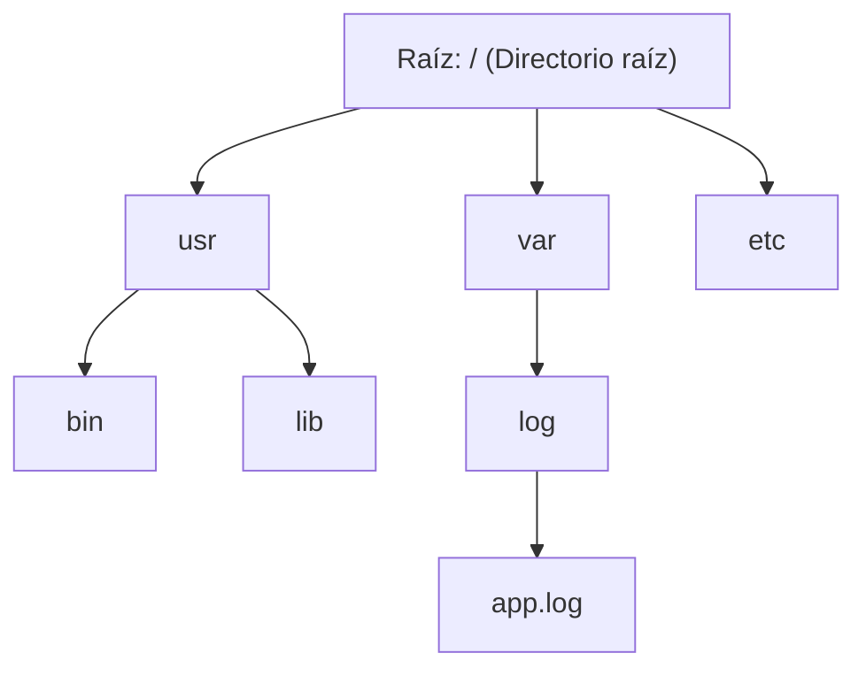
```mermaid
flowchart TD
    R["Raíz: / (Directorio raíz)"] --> U["usr"]
    R --> V["var"]
    R --> E["etc"]
    
    U --> B["bin"]
    U --> L["lib"]
    V --> Lg["log"]
    Lg --> App["app.log"]
```

#### Estructuras de Árboles en Computación y Bases de Datos

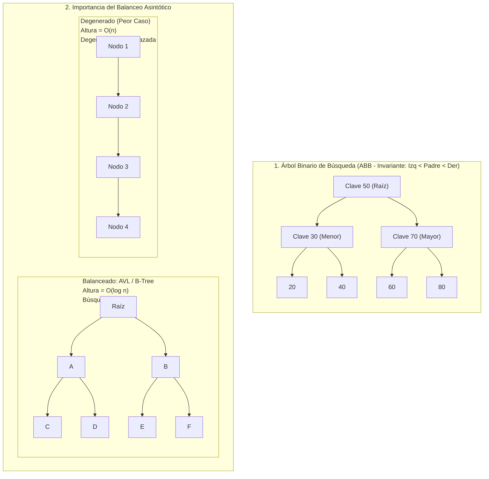
```mermaid
flowchart TD
    subgraph ABB["1. Árbol Binario de Búsqueda (ABB - Invariante: Izq < Padre < Der)"]
        direction TB
        N50["Clave 50 (Raíz)"] --> N30["Clave 30 (Menor)"]
        N50 --> N70["Clave 70 (Mayor)"]
        N30 --> N20["20"]
        N30 --> N40["40"]
        N70 --> N60["60"]
        N70 --> N80["80"]
    end

    subgraph ComparativaBalanceo["2. Importancia del Balanceo Asintótico"]
        direction LR
        subgraph Bal["Balanceado: AVL / B-Tree<br/>Altura = O(log n)<br/>Búsqueda Óptima"]
            bR["Raíz"] --> b1["A"]
            bR --> b2["B"]
            b1 --> b11["C"]
            b1 --> b12["D"]
            b2 --> b21["E"]
            b2 --> b22["F"]
        end
        subgraph Deg["Degenerado (Peor Caso)<br/>Altura = O(n)<br/>Degenera a Lista Enlazada"]
            d1["Nodo 1"] --> d2["Nodo 2"]
            d2 --> d3["Nodo 3"]
            d3 --> d4["Nodo 4"]
        end
    end
```

#### Arquitectura de un B+ Tree (Motor de Almacenamiento en Big Data)

Los árboles B+ organizan los índices de las bases de datos para garantizar lecturas mínimas en disco:

```mermaid
flowchart TD
    subgraph BTree["Estructura B+ Tree (Almacenamiento Persistente)"]
        direction TB
        RootNode["Nodo Raíz: [ Rangos: 1..100 | 101..200 ]"] --> Inter1["Nodo Interno: [ 1..50 | 51..100 ]"]
        RootNode --> Inter2["Nodo Interno: [ 101..150 | 151..200 ]"]

        Inter1 --> Leaf1["Hoja: Claves 1..50"]
        Inter1 --> Leaf2["Hoja: Claves 51..100"]
        Inter2 --> Leaf3["Hoja: Claves 101..150"]
        Inter2 --> Leaf4["Hoja: Claves 151..200"]

        Leaf1 <==>|"Punteros de lista enlazada secuencial (Range Scans)"| Leaf2
        Leaf2 <==> Leaf3
        Leaf3 <==> Leaf4

        Leaf1 -.-> D1["Bloques de Datos en Disco (Parquet / SSD)"]
        Leaf2 -.-> D2["Bloques de Datos en Disco"]
    end
```

#### Tipos Clave de Árboles
- **Árbol Binario:** Cada nodo tiene como máximo dos hijos (izquierdo y derecho).
- **Árbol AVL:** Árbol binario de búsqueda autobalanceado que mantiene su altura en $O(\log n)$.
- **Árboles B y B+ (*B-Trees*):** Árboles multicamino autobalanceados optimizados para sistemas de almacenamiento en disco y bloques de lectura/escritura. Son la estructura estándar detrás de los **índices en bases de datos relacionales** (PostgreSQL, MySQL) y almacenes distribuidos.

#### Aplicaciones en Big Data e Inteligencia Artificial
1. **Índices en bases de datos:** Permiten localizar cualquier registro entre miles de millones en pocas lecturas de disco ($O(\log n)$).
2. **Árboles de Sintaxis Abstracta (AST):** Motores como Catalyst en Apache Spark parsean consultas SQL y las representan como árboles de expresiones para optimizarlas algebraicamente antes de ejecutarlas.
3. **Machine Learning:** Algoritmos basados en árboles de decisión (CART, Random Forest, XGBoost, LightGBM) que clasifican registros mediante bifurcaciones jerárquicas sucesivas.

#### Ejemplo Práctico en Python: Árbol de Decisión Binario

```python
class NodoDecision:
    """Nodo simple para modelar un clasificador jerárquico basado en árbol."""
    def __init__(self, caracteristica=None, umbral=None, izquierdo=None, derecho=None, resultado=None):
        self.caracteristica = caracteristica
        self.umbral = umbral
        self.izquierdo = izquierdo
        self.derecho = derecho
        self.resultado = resultado

    def es_hoja(self):
        return self.resultado is not None

def predecir_arbol(nodo: NodoDecision, registro: dict) -> str:
    if nodo.es_hoja():
        return nodo.resultado
    
    valor = registro[nodo.caracteristica]
    if valor <= nodo.umbral:
        return predecir_arbol(nodo.izquierdo, registro)
    else:
        return predecir_arbol(nodo.derecho, registro)

# Construcción de un árbol de decisión para concesión de préstamos
# Raíz: ingresos <= 2500
#   -> Izq: Denegado
#   -> Der: Deuda <= 5000 -> Concedido / Denegado
arbol_credito = NodoDecision(
    caracteristica="ingresos", umbral=2500,
    izquierdo=NodoDecision(resultado="❌ Préstamo Denegado (Ingresos bajos)"),
    derecho=NodoDecision(
        caracteristica="deuda", umbral=5000,
        izquierdo=NodoDecision(resultado="✅ Préstamo Concedido"),
        derecho=NodoDecision(resultado="⚠️ Requiere Aval (Deuda alta)")
    )
)

solicitud = {"ingresos": 3200, "deuda": 1200}
dictamen = predecir_arbol(arbol_credito, solicitud)
print("Evaluación de solicitud con Árbol de Decisión:", solicitud)
print("Resultado:", dictamen)
```

---

### 3.12 Aplicando lo Aprendido: Análisis de Datos y Arquitecturas Big Data

La convergencia de teoría de conjuntos, lógica formal y algorítmica discreta es lo que permite operar las modernas plataformas de Big Data:

| Concepto Discreto | Implementación en Arquitecturas Big Data | Beneficio Tecnológico |
| :--- | :--- | :--- |
| **Tablas Hash ($O(1)$)** | *Broadcast Hash Join* y agregaciones en memoria en Apache Spark / DuckDB | Cruces de tablas ultrarrápidos sin necesidad de ordenar previamente los datos. |
| **Árboles B+ / Log-Structured Trees** | Índices primarios en RDBMS, Parquet file footers, índices de zona (*Zone Maps*) | Lectura selectiva de bloques de datos en almacenamiento columnar, omitiendo terabytes irrelevantes. |
| **Divide y Vencerás ($O(n \log n)$)** | Paradigma MapReduce, particiones distribuidas de RDDs en Spark | Paralelización horizontal masiva de tareas complejas en clústeres de miles de máquinas. |
| **Grafos Acíclicos Dirigidos (DAG)** | Planificadores físicos de ejecución en Spark, linaje de datos en Apache Atlas, orquestación en Apache Airflow | Detección de dependencias, reintento resiliente ante fallos de nodos y eliminación de pasos redundantes. |
| **Lógica de Predicados y Álgebra** | Optimizadores de consultas (*Catalyst Optimizer*, Calcite) | Pushing down de filtros hacia el almacenamiento (`Predicate Pushdown`) antes de cargar datos en RAM. |

---

## 4. Resumen Global de Complejidades y Estructuras

| Estructura de Datos | Acceso | Búsqueda | Inserción | Borrado | Caso de Uso en Sistemas de Datos |
| :--- | :---: | :---: | :---: | :---: | :--- |
| **Array / Lista Contigua** | $O(1)$ | $O(n)$ | $O(n)$ | $O(n)$ | Lecturas secuenciales rápidas en memoria contigua. |
| **Tabla Hash (Dict / Set)** | N/A | $O(1)$ | $O(1)$ | $O(1)$ | Cachés de sesión, índices en memoria, lookup de claves primarias. |
| **Árbol Balanceado (AVL / B-Tree)**| $O(\log n)$ | $O(\log n)$ | $O(\log n)$ | $O(\log n)$ | Índices en bases de datos relacionales y búsquedas por rango numérico. |
| **Grafo (Matriz / Lista Adyacencia)**| N/A | $O(\|V\| + \|E\|)$ | $O(1)$ | $O(\|E\|)$ | Redes de fraude, sistemas de recomendación, linaje de pipelines. |
| **Pila (Stack) / Cola (Queue)** | $O(n)$ | $O(n)$ | $O(1)$ | $O(1)$ | Buffers de streaming (Kafka), evaluación de expresiones y recursión. |
