# Matemáticas Discretas y Fundamentos Computacionales

> Apuntes y ampliación de teoría de la asignatura **Sistemas de Big Data**.  
> 📅 **Fecha:** 2026-10-05  
> 📖 **Documento de referencia:** `2026-10-05 - SBD Conceptos Basicos.docx`

---

## Introducción

La **matemática discreta** constituye la base teórica y conceptual sobre la que se asientan las ciencias de la computación, la ingeniería de software y el análisis masivo de datos (**Big Data**). A diferencia del cálculo infinitesimal o las matemáticas continuas (que operan con números reales y variaciones continuas), la matemática discreta estudia estructuras compuestas por elementos diferenciados, individuales y contables.

Conceptos fundamentales como **conjuntos**, **relaciones**, **funciones**, **lógica formal** y **algorítmica** son esenciales para modelar, estructurar, transformar y optimizar la información en arquitecturas distribuidas. Dominar estos fundamentos permite a los ingenieros y científicos de datos comprender los principios internos de los motores de procesamiento (como Apache Spark, Hadoop o motores relacionales), diseñar algoritmos escalables y prevenir cuellos de botella computacionales.

### Lecturas Recomendadas y Recursos de Autoformación
- 🌐 [Math is Fun - Set Theory Index](https://www.mathsisfun.com/sets/): Guía interactiva de fundamentos de teoría de conjuntos.
- 🎥 [Matemática Discreta 1: Inducción Completa (Sesión 1)](https://youtu.be/8Ag507fO62w): Demostraciones por inducción matemática y razonamiento deductivo.
- 🎥 [Matemática Discreta 1: Inducción Completa (Sesión 2)](https://youtu.be/uB1K-a414yI): Ejercicios y aplicaciones del principio de inducción.

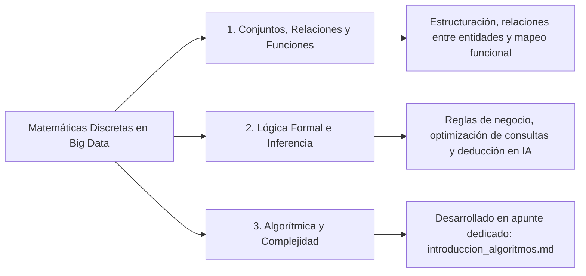

---

## 1. Conjuntos, Relaciones y Funciones

### 1.1 ¿Por qué Matemática Discreta en Big Data e IA?

El procesamiento de datos a gran escala no opera sobre flujos continuos indeterminados, sino sobre registros atómicos, particiones, tablas y grafos. La matemática discreta aporta:

1. **Fundamento computacional esencial:** Toda la arquitectura de procesadores y sistemas binarios descansa en estados discretos (0 y 1). Proporciona la base teórica para las estructuras de datos (arrays, listas, colas, grafos, árboles) y algoritmos.
2. **Lógica de programación y diseño de consultas:** La semántica de las consultas SQL, el cálculo relacional y las expresiones booleanas en condicionales (`if-else`, filtros) son aplicaciones directas de la lógica proposicional y de conjuntos.
3. **Modelado de problemas en Big Data:** Representación de redes sociales mediante grafos, modelado de particionado de datos mediante funciones hash y particiones de conjuntos, y optimización de hiperparámetros en Machine Learning.
4. **Pensamiento lógico y analítico:** Fomenta el razonamiento estructurado, la demostración de corrección de algoritmos y la capacidad sistemática de resolución de problemas técnicos complejos.

---

### 1.2 Conjuntos: La Base de Todo

Un **conjunto** es una colección bien definida de objetos o entidades, llamados *elementos* o *miembros*. Un elemento solo puede pertenecer o no pertenecer a un conjunto ($\in$ o $\notin$), y los elementos de un conjunto son **únicos y distintos** (no hay duplicados por definición).

Los conjuntos pueden ser:
- **Finitos:** Poseen un número contable determinado de elementos (por ejemplo, el catálogo de productos de una tienda o los nodos de un clúster).
- **Infinitos:** Poseen infinitos elementos (por ejemplo, el conjunto de los números enteros $\mathbb{Z}$ o los posibles flujos continuos de números reales).

#### Operaciones Básicas entre Conjuntos

Considerando dos conjuntos $A$ y $B$ dentro de un conjunto universal $U$:

| Operación | Símbolo | Definición (Lógica) | Descripción |
| :--- | :---: | :--- | :--- |
| **Unión** | $A \cup B$ | $\{x \mid x \in A \lor x \in B\}$ | Elementos que pertenecen a $A$, a $B$, o a ambos (todos combinados sin duplicados). |
| **Intersección**| $A \cap B$ | $\{x \mid x \in A \land x \in B\}$ | Elementos comunes que pertenecen simultáneamente a $A$ y a $B$. |
| **Diferencia** | $A \setminus B$ | $\{x \mid x \in A \land x \notin B\}$ | Elementos que pertenecen exclusivamente a $A$ y no están en $B$. |
| **Complemento**| $A^c$ o $A'$ | $\{x \mid x \in U \land x \notin A\}$ | Todos los elementos del universo $U$ que **no** pertenecen a $A$. |

#### Mapa Conceptual y Diagrama de Regiones (Estilo Venn)

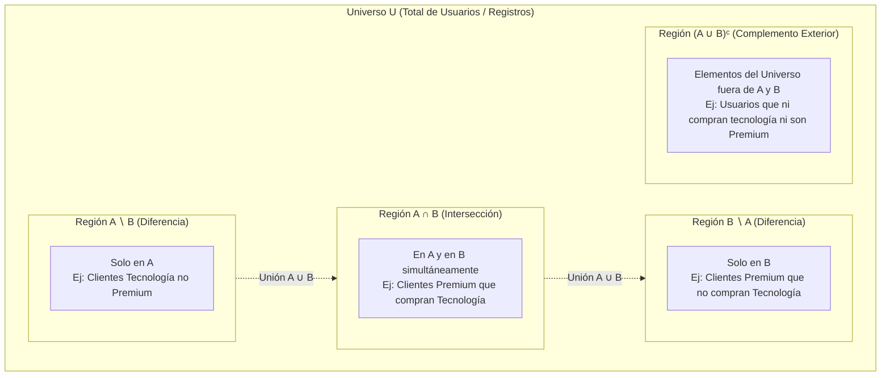

#### Relaciones de Inclusión y Particionado de Conjuntos en Big Data

En sistemas distribuidos, un conjunto universal de datos $U$ se divide mediante **particionamiento disjunto** para su procesamiento paralelo en clústeres:

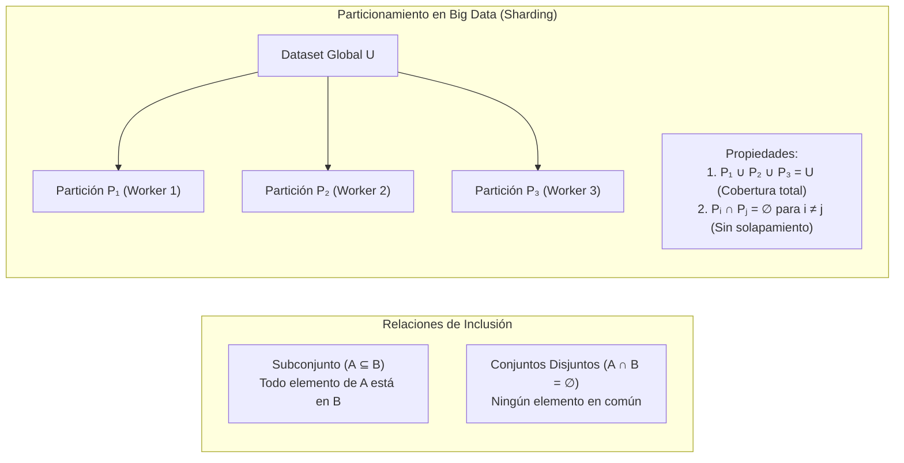

> 💡 **Representación Visual (Diagramas de Venn):**  
> Los diagramas de Venn representan conjuntos mediante curvas cerradas (habitualmente círculos) en un plano. Las áreas superpuestas ilustran las relaciones e intersecciones entre los conjuntos, mientras que la región exterior dentro del rectángulo delimitador representa el universo $U$.

#### Ejemplo Práctico en Python (Analítica de Datos)

Imaginemos que analizamos usuarios de una plataforma e-commerce en Python utilizando `set` y un DataFrame de `pandas`:

```python
import pandas as pd

# Definición de universos y conjuntos de usuarios
universo_usuarios = {"Ana", "Luis", "Carlos", "Marta", "Pedro", "Sofia", "Jorge", "Elena"}
compradores_tecnologia = {"Ana", "Luis", "Carlos", "Marta"}      # Conjunto A
usuarios_premium = {"Carlos", "Marta", "Pedro", "Sofia"}          # Conjunto B

# Operaciones con tipos set en Python
union = compradores_tecnologia | usuarios_premium
interseccion = compradores_tecnologia & usuarios_premium
diferencia = compradores_tecnologia - usuarios_premium
complemento = universo_usuarios - compradores_tecnologia

print("Unión (A ∪ B):", union)
print("Intersección (A ∩ B):", interseccion)
print("Diferencia (A ∖ B - candidatos a suscripción):", diferencia)
print("Complemento (Aᶜ - usuarios que no compraron tecnología):", complemento)

# Equivalencia vectorial con Pandas
df_clientes = pd.DataFrame([
    {"usuario": u, "compro_tec": u in compradores_tecnologia, "es_premium": u in usuarios_premium}
    for u in universo_usuarios
])

# Filtrado por intersección y diferencia
premium_con_tecnologia = df_clientes[df_clientes["compro_tec"] & df_clientes["es_premium"]]
candidatos_promo = df_clientes[df_clientes["compro_tec"] & (~df_clientes["es_premium"])]

print("\n--- Vista en Pandas: Compraron tecnología y NO son Premium ---")
print(candidatos_promo[["usuario", "compro_tec", "es_premium"]])
```

---

### 1.3 Relaciones: Conexiones entre Elementos

Una **relación binaria** $R$ entre dos conjuntos $A$ y $B$ es formalmente un subconjunto de su producto cartesiano: $R \subseteq A \times B$. Representa una correspondencia o vínculo entre pares ordenados $(a, b)$ que satisfacen una condición específica (se escribe $a R b$ si $(a, b) \in R$).

**Ejemplo numérico:** Dado el conjunto $A = \{2, 3, 4, 6\}$, la relación *"es múltiplo de"* genera pares como $(4, 2)$, $(6, 2)$ y $(6, 3)$, pero no $(3, 2)$ ni $(2, 4)$.

#### Propiedades Fundamentales de las Relaciones

Sea una relación $R$ sobre un mismo conjunto $A$ ($R \subseteq A \times A$):

| Propiedad | Definición Formal | Explicación |
| :--- | :--- | :--- |
| **Reflexiva** | $\forall a \in A, \, (a, a) \in R$ | Todo elemento está relacionado consigo mismo. |
| **Simétrica** | $\forall a, b \in A, \, (a, b) \in R \implies (b, a) \in R$ | Si $a$ se relaciona con $b$, entonces obligatoriamente $b$ se relaciona con $a$ (relación bidireccional). |
| **Transitiva**| $\forall a, b, c \in A, \, ((a, b) \in R \land (b, c) \in R) \implies (a, c) \in R$ | Si $a$ se relaciona con $b$ y $b$ con $c$, entonces $a$ se relaciona directamente con $c$. |

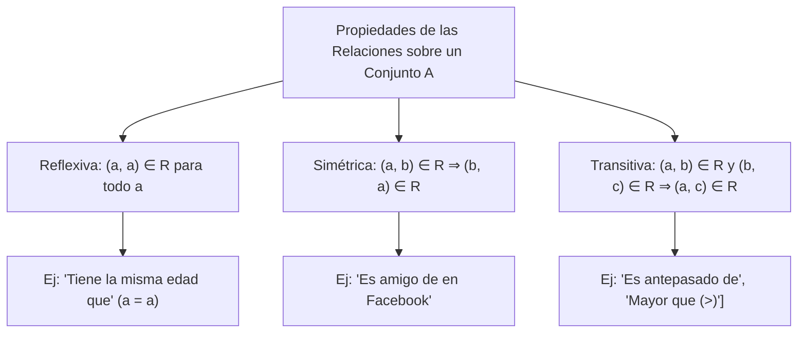

#### Representación de Relaciones mediante Grafos Dirigidos (Digrafos)

Toda relación binaria sobre un conjunto finito puede representarse rigurosamente mediante un **grafo dirigido** donde los vértices son los elementos del conjunto y las aristas dirigidas representan los pares ordenados pertenecientes a la relación:

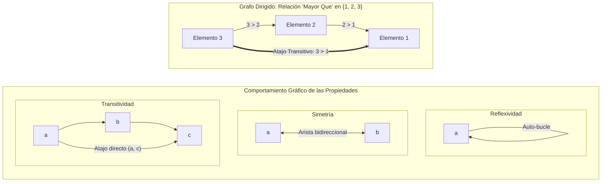

> 💡 **Interpretación del Grafo "Mayor Que":**  
> - **Sin bucles propios:** Ningún nodo tiene una arista hacia sí mismo ($a \ngtr a$) $\implies$ **No reflexiva**.  
> - **Sin aristas de retorno:** No existen caminos en sentido inverso ($2 \ngtr 3$) $\implies$ **No simétrica** (es asimétrica).  
> - **Atajo directo presente:** El camino $3 \to 2 \to 1$ está cerrado por la arista directa $3 \to 1$ $\implies$ **Transitiva**.

#### Caso de Estudio: La Relación "Es Mayor Que" ($>$)
Analicemos la relación $R = \{(a, b) \in \mathbb{R} \times \mathbb{R} \mid a > b\}$:
- **¿Es reflexiva?** ❌ **No**. Ningún número es estrictamente mayor que sí mismo ($a \ngtr a$).
- **¿Es simétrica?** ❌ **No**. Si $5 > 2$, es imposible que $2 > 5$.
- **¿Es transitiva?** ✅ **Sí**. Si $a > b$ y $b > c$, necesariamente $a > c$ (ej. $10 > 5$ y $5 > 2 \implies 10 > 2$).

> 📌 **Aplicación en Big Data:**  
> Las relaciones modelan las **claves foráneas (Foreign Keys)** en bases de datos relacionales, los vínculos de linaje entre transformaciones (DAG de dependencias), las interacciones en redes sociales (seguidores en Twitter son relaciones no simétricas, amigos en LinkedIn son simétricas) y los pares clave-valor `(K, V)` en MapReduce.

#### Ejemplo Práctico en Python: Validador de Propiedades Relacionales

```python
def evaluar_propiedades_relacion(conjunto: set, relacion: set) -> dict:
    """
    Evalúa si una relación binaria sobre un conjunto es reflexiva, simétrica y transitiva.
    """
    # 1. Reflexividad: (a, a) in relacion para todo a in conjunto
    es_reflexiva = all((a, a) in relacion for a in conjunto)
    
    # 2. Simetría: (a, b) in relacion => (b, a) in relacion
    es_simetrica = all((b, a) in relacion for (a, b) in relacion)
    
    # 3. Transitividad: (a, b) in relacion y (b, c) in relacion => (a, c) in relacion
    es_transitiva = True
    for (a, b) in relacion:
        for (x, c) in relacion:
            if b == x and (a, c) not in relacion:
                es_transitiva = False
                break
        if not es_transitiva:
            break
            
    return {
        "reflexiva": es_reflexiva,
        "simetrica": es_simetrica,
        "transitiva": es_transitiva
    }

# Prueba con el conjunto {1, 2, 3} y la relación ">" (Mayor que)
A = {1, 2, 3}
relacion_mayor_que = {(2, 1), (3, 1), (3, 2)}
resultados = evaluar_propiedades_relacion(A, relacion_mayor_que)

print("Relación 'Mayor que' en {1, 2, 3}:", relacion_mayor_que)
print("Evaluación formal:")
for prop, val in resultados.items():
    print(f"  - {prop.capitalize()}: {'✅ Sí' if val else '❌ No'}")
```

---

### 1.4 Funciones: Mapeo entre Conjuntos

Una **función** $f: A \to B$ es un tipo especial de relación matemática que asigna a **cada** elemento de un conjunto de entrada $A$ exactamente **un único** elemento de un conjunto de salida $B$.

- **Dominio ($A$):** Conjunto de todos los posibles valores de entrada para los cuales la función está definida.
- **Codominio ($B$):** Conjunto de todos los posibles valores de salida declarados.
- **Imagen o Rango ($f(A) \subseteq B$):** Subconjunto de valores del codominio que realmente son producidos por algún elemento del dominio.
- **Regla de correspondencia:** Expresión lógica o algoritmo que determina cómo transformar una entrada en su salida (ej. $f(x) = x^2 + 1$).

#### Clasificación de Funciones

| Tipo | Definición Formal | Explicación | Impacto Práctico |
| :--- | :--- | :--- | :--- |
| **Inyectiva** (*Uno a uno*) | $f(x_1) = f(x_2) \implies x_1 = x_2$ | Cada elemento del codominio tiene a lo sumo **una preimagen**. No hay dos entradas distintas con la misma salida. | Claves primarias únicas (`Primary Keys`), IDs generados sin colisiones. |
| **Suprayectiva** (*Sobreyectiva / Sobre*) | $\forall y \in B, \, \exists x \in A \text{ tq } f(x) = y$ | Todo elemento del codominio tiene al menos **una preimagen**. La imagen cubre por completo el codominio ($f(A) = B$). | Transformaciones completas de categorización donde todas las clases de salida son pobladas. |
| **Biyectiva** | Inyectiva $\land$ Suprayectiva | Correspondencia biunívoca perfecta y exacta entre $A$ y $B$. Tiene **función inversa** $f^{-1}$. | Codificación y decodificación reversible (cifrado, serialización/deserialización de datos). |

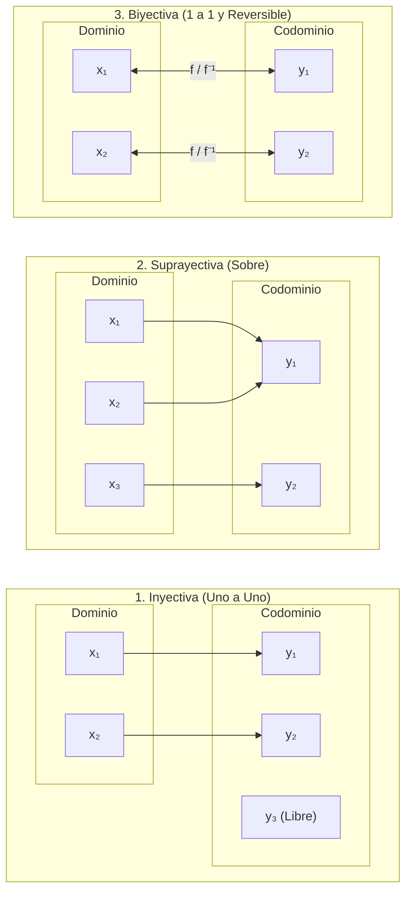

#### Diagrama de Función Hash y Sharding en Big Data

En almacenamiento distribuido y motores de procesamiento, una función de dispersión (*Hash Function*) mapea el espacio continuo o discreto de claves hacia un número finito de particiones o nodos de cómputo:

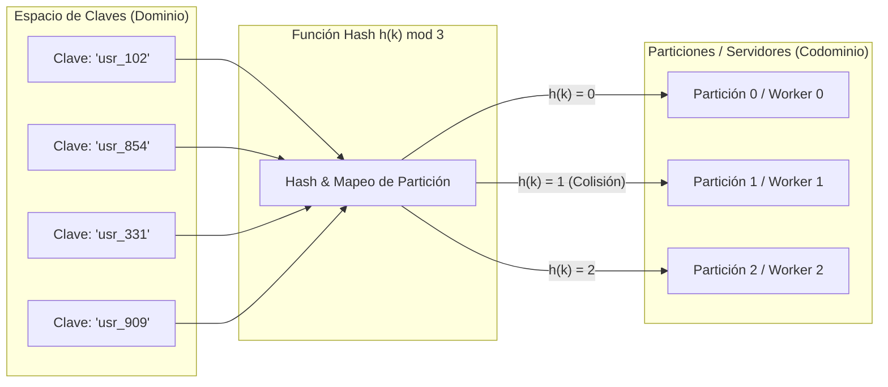

> 📌 **Aplicaciones en Big Data:**  
> - **Funciones Hash:** Mapean un espacio de claves arbitrario a un rango finito de enteros. Si la función no es inyectiva, surgen *colisiones de hash*, lo que requiere algoritmos de resolución (encadenamiento o direccionamiento abierto) en tablas hash y sharding distribuido.
> - **Transformaciones ETL / MapReduce:** La primitiva `map(f)` toma un conjunto de datos y aplica la función determinista $f$ a cada registro en paralelo a través de los nodos del clúster.

#### Ejemplo Práctico en Python: Clasificación Funcional y Transformaciones

```python
import pandas as pd

def analizar_mapeo_funcional(dominio: list, codominio: list, mapeo: dict):
    """
    Determina si un mapeo entre dominio y codominio es inyectivo, suprayectivo y biyectivo.
    """
    imagenes = [mapeo[x] for x in dominio]
    valores_unicos_imagen = set(imagenes)
    
    # Inyectiva: longitud de entradas igual a salidas únicas (no hay dos x con igual y)
    es_inyectiva = len(dominio) == len(valores_unicos_imagen)
    
    # Suprayectiva: todos los elementos del codominio tienen al menos una preimagen
    es_suprayectiva = set(codominio).issubset(valores_unicos_imagen)
    
    # Biyectiva: ambas
    es_biyectiva = es_inyectiva and es_suprayectiva
    
    return {
        "inyectiva": es_inyectiva,
        "suprayectiva": es_suprayectiva,
        "biyectiva": es_biyectiva
    }

# Prueba con función de categorización de clientes por nivel de gasto
dom = ["Cliente_1", "Cliente_2", "Cliente_3"]
codom = ["Bajo", "Medio", "Alto"]
regla_mapeo = {"Cliente_1": "Medio", "Cliente_2": "Alto", "Cliente_3": "Medio"}

res_func = analizar_mapeo_funcional(dom, codom, regla_mapeo)
print("Mapeo analizado:", regla_mapeo)
print(f"  - Inyectiva: {res_func['inyectiva']} (Cliente_1 y Cliente_3 colisionan en 'Medio')")
print(f"  - Suprayectiva: {res_func['suprayectiva']} (La categoría 'Bajo' no tiene preimagen)")
print(f"  - Biyectiva: {res_func['biyectiva']}")

# Mapeo con Pandas en pipelines
df_transacciones = pd.DataFrame({"cliente_id": [101, 102, 103], "gasto": [45, 1200, 310]})
# Aplicación de una función determinista sobre una columna
df_transacciones["categoria"] = df_transacciones["gasto"].apply(
    lambda g: "Alto" if g > 500 else ("Medio" if g > 100 else "Bajo")
)
print("\n--- Pipeline con Pandas .apply() ---")
print(df_transacciones)
```

---

## 2. Lógica Proposicional y Lógica de Predicados

### 2.1 Lógica Proposicional: El Arte de Razonar

La **lógica proposicional** estudia las proposiciones y las formas en que se combinan mediante conectores lógicos para estructurar razonamientos válidos. Es el fundamento directo para el diseño de circuitos digitales (compuertas lógicas como AND, OR, NOT) y las sentencias condicionales en el código de cualquier lenguaje.

#### La Proposición (Afirmación)
Una **proposición** es un enunciado declarativo que posee un único valor de verdad bien determinado: **Verdadero (V)** o **Falso (F)**. No puede ser ambiguo, subjetivo, ni ambas cosas simultáneamente.

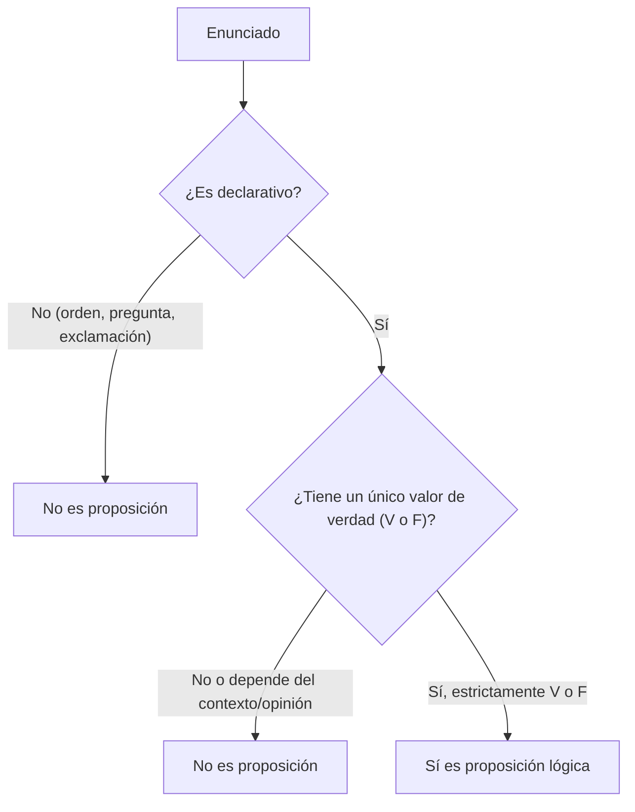

#### Conectores Lógicos Básicos

| Conector | Nombre | Símbolo | Operador Python | Condición de Verdad |
| :--- | :--- | :---: | :---: | :--- |
| **Negación** | NOT | $\neg$ o $\sim$ | `not` o `~` | Invierte el valor: $\neg V = F$, $\neg F = V$. |
| **Conjunción** | AND | $\land$ | `and` o `&` | Verdadera **únicamente si ambas** proposiciones son verdaderas. |
| **Disyunción** | OR | $\lor$ | `or` o `\|` | Verdadera si **al menos una** de las proposiciones es verdadera. |
| **Implicación** | Si... entonces | $\rightarrow$ | `not p or q` | Verdadera siempre, **excepto** si el antecedente es $V$ y el consecuente $F$. |
| **Bicondicional**| Si y solo si | $\leftrightarrow$ | `p == q` | Verdadera cuando ambas proposiciones tienen **el mismo valor de verdad**. |

#### Tablas de Verdad Combinadas

| $p$ | $q$ | $\neg p$ | $p \land q$ | $p \lor q$ | $p \rightarrow q$ | $p \leftrightarrow q$ |
| :---: | :---: | :---: | :---: | :---: | :---: | :---: |
| **V** | **V** | F | **V** | **V** | **V** | **V** |
| **V** | **F** | F | F | **V** | F | F |
| **F** | **V** | **V** | F | **V** | **V** | F |
| **F** | **F** | **V** | F | F | **V** | **V** |

#### Casos de Negocio en Data Quality y Filtrado (Pandas)

```python
import pandas as pd
import numpy as np

# DataFrame con logs y pedidos
df_pedidos = pd.DataFrame([
    {"id": 1, "importe": 120, "envio_gratis": True,  "vip": True,  "email": "a@test.com"},
    {"id": 2, "importe": 130, "envio_gratis": False, "vip": False, "email": np.nan},
    {"id": 3, "importe": 40,  "envio_gratis": True,  "vip": True,  "email": "c@test.com"},
    {"id": 4, "importe": 35,  "envio_gratis": False, "vip": False, "email": np.nan}
])

# 1. Conjunción: Importe > 100 AND VIP
pedidos_vip_grandes = df_pedidos[(df_pedidos["importe"] > 100) & (df_pedidos["vip"] == True)]

# 2. Implicación: "Si el pedido > 100 €, entonces el envío DEBE ser gratis"
# Violación de regla: Antecedente Verdadero Y Consecuente Falso (p and not q)
p = df_pedidos["importe"] > 100
q = df_pedidos["envio_gratis"]
violaciones_regla_envio = df_pedidos[p & (~q)]

# 3. Bicondicional: "Es VIP si y solo si tiene email corporativo válido"
df_pedidos["bicondicional_email"] = df_pedidos["vip"] == df_pedidos["email"].notna()

print("Violaciones de la regla de envío gratis (Implicación rota):")
print(violaciones_regla_envio[["id", "importe", "envio_gratis"]])
print("\nRegistros con consistencia bicondicional (VIP <=> Email presente):")
print(df_pedidos[["id", "vip", "email", "bicondicional_email"]])
```

---

### 2.2 Tablas de Verdad y Clasificación de Proposiciones Compuestas

Al evaluar la tabla de verdad exhaustiva de cualquier fórmula lógica proposicional, la columna final nos permite clasificarla en tres categorías fundamentales:

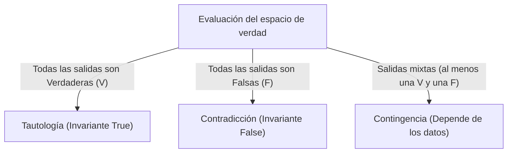

| Tipo | Resultado en Tabla | Significado Lógico | Impacto en Motores de Big Data / Optimización |
| :--- | :---: | :--- | :--- |
| **Tautología** | Siempre **V** | Verdad universal invariante ($p \lor \neg p$) | **Predicado trivial:** Motores como Catalyst (Spark) simplifican la cláusula a `True` y eliminan la evaluación para ahorrar CPU. |
| **Contradicción** | Siempre **F** | Imposibilidad lógica ($p \land \neg p$) | **Poda de particiones (*Partition Pruning*):** El planificador descarta leer archivos de disco porque la relación retornará 0 registros. |
| **Contingencia** | Mixto (**V** y **F**) | Depende de los datos ($p \land q$) | **Filtro selectivo:** Condición de negocio habitual que selecciona un subconjunto dinámico de filas. |

#### Ejemplo en Python: Clasificador Exhaustivo de Fórmulas Lógicas

```python
import itertools

def clasificar_formula_logica(nombre: str, func, n_variables: int = 2):
    """
    Evalúa exhaustivamente el espacio booleano {True, False}^n para clasificar una expresión.
    """
    combinaciones = list(itertools.product([True, False], repeat=n_variables))
    resultados = [func(*comb) for comb in combinaciones]
    
    if all(resultados):
        categoria = "TAUTOLOGÍA (Siempre Verdadera)"
    elif not any(resultados):
        categoria = "CONTRADICCIÓN (Siempre Falsa)"
    else:
        categoria = "CONTINGENCIA (Dependiente del estado)"
        
    print(f"Fórmula: {nombre:15} -> {categoria} | Resultados: {resultados}")

# Pruebas de expresiones:
clasificar_formula_logica("p ∨ ¬p", lambda p: p or not p, n_variables=1)
clasificar_formula_logica("p ∧ ¬p", lambda p: p and not p, n_variables=1)
clasificar_formula_logica("p ∧ q",  lambda p, q: p and q, n_variables=2)
clasificar_formula_logica("p → (p ∨ q)", lambda p, q: (not p) or (p or q), n_variables=2)
```

---

### 2.3 Lógica de Predicados: Más Allá de lo Binario

La lógica proposicional trata a las afirmaciones como cajas negras atómicas ($p, q$). Sin embargo, en el análisis de datos necesitamos modelar **propiedades sobre objetos específicos** y **relaciones entre múltiples variables**. Aquí entra la **lógica de primer orden o lógica de predicados**.

Un **predicado** $P(x)$ es una función proposicional que toma una o más variables de un dominio de discurso $D$ y devuelve un valor de verdad.
- Ejemplo: $P(x) = \text{“}x \text{ es un servidor activo”}$. Si $x = \text{“Nodo-1”}$, $P(\text{Nodo-1})$ evalúa a $V$ o $F$.

#### Cuantificadores Lógicos

Los cuantificadores determinan cuántos elementos del dominio satisfacen un predicado:

| Cuantificador | Símbolo | Lectura | Significado Formal | Equivalencia Discreta |
| :--- | :---: | :--- | :--- | :--- |
| **Universal** | $\forall$ | *"Para todo"* | $\forall x \, P(x)$: La propiedad $P(x)$ es verdadera para **todos y cada uno** de los elementos $x \in D$. | $P(x_1) \land P(x_2) \land \dots \land P(x_n)$ |
| **Existencial** | $\exists$ | *"Existe al menos uno"* | $\exists x \, P(x)$: Existe **al menos un** elemento $x \in D$ tal que $P(x)$ es verdadero. | $P(x_1) \lor P(x_2) \lor \dots \lor P(x_n)$ |

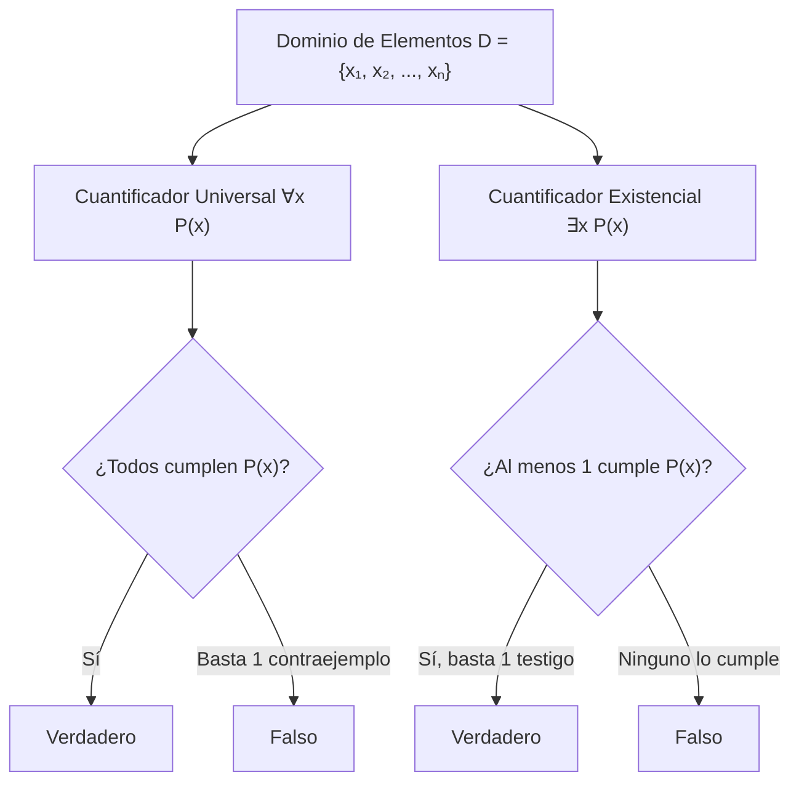

#### Negación de Cuantificadores (Leyes de De Morgan Generalizadas)
- Negar que *todos* cumplan una propiedad equivale a afirmar que *existe al menos uno* que no la cumple:
  $$\neg(\forall x \, P(x)) \equiv \exists x \, \neg P(x)$$
- Negar que *exista alguien* que cumpla una propiedad equivale a decir que *todos* la incumplen:
  $$\neg(\exists x \, P(x)) \equiv \forall x \, \neg P(x)$$

> 📌 **Aplicaciones en Inteligencia Artificial y Big Data:**  
> - **Representación del conocimiento en IA:** Modelado de ontologías (OWL), razonamiento en grafos de conocimiento y procesamiento del lenguaje natural.
> - **Verificación formal de software:** Especificación de invariantes de bucles, precondiciones y postcondiciones en arquitecturas críticas.
> - **Consultas analíticas:** Cláusulas SQL del tipo `WHERE NOT EXISTS (...)`, o validaciones en pipelines `all()` y `any()`.

#### Ejemplo Práctico en Python: Evaluación de Predicados y Cuantificadores

```python
import pandas as pd

# Servidores de un cluster distribuido
df_cluster = pd.DataFrame([
    {"nodo": "srv-01", "cpu_pct": 45, "activo": True,  "version_os": "Ubuntu 22.04"},
    {"nodo": "srv-02", "cpu_pct": 78, "activo": True,  "version_os": "Ubuntu 22.04"},
    {"nodo": "srv-03", "cpu_pct": 92, "activo": True,  "version_os": "Ubuntu 22.04"},
    {"nodo": "srv-04", "cpu_pct": 15, "activo": False, "version_os": "Ubuntu 20.04"}
])

# Predicado P(x): "El nodo x está activo"
# Predicado Q(x): "La CPU de x supera el 85%"
# Predicado R(x): "La versión de OS de x es Ubuntu 22.04"

# 1. Cuantificador Universal: ∀x P(x) -> "¿Están TODOS los nodos activos?"
todos_activos = df_cluster["activo"].all()
print(f"∀x P(x) [Todos activos]: {todos_activos}")

# 2. Cuantificador Existencial: ∃x Q(x) -> "¿Existe AL MENOS UN nodo con sobrecarga de CPU (>85%)?"
existe_sobrecarga = (df_cluster["cpu_pct"] > 85).any()
print(f"∃x Q(x) [Existe sobrecarga]: {existe_sobrecarga}")

# 3. Demostración De Morgan: ¬(∀x R(x)) <=> ∃x ¬R(x)
neg_para_todo_os = not (df_cluster["version_os"] == "Ubuntu 22.04").all()
existe_distinto_os = (df_cluster["version_os"] != "Ubuntu 22.04").any()
print(f"¬(∀x R(x)) equivale a ∃x ¬R(x): {neg_para_todo_os == existe_distinto_os} ({neg_para_todo_os})")
```

---

### 2.4 Inferencia Lógica: Sacando Conclusiones

La **inferencia lógica** es el proceso formal mediante el cual se deducen nuevas proposiciones o conclusiones válidas a partir de un conjunto de premisas asumidas como verdaderas. Si las premisas son verdaderas y la regla de inferencia es válida, la conclusión está **garantizada** como verdadera.

#### Reglas Fundamentales de Inferencia

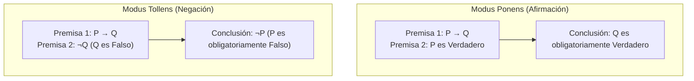

1. **Modus Ponens (Modo que afirma al afirmar):**
   - **Regla formal:** $[(P \rightarrow Q) \land P] \implies Q$
   - **Esquema:**
     - Si ocurre $P$, entonces ocurre $Q$. *(Premisa 1)*
     - Se constata que ocurre $P$. *(Premisa 2)*
     - **Conclusión:** Ocurre $Q$.
   - **Ejemplo en Big Data:**
     - *P1:* Si el volumen de datos supera 1 TB/hora ($P$), el motor activa particionado distribuido ($Q$).
     - *P2:* El volumen actual es 1.5 TB/hora ($P$ es $V$).
     - *Conclusión:* El motor activa particionado distribuido ($Q$ es $V$).

2. **Modus Tollens (Modo que niega al negar):**
   - **Regla formal:** $[(P \rightarrow Q) \land \neg Q] \implies \neg P$
   - **Esquema:**
     - Si ocurre $P$, entonces ocurre $Q$. *(Premisa 1)*
     - Se constata que no ocurre $Q$ ($\neg Q$). *(Premisa 2)*
     - **Conclusión:** No ocurrió $P$ ($\neg P$).
   - **Ejemplo en Seguridad:**
     - *P1:* Si la transacción es legítima ($P$), la firma criptográfica es válida ($Q$).
     - *P2:* La firma criptográfica no es válida ($\neg Q$).
     - *Conclusión:* La transacción no es legítima ($\neg P$, activar alerta de fraude).

> 📌 **Base para Sistemas Expertos e Inteligencia Artificial:**  
> - **Sistemas basados en reglas (Rule-Based Expert Systems):** Compuestos por una base de conocimientos (hechos) y un conjunto de reglas `SI (condición) ENTONCES (acción)`.
> - **Motores de Inferencia (Inference Engines):**
>   - *Encadenamiento hacia adelante (Forward Chaining):* Parte de los datos conocidos y aplica *Modus Ponens* repetidamente para derivar todas las conclusiones posibles (típico en monitoreo y alertas en tiempo real).
>   - *Encadenamiento hacia atrás (Backward Chaining):* Parte de una hipótesis meta y busca premisas que la sustenten (típico en sistemas de diagnóstico médico o resolución de incidencias).

#### Ejemplo Práctico en Python: Motor de Inferencia Deductivo

```python
class MotorInferenciaReglas:
    """
    Motor básico de inferencia lógica que aplica Modus Ponens y Modus Tollens.
    """
    def __init__(self):
        self.hechos_verdaderos = set()
        self.hechos_falsos = set()
        self.reglas_implicacion = [] # Lista de tuplas (P, Q) representando P -> Q

    def registrar_hecho(self, hecho: str, valor: bool):
        if valor:
            self.hechos_verdaderos.add(hecho)
        else:
            self.hechos_falsos.add(hecho)

    def agregar_regla(self, antecedente: str, consecuente: str):
        self.reglas_implicacion.append((antecedente, consecuente))

    def inferir(self) -> dict:
        nuevas_inferencias = {}
        cambios = True
        
        while cambios:
            cambios = False
            for P, Q in self.reglas_implicacion:
                # Modus Ponens: P -> Q y P es V => Q es V
                if P in self.hechos_verdaderos and Q not in self.hechos_verdaderos:
                    self.hechos_verdaderos.add(Q)
                    nuevas_inferencias[Q] = ("Verdadero", f"Modus Ponens derivado de {P}")
                    cambios = True
                
                # Modus Tollens: P -> Q y Q es F => P es F
                if Q in self.hechos_falsos and P not in self.hechos_falsos:
                    self.hechos_falsos.add(P)
                    nuevas_inferencias[P] = ("Falso", f"Modus Tollens derivado de ¬{Q}")
                    cambios = True
                    
        return nuevas_inferencias

# Simulación de un sistema de diagnóstico de clúster Big Data
motor = MotorInferenciaReglas()

# Reglas del sistema:
# 1. Pérdida_Heartbeat -> Nodo_Caído
# 2. Nodo_Caído -> Rebalanceo_Particiones
# 3. Respuesta_Ping_OK -> Red_Operativa
motor.agregar_regla("Perdida_Heartbeat", "Nodo_Caido")
motor.agregar_regla("Nodo_Caido", "Rebalanceo_Particiones")
motor.agregar_regla("Transaccion_Legitima", "Firma_Valida")

# Hechos observados:
motor.registrar_hecho("Perdida_Heartbeat", True) # Se detecta pérdida de heartbeat
motor.registrar_hecho("Firma_Valida", False)       # La firma de la transacción falló

conclusiones = motor.inferir()
print("--- Conclusiones obtenidas por el Motor de Inferencia ---")
for hecho, (val, razon) in conclusiones.items():
    print(f"• Hecho derivado: {hecho:25} = {val:10} | Justificación: {razon}")
```

---

## 3. Conexión con Algorítmica y Estructuras de Datos

Los fundamentos de **teoría de conjuntos**, **relaciones binarias**, **funciones** y **lógica formal** desarrollados en este apunte constituyen la base matemática sobre la que se construyen los algoritmos y las estructuras de datos distribuidas en Big Data e Inteligencia Artificial.

Para evitar la duplicación de temarios y mantener una separación modular entre fundamentos matemáticos y diseño algorítmico, todo el contenido relativo a:
- **Características formales de algoritmos y diseño en pseudocódigo**
- **Estructuras de control y tipos abstractos de datos (Pilas y Colas con Python)**
- **Análisis asintótico, notación Big O y gráfico cartesiano interactivo de curvas**
- **Clases de complejidad computacional (P, NP y NP-Completitud)**
- **Algoritmos de búsqueda (Lineal, Binaria, Hash) y ordenamiento (Quicksort, Mergesort)**
- **Modelado no lineal con Grafos y Árboles (DAGs en Spark, Dijkstra, Árboles ABB, AVL, B+ Trees y Árboles de Decisión)**
- **Resumen comparativo global de complejidades en Big Data**

Se encuentra íntegramente desarrollado y detallado en el apunte específico:  
👉 **[introduccion_algoritmos.md](file:///Users/carlos/Projects/masterBigData_IA/clases/sistemas_de_big_data/anotaciones/introduccion_algoritmos.md)**
