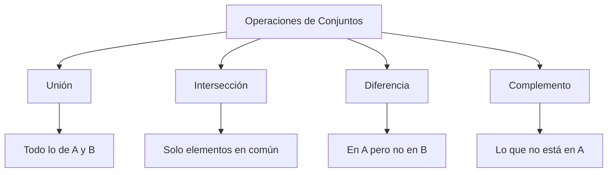
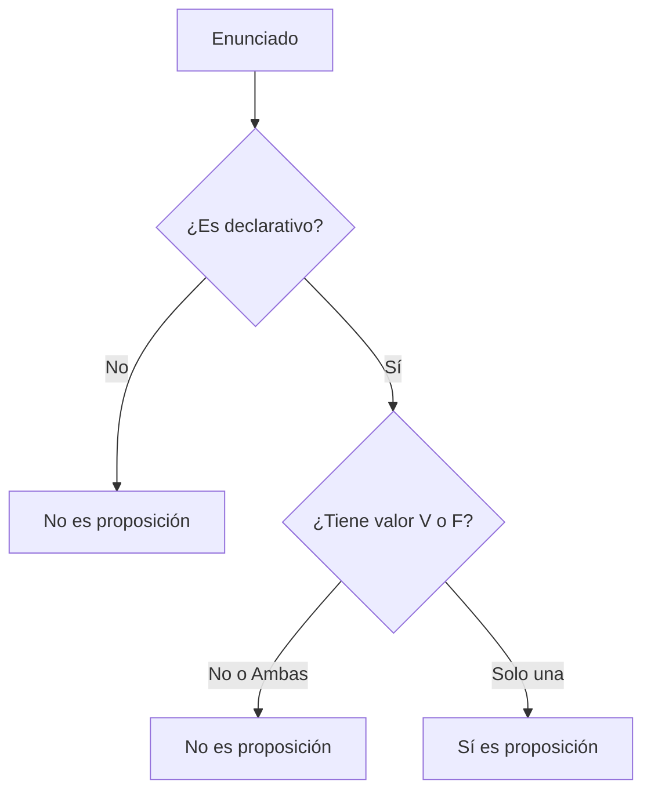
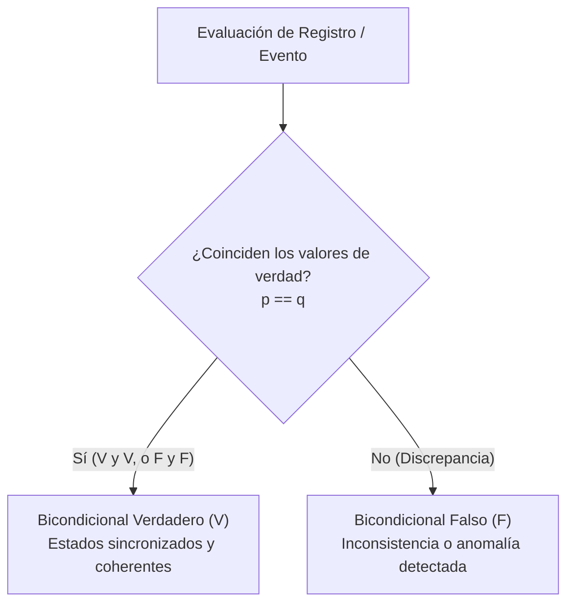
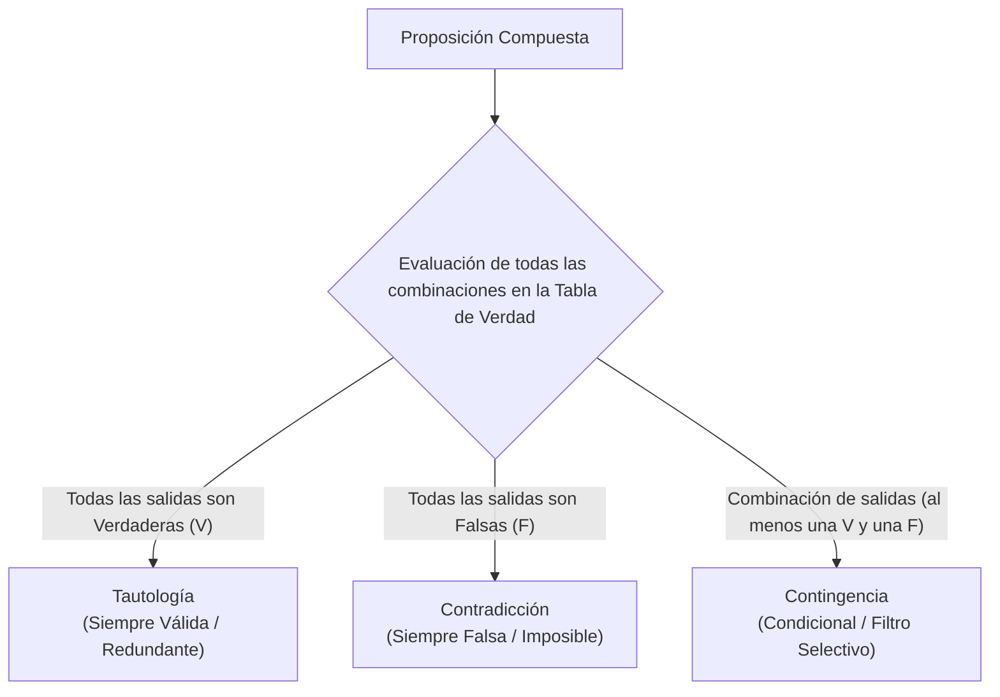

# Matemáticas Discretas

> Apuntes y ampliación de teoría de la asignatura **Sistemas de Big Data**.  
> 📅 **Fecha:** 2026-10-05

---

## 1. Teoría de Conjuntos

Un **conjunto** es una colección bien definida de objetos o entidades, llamados *elementos* o *miembros*. En matemáticas discretas y Big Data, los conjuntos son la base para estructurar y relacionar datos.

### Operaciones Básicas entre Conjuntos

A continuación, se resumen las principales operaciones que puedes realizar entre dos conjuntos $A$ y $B$, asumiendo un conjunto universal $U$.

| Operación | Símbolo | Definición (Lógica) | Descripción |
| :--- | :---: | :--- | :--- |
| **Unión** | $A \cup B$ | $\{x \mid x \in A \lor x \in B\}$ | Elementos que pertenecen a $A$, a $B$, o a ambos. Se combinan todos los elementos sin repetir. |
| **Intersección**| $A \cap B$ | $\{x \mid x \in A \land x \in B\}$ | Elementos que son comunes tanto a $A$ como a $B$. |
| **Diferencia** | $A \setminus B$ | $\{x \mid x \in A \land x \notin B\}$ | Elementos que pertenecen exclusivamente a $A$ y que no están en $B$. |
| **Complemento**| $A^c$ o $A'$ | $\{x \mid x \in U \land x \notin A\}$ | Todos los elementos del conjunto universal $U$ que **no** pertenecen a $A$. |

#### Mapa Conceptual de Operaciones


#### Ejemplo Práctico (Analítica de Datos)
Imagina que analizamos los clientes de un e-commerce:
- **Conjunto A**: Clientes que compraron tecnología en Black Friday $\rightarrow \{Ana, Luis, Carlos, Marta\}$
- **Conjunto B**: Clientes que son usuarios "Premium" $\rightarrow \{Carlos, Marta, Pedro, Sofia\}$

- **Unión ($A \cup B$)**: $\{Ana, Luis, Carlos, Marta, Pedro, Sofia\}$ *(Todos los clientes que impactan en una campaña combinada)*.
- **Intersección ($A \cap B$)**: $\{Carlos, Marta\}$ *(Clientes Premium que compraron tecnología)*.
- **Diferencia ($A \setminus B$)**: $\{Ana, Luis\}$ *(Clientes que compraron tecnología pero **no** son Premium, ideal para ofrecerles la suscripción)*.
- **Complemento ($A^c$)**: Si el universo $U$ es toda la base de datos (1.000 usuarios), el complemento serían los 996 usuarios que **no** compraron tecnología.

> 💡 **Equivalencia en Python (Conjuntos y Estructuras de Datos):** 
> - **Unión ($A \cup B$):** `A | B` o `A.union(B)`.
> - **Intersección ($A \cap B$):** `A & B` o `A.intersection(B)`.
> - **Diferencia ($A \setminus B$):** `A - B` o `A.difference(B)`.
> - **Complemento ($A^c$):** `universo - A`.

---

## 2. Lógica Proposicional

### La Proposición (Afirmación)
Una **proposición lógica** o **afirmación** es un enunciado declarativo que tiene un único valor de verdad: **Verdadero (V)** o **Falso (F)**. Nunca puede ser ambas cosas a la vez ni ninguna de ellas.

**Ejemplos:**
- ✅ *"Hadoop es un framework de Big Data."* -> Es una proposición (Verdadera).
- ✅ *"2 + 2 = 5."* -> Es una proposición (Falsa).
- ❌ *"¡Cierra la puerta!"* -> **No** es una proposición (Es una orden, no se puede evaluar como V o F).
- ❌ *"¿Qué hora es?"* -> **No** es una proposición (Es una pregunta).

#### Árbol de Decisión: ¿Es una proposición?



### Conectores Lógicos Básicos

Los conectores lógicos nos permiten construir proposiciones compuestas a partir de proposiciones simples. Operan de forma muy similar a las compuertas lógicas en sistemas informáticos.

#### 1. Negación ($\neg$ o $\sim$)
La negación invierte el valor de verdad de una proposición. Si $p$ es Verdadera, $\neg p$ es Falsa, y viceversa. En programación suele representarse con `!` o `NOT`.

**Tabla de Verdad:**
| $p$ | $\neg p$ |
| :---: | :---: |
| **V** | F |
| **F** | V |

#### 2. Conjunción ($\land$)
La conjunción de dos proposiciones $p$ y $q$ (leído "$p$ y $q$") es verdadera **solo si ambas** proposiciones son verdaderas simultáneamente. En programación suele representarse con `&&` o `AND`.

**Tabla de Verdad:**
| $p$ | $q$ | $p \land q$ |
| :---: | :---: | :---: |
| **V** | **V** | **V** |
| **V** | **F** | F |
| **F** | **V** | F |
| **F** | **F** | F |

#### Ejemplo Práctico (Filtrado de Logs)
Imagina que estás procesando un flujo de datos (logs) de un servidor en Python utilizando un DataFrame de Pandas. Supongamos que nuestro DataFrame (al que llamaremos `df`) contiene los siguientes datos de ejemplo:

```python
import pandas as pd

# df es nuestro DataFrame con los logs del servidor
df = pd.DataFrame([
    {"type": "ERROR", "date": "today", "message": "Connection lost"},
    {"type": "INFO", "date": "today", "message": "Server started"},
    {"type": "ERROR", "date": "yesterday", "message": "Timeout"},
    {"type": "WARNING", "date": "today", "message": "High CPU usage"}
])
```

Si evaluamos dos proposiciones para cada línea de log:
- **$p$**: "El registro es de tipo ERROR"
- **$q$**: "El registro se generó HOY"

Podemos aplicar operaciones lógicas para filtrar estos datos:

1. **Aplicando Negación ($\neg p$)**: Extraemos todos los registros que **NO** son errores (es decir, nos quedamos con advertencias e información). 
   *En Python (Pandas):* `df[df["type"] != "ERROR"]`
2. **Aplicando Conjunción ($p \land q$)**: Filtramos buscando exclusivamente las líneas que cumplan ambas condiciones estrictamente (Errores de hoy).
   *En Python (Pandas):* `df[(df["type"] == "ERROR") & (df["date"] == "today")]`

#### 3. Disyunción ($\lor$)
La disyunción de dos proposiciones $p$ y $q$ (leído "$p$ o $q$") es verdadera si **al menos una** de las proposiciones es verdadera. Solo es falsa cuando ambas son falsas. En programación suele representarse con `||` o `or`.

**Tabla de Verdad:**
| $p$ | $q$ | $p \lor q$ |
| :---: | :---: | :---: |
| **V** | **V** | **V** |
| **V** | **F** | **V** |
| **F** | **V** | **V** |
| **F** | **F** | F |

#### 4. Implicación o Condicional ($\rightarrow$)
La implicación $p \rightarrow q$ (leído "si $p$, entonces $q$") establece que si la condición $p$ (antecedente) se cumple, entonces $q$ (consecuente) debe cumplirse obligatoriamente. 
La implicación es verdadera siempre, **excepto** en un único caso: cuando el antecedente es Verdadero y el consecuente Falso (es decir, una premisa verdadera no puede llevar a una conclusión falsa).

**Tabla de Verdad:**
| $p$ | $q$ | $p \rightarrow q$ |
| :---: | :---: | :---: |
| **V** | **V** | **V** |
| **V** | **F** | F |
| **F** | **V** | **V** |
| **F** | **F** | **V** |

#### Ejemplo Práctico (Limpieza y Calidad de Datos)
Veamos cómo aplicaríamos estos dos conectores en un pipeline de datos (Data Pipeline):

1. **Disyunción ($\lor$) - Filtrado Flexible:**
   Al limpiar perfiles de clientes, queremos descartar aquellos que estén completamente vacíos. Descartamos el registro si el email es nulo ($p$) **O** si el teléfono es nulo ($q$). Basta con que se cumpla uno de los dos vacíos para requerir revisión.
   *En Python:* `df[df["email"].isna() | df["telefono"].isna()]`

2. **Implicación ($\rightarrow$) - Reglas de Negocio y Data Quality:**
   
   **Caso A: Límite de crédito VIP**
   Supongamos una regla en nuestro almacén de datos: "Si un usuario tiene el estado 'VIP' ($p$), entonces su límite de crédito es > 10.000 ($q$)".
   - Si es VIP (**V**) y su límite es > 10.000 (**V**), la regla está bien (**V**).
   - Si es VIP (**V**) pero su límite es menor a 10.000 (**F**), salta una alarma de calidad, esto rompe la regla (**F**).
   - Si **NO** es VIP (**F**), no nos importa si su crédito es alto o bajo, la regla del sistema no se está violando, así que la lógica no falla (**V**).

   **Caso B: Regla de E-commerce (Promoción de Envío Gratis)**
   - **$p$ (Antecedente / Premisa):** "El importe del pedido supera los 100 €"
   - **$q$ (Consecuente / Conclusión):** "El envío es gratis"
   - **Fórmula:** $p \rightarrow q$ (*"Si el pedido supera los 100 €, entonces el envío es gratis"*)

   | $p$ (Importe > 100 €) | $q$ (Envío gratis) | $p \rightarrow q$ | Significado en el Negocio | Estado de la Regla |
   | :---: | :---: | :---: | :--- | :---: |
   | **V** | **V** | **V** | Pedido de 120 € con envío gratis. | ✅ Cumple la promesa |
   | **V** | **F** | **F** | Pedido de 120 € con gastos de envío cobrados. | ❌ **Error / Violación de regla** |
   | **F** | **V** | **V** | Pedido de 40 € con envío gratis (por promoción/cupón). | ✅ Válido (no contradice la regla) |
   | **F** | **F** | **V** | Pedido de 40 € con gastos de envío cobrados. | ✅ Válido (caso estándar) |

   > 📌 **Intuición del caso $F \rightarrow V$:**  
   > La regla garantiza envío gratis *a partir de 100 €*, pero no prohíbe regalarlo en importes inferiores (por ejemplo, con cupones o campañas especiales). Por ello, que el antecedente sea falso no hace que la regla sea falsa.

   ```mermaid
   flowchart TD
       Inicio["Evaluación del Pedido"] --> P{"¿Importe > 100 €? (p)"}
       
       P -->|"Sí (V)"| Q1{"¿Envío gratis? (q)"}
       Q1 -->|"Sí (V)"| V1["Regla Válida (V)"]
       Q1 -->|"No (F)"| F1["Regla Violada (F) - Error en cobro"]
       
       P -->|"No (F)"| Q2{"¿Envío gratis? (q)"}
       Q2 -->|"Sí (V)"| V2["Regla Válida (V) - Promoción aplicada"]
       Q2 -->|"No (F)"| V3["Regla Válida (V) - Cobro estándar"]
   ```

   ##### Equivalencia Lógica y Calidad de Datos en Python
   En álgebra booleana, la implicación equivale a $p \rightarrow q \equiv \neg p \lor q$.

   *(«O bien el pedido no supera los 100 € ($\neg p$), o bien el envío es gratis ($q$)»)*

   Para auditar un DataFrame y detectar pedidos con anomalías que violen la implicación, buscamos registros donde se cumpla $p \land \neg q$:
   ```python
   import pandas as pd

   # Simulación de pedidos para validar la regla de negocio
   df_pedidos = pd.DataFrame([
       {"id_pedido": 1, "importe": 120, "envio_gratis": True},   # V -> V (Válido)
       {"id_pedido": 2, "importe": 130, "envio_gratis": False},  # V -> F (Anomalía: regla violada)
       {"id_pedido": 3, "importe": 40,  "envio_gratis": True},   # F -> V (Válido: promoción)
       {"id_pedido": 4, "importe": 35,  "envio_gratis": False},  # F -> F (Válido: cobro ordinario)
   ])

   # Detección de filas donde el antecedente es True pero el consecuente es False
   p = df_pedidos["importe"] > 100
   q = df_pedidos["envio_gratis"]

   errores_implicacion = df_pedidos[p & (~q)]
   print("Pedidos con anomalías (violan la implicación):")
   print(errores_implicacion)
   ```

#### 5. Bicondicional o Doble Implicación ($\leftrightarrow$ o $\equiv$)
El bicondicional de dos proposiciones $p$ y $q$ (leído "$p$ si y solo si $q$", frecuentemente abreviado como *iff* del inglés *"if and only if"*, o expresado como *"condición necesaria y suficiente"*) establece que ambas proposiciones deben tener **exactamente el mismo valor de verdad**.

El bicondicional es verdadero cuando ambas proposiciones son verdaderas al unísono ($V \leftrightarrow V$) o cuando ambas son falsas ($F \leftrightarrow F$). Si tienen valores de verdad opuestos, la proposición compuesta es falsa.

**Tabla de Verdad:**
| $p$ | $q$ | $p \leftrightarrow q$ | Explicación |
| :---: | :---: | :---: | :--- |
| **V** | **V** | **V** | Ambos coinciden en ser verdaderos. |
| **V** | **F** | F | Hay discrepancia (uno es verdadero y el otro falso). |
| **F** | **V** | F | Hay discrepancia. |
| **F** | **F** | **V** | Ambos coinciden en ser falsos (ninguno ocurre, se mantiene la coherencia). |

> ℹ️ **Relación con la Doble Implicación y Álgebra Booleana:**
> - El bicondicional se compone de dos implicaciones simultáneas: $p \leftrightarrow q \equiv (p \rightarrow q) \land (q \rightarrow p)$.
> - En arquitectura de computadores y compuertas lógicas, equivale a la función **XNOR** (o la negación del XOR): funciona como un comparador estricto de igualdad lógica (`p == q`).

##### Diagrama de Flujo: Evaluación Bicondicional



#### Ejemplo Práctico (Sincronización, Integridad y Data Quality)

En ingeniería de datos, almacenes de datos (*Data Warehouses*) y pipelines analíticos, el bicondicional es la herramienta fundamental para modelar **restricciones de consistencia bidireccional**.

##### Caso de Negocio A: Acceso a la Plataforma y Suscripción Activa
Imaginemos un servicio SaaS o plataforma de contenidos con la siguiente regla de negocio estricta:
*"Un usuario tiene acceso al catálogo Premium ($p$) si y solo si tiene una suscripción activa al corriente de pago ($q$)."*

- **$p$:** `acceso_premium == True`
- **$q$:** `pago_al_corriente == True`

| $p$ (Acceso) | $q$ (Pago) | $p \leftrightarrow q$ | Diagnóstico en el Sistema | Estado / Alerta |
| :---: | :---: | :---: | :--- | :---: |
| **V** | **V** | **V** | Cliente con servicio activo y cobro correcto. | ✅ Consistente |
| **V** | **F** | **F** | Acceso concedido sin cobro registrado. | 🚨 **Fuga de ingresos / Error de auth** |
| **F** | **V** | **F** | Cliente ha pagado pero no tiene acceso disponible. | 🚨 **Incidencia crítica de servicio** |
| **F** | **F** | **V** | Cliente sin pago y sin acceso. | ✅ Consistente |

##### Caso de Negocio B: Borrado Lógico (*Soft Delete*) en Data Lakes
Otra restricción típica en bases de datos relacionales y tablas Delta/Iceberg:
*"Un registro se considera archivado o dado de baja ($p$) si y solo si tiene asignada una fecha de baja ($q$)."*

- **Regla:** `is_deleted == True` $\leftrightarrow$ `deleted_at is not None`

##### Detección de Incoherencias en Python (Pandas)

En auditorías de calidad de datos (*Data Quality Checks*), buscamos los casos donde se rompe el bicondicional, es decir, donde $\neg(p \leftrightarrow q)$. Esto equivale a la diferencia simétrica (XOR): $(p \land \neg q) \lor (\neg p \land q)$.

```python
import pandas as pd

# Dataset simulado de usuarios en un pipeline
df = pd.DataFrame({
    "id_usuario": [101, 102, 103, 104],
    "acceso_premium": [True, True, False, False],
    "pago_al_corriente": [True, False, True, False]
})

# El bicondicional p <=> q equivale directamente a la igualdad booleana: p == q
df["bicondicional_valido"] = df["acceso_premium"] == df["pago_al_corriente"]

# Filtramos las filas que violan la regla bicondicional
anomalias = df[~df["bicondicional_valido"]]
print("Registros anómalos detectados:")
print(anomalias)
```

**Salida:**
```text
Registros anómalos detectados:
   id_usuario  acceso_premium  pago_al_corriente  bicondicional_valido
1         102            True              False                 False
2         103           False               True                 False
```

---

### Clasificación de Proposiciones Compuestas

Al evaluar la tabla de verdad completa de una proposición compuesta, su columna de resultados nos permite clasificarla según su comportamiento frente a todas las combinaciones posibles de verdad de sus variables componentes:



#### 1. Tautología
Una **tautología** es una proposición compuesta que resulta **verdadera para cualquier combinación de valores de verdad** de las proposiciones simples que la forman. Representa una verdad lógica universal o un hecho que se cumple de manera invariable.

- **Ejemplo clásico (Principio del tercero excluso):** $p \lor \neg p$ *(«O bien el servidor está activo, o bien el servidor no está activo»).*

**Tabla de Verdad:**
| $p$ | $\neg p$ | $p \lor \neg p$ |
| :---: | :---: | :---: |
| **V** | F | **V** |
| **F** | **V** | **V** |

- **Impacto en Sistemas y Big Data:**  
  - **Predicados redundantes:** Condiciones como `(precio >= 0) | (precio < 0)` o `1 == 1`.
  - **Optimización de consultas (*Query Optimization*):** Los motores de procesamiento (como el optimizador *Catalyst* en Apache Spark o el planificador de bases de datos) simplifican predicados tautológicos a `True`, descartando la condición para no malgastar ciclos de CPU evaluándola registro a registro.

#### 2. Contradicción
Una **contradicción** (o antitautología) es una proposición compuesta que resulta **falsa para cualquier combinación de valores de verdad** de sus variables componentes. Representa una imposibilidad lógica o un absurdo.

- **Ejemplo clásico (Principio de no contradicción):** $p \land \neg p$ *(«El sensor está enviando señal Y el sensor no está enviando señal a la vez»).*

**Tabla de Verdad:**
| $p$ | $\neg p$ | $p \land \neg p$ |
| :---: | :---: | :---: |
| **V** | F | **F** |
| **F** | **V** | **F** |

- **Impacto en Sistemas y Big Data:**  
  - **Filtros imposibles:** Por ejemplo, `(fecha > '2026-01-01') & (fecha < '2025-01-01')` o `(id.isna()) & (id.notna())`.
  - **Poda de particiones y eliminación de lecturas (*Empty Relation / Partition Pruning*):** Si el motor analítico detecta una contradicción en el predicado de filtrado, no llega a escanear el almacenamiento en disco ni los ficheros Parquet/Delta en el Data Lake; retorna 0 registros al instante con coste de I/O nulo.

#### 3. Contingencia
Una **contingencia** es una proposición compuesta que **no es ni tautología ni contradicción**. Su valor de verdad depende estrictamente de los valores que tomen sus proposiciones simples en cada caso concreto (su tabla de verdad contiene al menos un valor **Verdadero** y al menos un valor **Falso**).

- **Ejemplo clásico:** $p \land q$ o $p \rightarrow q$ *(«El cliente es VIP Y tiene compras acumuladas superiores a 500 €»).*

- **Impacto en Sistemas y Big Data:**  
  Constituye el **escenario habitual (99%)** en la lógica de negocio, filtros de selección analítica y validación de datos: clasifica y selecciona dinámicamente qué registros cumplen una condición y cuáles no.

---

### Resumen Comparativo

| Concepto | Resultado en Tabla de Verdad | Significado Lógico | Equivalente en Python (Pandas) | Comportamiento del Motor / Pipeline |
| :--- | :---: | :--- | :--- | :--- |
| **Tautología** | Siempre **V** | Verdad universal invariante | `df[(df['saldo'] >= 0) \| (df['saldo'] < 0)]` | **Predicado trivial**: Evalúa a `True`, devuelve el DataFrame completo sin filtrar. |
| **Contradicción** | Siempre **F** | Imposibilidad lógica | `df[(df['saldo'] > 1000) & (df['saldo'] < 500)]` | **Poda completa**: Retorna DataFrame vacío (0 filas leídas). |
| **Contingencia** | Mixto (**V** y **F**) | Condicional según los datos | `df[(df['saldo'] > 1000) & (df['es_activo'])]` | **Filtro selectivo**: Selecciona dinámicamente un subconjunto de filas. |

#### Ejemplo Práctico: Comportamiento en Filtrado de Datos con Python (Pandas)

```python
import pandas as pd

# DataFrame representativo de clientes
df_clientes = pd.DataFrame({
    "id_cliente": [1, 2, 3],
    "saldo": [1200, 450, -50],
    "es_activo": [True, False, True]
})

# 1. TAUTOLOGÍA: La condición siempre es True para cualquier registro
# Resultado: Selecciona todas las filas del DataFrame
filtro_tautologia = (df_clientes["saldo"] >= 0) | (df_clientes["saldo"] < 0)
df_tautologia = df_clientes[filtro_tautologia]
print(f"Tautología -> Filas seleccionadas: {len(df_tautologia)} de {len(df_clientes)}")

# 2. CONTRADICCIÓN: La condición siempre es False (intersección imposible)
# Resultado: DataFrame vacío (0 filas)
filtro_contradiccion = (df_clientes["saldo"] > 1000) & (df_clientes["saldo"] < 500)
df_contradiccion = df_clientes[filtro_contradiccion]
print(f"Contradicción -> Filas seleccionadas: {len(df_contradiccion)} (Vacío)")

# 3. CONTINGENCIA: Regla selectiva real dependiente de los datos
# Resultado: Subconjunto de clientes que cumplen ambas condiciones
filtro_contingencia = (df_clientes["saldo"] > 1000) & (df_clientes["es_activo"])
df_contingencia = df_clientes[filtro_contingencia]
print(f"Contingencia -> Filas seleccionadas: {len(df_contingencia)}")
```

#### Ejemplo en Python: Clasificador Automático de Expresiones Booleanas

Podemos implementar un analizador que determine si una función lógica es una tautología, contradicción o contingencia evaluando exhaustivamente su espacio de estados:

```python
import itertools

def clasificar_logica(nombre, expresion_func, n_variables=2):
    # Genera todas las combinaciones posibles de True/False para n variables
    espacio_estados = list(itertools.product([True, False], repeat=n_variables))
    resultados = [expresion_func(*estado) for estado in espacio_estados]
    
    if all(resultados):
        tipo = "TAUTOLOGÍA (Siempre Verdadera)"
    elif not any(resultados):
        tipo = "CONTRADICCIÓN (Siempre Falsa)"
    else:
        tipo = "CONTINGENCIA (Depende de los valores de entrada)"
        
    print(f"Expresión: {nombre}")
    print(f"  -> Clasificación: {tipo}")
    print(f"  -> Resultados evaluados: {resultados}\n")

# Pruebas:
# 1. Tercero excluso: p or not p
clasificar_logica("p ∨ ¬p", lambda p: p or not p, n_variables=1)

# 2. No contradicción: p and not p
clasificar_logica("p ∧ ¬p", lambda p: p and not p, n_variables=1)

# 3. Filtro de negocio: p and q
clasificar_logica("p ∧ q", lambda p, q: p and q, n_variables=2)
```

**Salida de la ejecución:**
```text
Expresión: p ∨ ¬p
  -> Clasificación: TAUTOLOGÍA (Siempre Verdadera)
  -> Resultados evaluados: [True, True]

Expresión: p ∧ ¬p
  -> Clasificación: CONTRADICCIÓN (Siempre Falsa)
  -> Resultados evaluados: [False, False]

Expresión: p ∧ q
  -> Clasificación: CONTINGENCIA (Depende de los valores de entrada)
  -> Resultados evaluados: [True, False, False, False]
```

