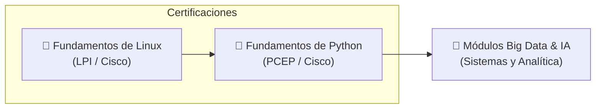

# Cursos y Certificaciones Complementarias

Este directorio reúne los **cursos formativos adicionales** realizados antes o durante el Curso de Especialización en Big Data e Inteligencia Artificial (FP). Su propósito es consolidar competencias clave en administración de sistemas Linux, scripting Bash, desarrollo en Python y bases matemáticas para el tratamiento masivo de datos.

---

## 🗺️ Mapa de Itinerario Formativo



---

## 📚 Índice de Cursos Disponibles

A continuación se indexan los cursos organizados por su fecha de realización o incorporación:

| Fecha / Versión | Curso | Institución / Certificación | Estado | Acceso Directo |
| :---: | :--- | :--- | :---: | :---: |
| **2026-07-05** | [**Fundamentos de Linux**](fundamentos_linux/00-indice.md) | Cisco Networking Academy / **LPI Linux Essentials** | ✅ Completo | [Ver temario](fundamentos_linux/00-indice.md) |
| **2026-10-01** | [**Fundamentos de Python 1**](fundamentos_python_1/README.md) | Cisco Networking Academy / **OpenEDG PCEP** | 🔄 En redacción | [Ver módulos](fundamentos_python_1/README.md) |

---

## 📖 Detalle de los Cursos

### 1. [Fundamentos de Linux](fundamentos_linux/00-indice.md)

Curso integral de introducción y administración del sistema operativo Linux, enfocado tanto en el trabajo diario por línea de comandos como en la gestión de servidores y servicios en producción. 

- **Temario completo:** 16 capítulos cubriendo arquitectura del kernel, licenciamiento de software, shell Bash, filtrado de texto avanzado (`grep`, `sed`, `awk`, expresiones regulares), gestión de procesos, hardware, redes, administración de usuarios y permisos estándar/especiales (FHS).
- **Formatos alternativos:** 
  - 📕 [Libro en PDF compilado](fundamentos_linux/other_formats/Fundamentos-de-Linux-Curso-Completo.pdf)
  - 📱 [Libro electrónico en EPUB](fundamentos_linux/other_formats/Fundamentos-de-Linux-Curso-Completo.epub)
- **Recursos visuales:** [Diagramas vectoriales SVG](fundamentos_linux/diagrams/) explicativos por capítulo.

#### Índice Rápido de Capítulos:
1. [Capítulo 1: Introducción a Linux y Sistemas Operativos](fundamentos_linux/cap1.md)
2. [Capítulo 2: Aplicaciones de Código Abierto y Licenciamiento](fundamentos_linux/cap2.md)
3. [Capítulo 3: Linux en el Escritorio: Uso, Virtualización y Seguridad](fundamentos_linux/cap3.md)
4. [Capítulo 4: CLI y Shell Bash](fundamentos_linux/cap4.md)
5. [Capítulo 5: Documentación y Ayuda en Linux](fundamentos_linux/cap5.md)
6. [Capítulo 6: Gestión de Archivos y Directorios](fundamentos_linux/cap6.md)
7. [Capítulo 7: Compresión y Empaquetado](fundamentos_linux/cap7.md)
8. [Capítulo 8: Procesamiento y Filtrado de Texto](fundamentos_linux/cap8.md)
9. [Capítulo 9: Introducción a Shell Scripts](fundamentos_linux/cap9.md)
10. [Capítulo 10: Hardware y Dispositivos](fundamentos_linux/cap10.md)
11. [Capítulo 11: Administración de Paquetes y Procesos](fundamentos_linux/cap11.md)
12. [Capítulo 12: Fundamentos de Redes](fundamentos_linux/cap12.md)
13. [Capítulo 13: Cuentas de Usuario y Grupos](fundamentos_linux/cap13.md)
14. [Capítulo 14: Gestión de Usuarios y Grupos](fundamentos_linux/cap14.md)
15. [Capítulo 15: Propiedad y Permisos de Archivos](fundamentos_linux/cap15.md)
16. [Capítulo 16: Permisos Especiales y Jerarquía FHS](fundamentos_linux/cap16.md)

---

### 2. [Fundamentos de Python 1](fundamentos_python_1/README.md)

Curso Python Essentials 1 promovido por Cisco Networking Academy y OpenEDG Python Institute. Diseñado para dominar la programación orientada a la ingeniería y la ciencia de datos, preparando para el examen oficial **PCEP-30-0x**:

- **Módulo 1:** Introducción a la computación y primeros pasos con Python.
- **Módulo 2:** Tipos de datos, operadores aritméticos, variables y operaciones I/O.
- **Módulo 3:** Lógica booleana, condicionales (`if`/`elif`/`else`), bucles (`while`/`for`) y estructuras de listas.
- **Módulo 4:** Funciones, alcance de variables, tuplas, diccionarios y gestión de excepciones.
- **Proyecto Final:** Desarrollo de un caso práctico integrador.

---

## 🐍 Ejemplo Práctico: Verificación de Entorno de Ejecución con Python

Alineado con el curso de Linux y Python, este script comprueba las herramientas del sistema esenciales para entornos Big Data:

```python
import sys
import shutil
import platform

def verificar_herramientas_big_data():
    """Comprueba la disponibilidad de herramientas clave en el sistema."""
    herramientas = ["bash", "git", "python3", "docker", "ssh"]
    
    print(f"Sistema Operativo: {platform.system()} {platform.release()}")
    print(f"Versión de Python: {sys.version.split()[0]}")
    print("-" * 50)
    
    for tool in herramientas:
        ruta = shutil.which(tool)
        estado = f"✅ Encontrada ({ruta})" if ruta else "❌ No instalada"
        print(f"Herramienta: {tool:<12} -> {estado}")

if __name__ == "__main__":
    verificar_herramientas_big_data()
```
