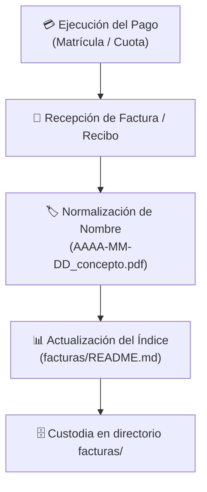

# Facturación y Trámites Administrativos

Este directorio almacena y organiza los comprobantes de pago, recibos de mensualidades, facturas oficiales y justificantes de matrícula correspondientes al **Curso de Especialización en Big Data e Inteligencia Artificial**.

---

## 🗺️ Flujo de Registro y Gestión Administrativa



---

## 📋 Índice Cronológico de Facturas y Recibos

Registro de los pagos y documentos contables ordenados por fecha:

| Fecha | Concepto | Emisor / Centro | Importe | Estado | Documento |
| :---: | :--- | :--- | :---: | :---: | :---: |
| **2026-07-15** | Reserva y Apertura de Expediente de Matrícula | Centro Educativo | — | ✅ Abonado | *Expediente digital* |
| **2026-09-25** | Pago Único / Primera Cuota Curso 2026/2027 | Centro Educativo | — | ✅ Abonado | *Justificante bancario* |
| **2026-11-05** | Cuota formativa (Periodo Noviembre 2026) | Centro Educativo | — | ⏳ Previsto | *Pendiente de emisión* |
| **2026-12-05** | Cuota formativa (Periodo Diciembre 2026) | Centro Educativo | — | ⏳ Previsto | *Pendiente de emisión* |

> 💡 **Nota de Seguridad:** Se recomienda almacenar los documentos fiscales asegurando que el repositorio permanezca en un entorno con permisos restringidos o anonimizando previamente datos especialmente sensibles (como códigos de seguridad bancarios).

---

## 🏷️ Convención de Nomenclatura

Para mantener la coherencia con las especificaciones del repositorio, los archivos PDF o imágenes que se guarden en esta carpeta deben seguir la siguiente estructura:

```text
AAAA-MM-DD_[concepto]_[emisor].pdf
```

**Ejemplos válidos:**
- `2026-07-15_reserva_matricula_centro.pdf`
- `2026-09-25_pago_cuota1_matricula.pdf`

---

## 🐍 Script en Python: Balance y Auditoría de Gastos Formativos

El siguiente script en Python utiliza `pandas` para procesar el registro contable de las facturas y generar un resumen financiero del curso:

```python
import pandas as pd

def generar_balance_gastos():
    """Calcula el balance acumulado y desglosado de las facturas del curso."""
    registros = [
        {"fecha": "2026-07-15", "concepto": "Reserva de matrícula", "importe": 350.00, "estado": "Pagado"},
        {"fecha": "2026-09-25", "concepto": "Primera cuota matrícula", "importe": 600.00, "estado": "Pagado"},
        {"fecha": "2026-11-05", "concepto": "Cuota Noviembre", "importe": 300.00, "estado": "Pendiente"},
        {"fecha": "2026-12-05", "concepto": "Cuota Diciembre", "importe": 300.00, "estado": "Pendiente"},
    ]

    df = pd.DataFrame(registros)
    df["fecha"] = pd.to_datetime(df["fecha"])
    df = df.sort_values(by="fecha")

    total_pagado = df[df["estado"] == "Pagado"]["importe"].sum()
    total_pendiente = df[df["estado"] == "Pendiente"]["importe"].sum()
    total_general = df["importe"].sum()

    print("=== RESUMEN ECONÓMICO DEL CURSO ===")
    print(f"Total abonado a la fecha : {total_pagado:>8.2f} €")
    print(f"Total pendiente de pago  : {total_pendiente:>8.2f} €")
    print(f"Coste total previsto     : {total_general:>8.2f} €")
    print("\nDetalle ordenado:")
    print(df[["fecha", "concepto", "importe", "estado"]].to_string(index=False))

if __name__ == "__main__":
    generar_balance_gastos()
```
